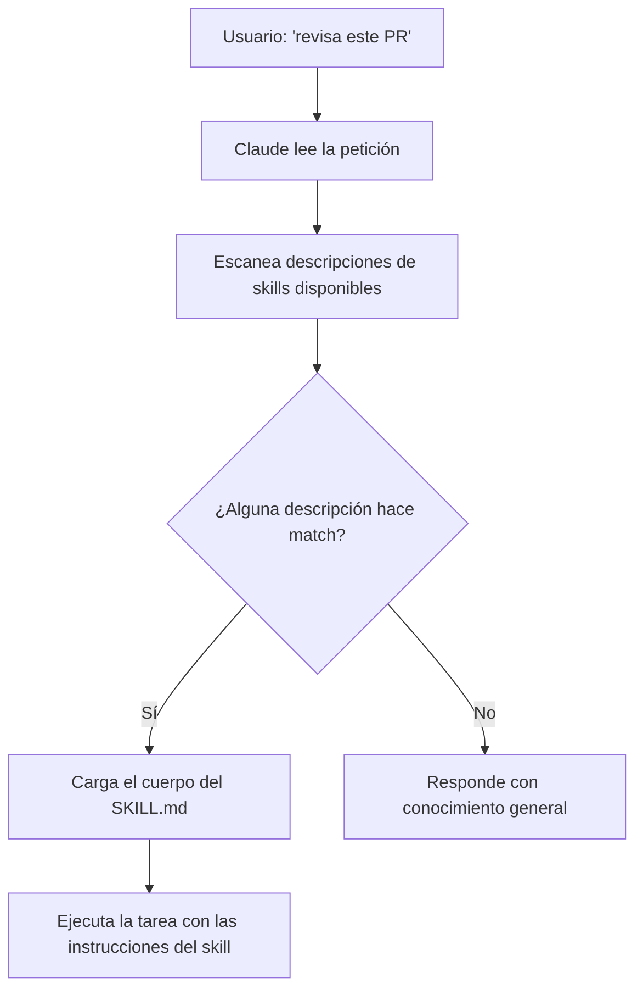

# Skills en Claude Code

> **Resumen Feynman (una frase):** Un skill es un archivo markdown que le enseña a Claude
> cómo manejar una tarea específica una sola vez, para que la aplique automáticamente cada
> vez que esa situación aparezca — sin que tengas que repetirte.

---

## 1) Analogía sencilla

Imagina que eres nuevo en un trabajo y cada vez que tu jefe te pide revisar un contrato,
te explica desde cero qué revisar: cláusulas de penalización, fechas, firmas, lenguaje
ambiguo. Cada vez, la misma explicación.

Un día escribes un **checklist laminado** y lo pegas en tu cubículo. A partir de ese
momento, cuando alguien te dice "revisa este contrato", tú miras el checklist y lo
aplicas — sin que nadie tenga que explicarte nada.

**Eso es un skill**: instrucciones escritas una vez, aplicadas automáticamente cuando
el contexto lo amerita.

---

## 2) ¿Qué es realmente?

Un **skill** es un archivo `SKILL.md` con frontmatter YAML que contiene:

- `name`: identificador del skill.
- `description`: texto que Claude usa para decidir si este skill aplica a la petición actual.
- **Cuerpo**: las instrucciones concretas — checklist, formato, criterios, etc.

```yaml
---
name: pr-review
description: Reviews pull requests for code quality. Use when reviewing PRs or checking code changes.
---
# PR Review Checklist
- Verifica cobertura de tests
- Revisa naming conventions
- Confirma que no hay secrets hardcodeados
```

Claude solo carga el `name` y `description` inicialmente. El cuerpo completo se lee
**solo si el skill hace match** con la petición del usuario.

---

## 3) ¿Cómo funciona? (mecanismo interno)



**Puntos clave del mecanismo:**

1. Claude mantiene un índice ligero de `name + description` de todos los skills disponibles.
2. Al recibir una petición, compara semánticamente contra ese índice.
3. Solo si hay match carga el contenido completo — esto **protege el context window**.
4. La activación es **automática**: no requiere escribir un comando explícito.

---

## 4) ¿Cuándo usarlo?

| Situación | ¿Skill? |
|-----------|---------|
| Revisión de PRs con criterios de tu equipo | ✅ Sí |
| Formato de commit messages | ✅ Sí |
| Brand guidelines para diseño web | ✅ Sí |
| Templates de documentación | ✅ Sí |
| Debugging checklist para un framework específico | ✅ Sí |
| Instrucciones que aplican a **toda** conversación | ❌ Mejor en `CLAUDE.md` |
| Comando que quieres invocar explícitamente | ❌ Mejor slash command |

**Regla de oro:** si te descubres explicando lo mismo a Claude más de una vez,
eso es un skill esperando ser escrito.

---

## 5) Ejemplo práctico mínimo

**Estructura de archivos:**

```
~/.claude/skills/           ← skills personales (siguen al usuario)
  commit-message/
    SKILL.md

mi-repo/.claude/skills/     ← skills de proyecto (siguen al repo)
  pr-review/
    SKILL.md
```

**Contenido de `~/.claude/skills/commit-message/SKILL.md`:**

```markdown
---
name: commit-message
description: Writes conventional commit messages. Use when creating commits or writing commit descriptions.
---

Usa el formato Conventional Commits:
- `feat:` para nuevas funcionalidades
- `fix:` para corrección de bugs
- `chore:` para tareas de mantenimiento
- `docs:` para documentación

El mensaje debe ser en inglés, imperativo, máximo 72 caracteres en el título.
Incluye cuerpo si el cambio no es obvio.
```

Ahora, cada vez que digas "crea un commit para estos cambios", Claude aplica
automáticamente este formato sin que lo pidas.

---

## 6) Conexiones con otros conceptos

- `→ contrasta:` [[CLAUDE_md]] — CLAUDE.md carga en *cada* conversación; skills cargan *solo cuando aplican*.
- `→ contrasta:` [[slash_commands]] — slash commands requieren invocación explícita; skills son automáticos.
- `→ aplica en:` [[04_claude_code/_overview]] — los skills son una de las capas de personalización de Claude Code.
- `→ extiende:` [[01_agent_skills/_overview]] — esta nota profundiza el concepto central del curso.

---

## 7) Preguntas Feynman

1. ¿Por qué Claude solo carga el `name` y `description` de un skill inicialmente, y no
   el cuerpo completo? ¿Qué problema resuelve esto?

2. Tienes un estándar de code review que aplica a todos tus proyectos y otro que es
   específico de un repo de tu equipo. ¿Dónde pondrías cada uno y por qué?

3. ¿En qué se diferencia un skill de simplemente escribir las instrucciones en `CLAUDE.md`?
   ¿Cuándo es mejor cada opción?

4. ¿Qué pasa si dos skills tienen descripciones que hacen match con la misma petición?
   ¿Qué esperarías que Claude haga?

5. Tu equipo tiene guías de estilo para Python que nadie recuerda aplicar. ¿Cómo
   estructurarías un skill para esto y cómo garantizarías que todo el equipo lo use?

---

## 8) Tarjetas Anki

**Q:** ¿Qué archivo define un skill en Claude Code y qué debe contener su frontmatter?
**A:** Un archivo `SKILL.md` con campos `name` (identificador) y `description` (texto
que Claude usa para decidir si el skill aplica a la petición actual).

**Q:** ¿Dónde se guardan los skills personales vs. los skills de proyecto?
**A:** Personales en `~/.claude/skills/` (Windows: `C:/Users/<user>/.claude/skills/`).
De proyecto en `.claude/skills/` dentro del repositorio — se versionan con el código.

**Q:** ¿Cuál es la diferencia fundamental entre un skill y un slash command?
**A:** Los skills se activan **automáticamente** cuando Claude detecta que la situación
los requiere. Los slash commands requieren que el usuario los invoque explícitamente.

**Q:** ¿Por qué los skills no saturan el context window aunque haya muchos definidos?
**A:** Claude solo carga `name + description` inicialmente. El cuerpo completo del skill
se lee solo si hay match con la petición — lazy loading semántico.

**Q:** ¿Cuál es la "regla de oro" para saber si algo merece ser un skill?
**A:** Si te encuentras explicando lo mismo a Claude repetidamente, eso es un skill
esperando ser escrito.

---

## 9) Lo que no es obvio (trampas y confusiones frecuentes)

**La descripción es el mecanismo de activación, no el nombre.**
El campo `name` es solo un identificador. Lo que determina si un skill se activa es la
`description`. Si la descripción es vaga o genérica, el skill puede no activarse cuando
deberías, o activarse cuando no deberías.

**Skills ≠ instrucciones permanentes.**
CLAUDE.md es para comportamientos que quieres *siempre*. Un skill es para conocimiento
especializado que solo es relevante en ciertos contextos. Mezclarlos lleva a context
window inflado o instrucciones que se ignoran por irrelevancia.

**Los skills de proyecto se versionan — eso es intencional.**
A diferencia de las preferencias personales, los skills de proyecto van en el repo porque
representan estándares del equipo. Si tu skill de PR review vive solo en tu máquina,
no cumple su propósito colaborativo.

**La carpeta es parte de la estructura.**
Un skill no es solo el archivo `SKILL.md` suelto — vive dentro de una **carpeta** con
el nombre del skill (ej: `.claude/skills/pr-review/SKILL.md`). Colocar el archivo
directamente en `.claude/skills/SKILL.md` puede no ser detectado correctamente.

---

### Registro personal

- Qué me sorprendió o conectó con algo que ya sabía: La idea de lazy loading semántico
  (cargar solo name+description inicialmente) es directamente análoga a cómo funciona
  la indexación en BigQuery — no lees toda la tabla, solo el esquema hasta que necesitas
  los datos reales. Eso hace que skills escale bien con muchos archivos.
- Dudas que quedaron abiertas: ¿Qué pasa si dos skills hacen match simultáneo? ¿Se
  cargan ambos o hay un mecanismo de prioridad?
- Siguientes pasos: Crear mi primer skill real para commit messages y probar la activación
  automática en un proyecto.
