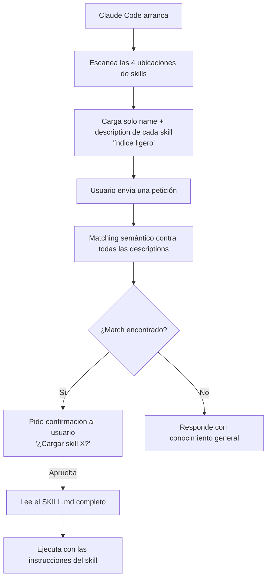

# Creando tu primer Skill

> **Resumen Feynman (una frase):** Un skill es una carpeta con un `SKILL.md` que Claude
> carga bajo demanda; la descripción en el frontmatter es el criterio de activación, y
> hay una jerarquía de prioridad que resuelve conflictos cuando dos skills tienen el mismo
> nombre.

---

## 1) Analogía sencilla

Imagina una biblioteca con secciones en orden de autoridad: el **reglamento institucional**
(empresa) siempre tiene la última palabra, luego tus **apuntes personales** (carpeta
personal), luego el **manual del proyecto** (repo), y al final los **folletos externos**
(plugins).

Cuando buscas "cómo revisar un contrato" y hay dos versiones — una corporativa y una tuya
personal — aplicas la corporativa, porque la institución tiene precedencia. Así funciona
la jerarquía de skills.

Además, la biblioteca tiene un índice en la entrada (solo títulos y resúmenes). No sacas
cada libro del estante hasta que alguien lo pide. Eso es el lazy loading de skills.

---

## 2) ¿Qué es realmente?

Un skill es una **carpeta** cuyo nombre coincide con el nombre del skill, y que contiene
un archivo `SKILL.md` con esta estructura:

```
~/.claude/skills/
  pr-description/          ← nombre del skill = nombre de la carpeta
    SKILL.md               ← el único archivo obligatorio
```

El `SKILL.md` tiene dos zonas separadas por frontmatter:

```markdown
---
name: pr-description
description: Writes pull request descriptions. Use when creating a PR, writing a PR,
             or when the user asks to summarize changes for a pull request.
---

<!-- Todo lo que sigue son las instrucciones que Claude ejecuta cuando activa el skill -->
When writing a PR description:
1. Run `git diff main...HEAD`
2. Write a description with sections: ## What, ## Why, ## Changes
```

| Parte | Propósito |
|-------|-----------|
| `name` | Identificador único del skill |
| `description` | **Criterio de matching** — Claude decide aquí si activar el skill |
| Cuerpo (post-frontmatter) | Instrucciones que Claude sigue al ejecutar la tarea |

---

## 3) ¿Cómo funciona? (mecanismo interno)



**Detalles importantes del flujo:**

- **Startup scan**: Claude escanea las 4 ubicaciones al arrancar, no en tiempo de ejecución.
- **Semantic matching**: no es búsqueda exacta de palabras — "explain what this function does"
  puede activar un skill descrito como "explain code with visual diagrams" porque el
  **intent** se superpone.
- **Confirmation step**: antes de cargar el cuerpo completo, Claude pregunta si confirmas.
  Esto mantiene al usuario consciente del contexto que se está inyectando.
- **Restart requerido**: crear, editar o eliminar un skill no tiene efecto hasta que
  reinicias Claude Code (el índice se construye en startup).

---

## 4) Jerarquía de prioridad (conflictos de nombres)

Cuando dos skills tienen el mismo `name`, gana el de mayor jerarquía:

```
Enterprise  ←  máxima prioridad (settings corporativos)
    ↓
Personal    ←  ~/.claude/skills/
    ↓
Project     ←  .claude/skills/ dentro del repo
    ↓
Plugins     ←  mínima prioridad
```

**Caso concreto:** tu empresa define un skill `code-review` a nivel enterprise.
Tú tienes uno personal con el mismo nombre. El enterprise siempre gana.

**Implicación práctica para equipos:** usa nombres descriptivos y específicos para
evitar colisiones involuntarias. En vez de `review`, usa `frontend-review` o
`airflow-dag-review`.

---

## 5) Ejemplo práctico mínimo

**Crear el skill:**

```bash
# Skill personal (sigue al usuario entre proyectos)
mkdir -p ~/.claude/skills/pr-description

cat > ~/.claude/skills/pr-description/SKILL.md << 'EOF'
---
name: pr-description
description: Writes pull request descriptions. Use when creating a PR, writing a PR,
             or when the user asks to summarize changes for a pull request.
---

When writing a PR description:

1. Run `git diff main...HEAD` to see all changes on this branch
2. Write a description following this format:

## What
One sentence explaining what this PR does.

## Why
Brief context on why this change is needed.

## Changes
- Bullet points of specific changes made
- Group related changes together
- Mention any files deleted or renamed
EOF
```

**Verificar que fue detectado:**
```bash
# Reiniciar Claude Code, luego verificar en la lista de skills disponibles
```

**Activar (implícitamente):**
```
Usuario: "write a PR description for my changes"
Claude:  [indica que está usando el skill pr-description]
         [corre git diff main...HEAD]
         [genera la descripción en el formato definido]
```

**Actualizar o eliminar:**
```bash
# Actualizar: editar el archivo
nano ~/.claude/skills/pr-description/SKILL.md

# Eliminar: borrar la carpeta
rm -rf ~/.claude/skills/pr-description

# En ambos casos: reiniciar Claude Code
```

---

## 6) Conexiones con otros conceptos

- `→ extiende:` [[01_que_son_skills]] — esta lecture materializa en código lo que la anterior conceptualizó.
- `→ requiere:` [[01_que_son_skills]] — la jerarquía y el matching solo tienen sentido si ya entendiste qué es un skill.
- `→ aplica en:` [[04_claude_code/_overview]] — la jerarquía enterprise→personal→project es central al flujo de equipos con Claude Code.

---

## 7) Preguntas Feynman

1. ¿Por qué Claude pide confirmación antes de cargar el cuerpo completo de un skill?
   ¿Qué problema evita ese paso?

2. Tienes un skill personal llamado `deploy` y el repo de tu trabajo también tiene uno
   llamado `deploy`. ¿Cuál se activa? ¿Cómo lo cambiarías si quisieras que ganara el
   del proyecto?

3. Escribes una descripción de skill demasiado genérica: `"Helps with code tasks."`.
   ¿Qué consecuencias prácticas tiene esto para el matching?

4. ¿Por qué es obligatorio reiniciar Claude Code después de crear o editar un skill?
   ¿Qué parte del mecanismo interno lo explica?

5. En un equipo donde la empresa tiene skills enterprise, los devs tienen personales y
   el repo tiene los propios: ¿cómo diseñarías la estrategia de nombres para evitar
   que la jerarquía cause sorpresas?

---

## 8) Tarjetas Anki

**Q:** ¿Cuál es la estructura de archivos mínima para que Claude reconozca un skill?
**A:** Una carpeta con el nombre del skill que contenga un `SKILL.md` con frontmatter
`name` y `description`. Ej: `~/.claude/skills/mi-skill/SKILL.md`.

**Q:** ¿En qué orden de prioridad resuelve Claude los conflictos de nombres entre skills?
**A:** Enterprise > Personal (`~/.claude/skills/`) > Project (`.claude/skills/`) > Plugins.

**Q:** ¿Cuándo escanea Claude Code los skills disponibles?
**A:** Al arrancar (startup). Por eso es necesario **reiniciar** Claude Code después de
crear, editar o eliminar un skill.

**Q:** ¿Qué tipo de matching usa Claude para activar un skill?
**A:** Matching **semántico** — compara la intención de la petición contra las
`description` de los skills disponibles, no coincidencia exacta de palabras.

**Q:** ¿Por qué el cuerpo de un skill NO se carga al arrancar Claude Code?
**A:** Para no saturar el context window. Solo `name + description` forman el índice
inicial; el cuerpo completo se carga solo si hay match y el usuario confirma.

---

## 9) Lo que no es obvio (trampas y confusiones frecuentes)

**La carpeta y el `name` en frontmatter deben coincidir — y la carpeta es la unidad.**
Si creas `~/.claude/skills/my-skill/SKILL.md` pero en el frontmatter escribes
`name: myskill` (sin guion), puede haber inconsistencias. La convención es que
el nombre de la carpeta y el `name` sean idénticos.

**El confirmation step no es opcional ni es un bug.**
Puede sentirse como fricción, pero es deliberado: te mantiene consciente de qué contexto
se está inyectando en tu conversación. Si lo desactivas mentalmente ("siempre le digo sí"),
pierdes la trazabilidad de por qué Claude se está comportando de cierta manera.

**"Restart required" es el error más frecuente de usuarios nuevos.**
Creas el skill, pruebas inmediatamente, no aparece, concluyes que no funciona. El skill
funciona — pero el índice se construyó antes de que lo crearas. Siempre reinicia.

**La jerarquía enterprise no es configurable por el usuario.**
Si tu organización define skills enterprise, no puedes sobrescribirlos con personales.
Esto es una decisión de seguridad/gobernanza. Si un skill enterprise no se comporta
como esperas, el problema es en la definición enterprise, no en tu personal.

**Descripción demasiado amplia = activaciones no deseadas.**
Una description como `"Helps with any coding task"` activará el skill casi siempre,
incluyendo contextos donde no lo quieres. Sé específico: `"Reviews Python code for PEP 8
compliance. Use when checking Python formatting or style."`.

---

### Registro personal

- Qué me sorprendió o conectó con algo que ya sabía: El confirmation step antes de cargar
  el cuerpo completo me recuerda a los `dbt run --dry-run` — una capa de confianza antes
  de ejecutar algo que modifica estado (en este caso, el contexto de la conversación).
- Dudas que quedaron abiertas: ¿Puede un skill incluir archivos adicionales además de
  `SKILL.md`? ¿Se pueden referenciar assets o fragmentos de código desde el skill?
- Siguientes pasos: Crear un skill `airflow-dag-review` para los estándares de Protección
  y uno personal `commit-message` con Conventional Commits.
