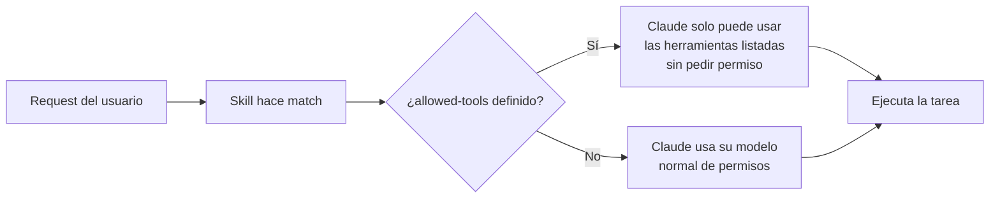

# Configuración avanzada y Skills Multi-archivo

> **Resumen Feynman (una frase):** Un skill bien configurado restringe qué herramientas
> puede usar Claude (para seguridad), y organiza su contenido en múltiples archivos para
> que el contexto no se sature — cargando material de referencia solo cuando la tarea
> concreta lo necesita.

---

## 1) Analogía sencilla

Imagina que contratas a un consultor externo para auditar tu código. Le das un manual
de trabajo (el `SKILL.md`), pero además tienes una bodega con documentación técnica
extensa (los archivos de referencia).

**Restricción de herramientas:** Le dices al consultor: "en esta auditoría solo puedes
*leer* archivos, no modificarlos". Eso es `allowed-tools` — defines el perímetro de
acción antes de que empiece.

**Progressive disclosure:** El manual del consultor dice: "si el cliente pregunta sobre
arquitectura del sistema, ve a la bodega y busca `architecture-guide.md`". El consultor
no carga toda la bodega en su cabeza desde el inicio — solo va cuando la pregunta
concreta lo requiere. Tu memoria de trabajo no se satura.

---

## 2) ¿Qué es realmente?

La especificación del `SKILL.md` define cuatro campos en el frontmatter:

| Campo | Requerido | Límite | Propósito |
|-------|-----------|--------|-----------|
| `name` | ✅ Sí | 64 caracteres | Identificador único; solo lowercase, números y guiones; debe coincidir con el nombre de la carpeta |
| `description` | ✅ Sí | 1.024 caracteres | Criterio de matching semántico — el campo más importante |
| `allowed-tools` | ❌ Opcional | — | Lista blanca de herramientas que Claude puede usar sin pedir permiso cuando el skill está activo |
| `model` | ❌ Opcional | — | Modelo específico de Claude para este skill (ej: `sonnet`, `haiku`) |

Si omites `allowed-tools`, el skill no restringe nada — Claude usa su modelo normal de permisos.

---

## 3) ¿Cómo funciona? (mecanismo interno)

### 3a. Escritura efectiva de descriptions

La description responde dos preguntas de forma explícita:

```
¿Qué hace el skill? + ¿Cuándo debe Claude usarlo?
```

**Mal:**
```yaml
description: Helps with code.
```

**Bien:**
```yaml
description: Reviews Python code for PEP 8 compliance and type hint coverage.
             Use when checking Python formatting, style, or running a code quality
             review on .py files.
```

Si el skill no se activa cuando esperas, agrega más keywords que reflejen cómo
realmente formulas tus peticiones. Claude hace matching semántico, pero mientras
más alineada esté la description con tu vocabulario, más confiable el matching.

### 3b. allowed-tools — perímetro de ejecución



Ejemplo de skill de onboarding de solo lectura:

```yaml
---
name: codebase-onboarding
description: Helps new developers understand how the system works. Use when
             onboarding devs, explaining the codebase, or giving a system overview.
allowed-tools: Read, Grep, Glob, Bash
model: sonnet
---
```

Con esta configuración, cuando el skill está activo, Claude puede usar `Read`, `Grep`,
`Glob` y `Bash` sin pedir aprobación — pero **no puede editar ni escribir archivos**.

### 3c. Progressive disclosure — estructura multi-archivo

```
.claude/skills/codebase-onboarding/
  SKILL.md                  ← instrucciones esenciales (< 500 líneas)
  references/
    architecture-guide.md   ← carga solo si preguntan sobre arquitectura
    api-contracts.md        ← carga solo si preguntan sobre la API
  scripts/
    validate-env.sh         ← se ejecuta sin cargar su contenido en contexto
  assets/
    system-diagram.png      ← material de apoyo visual
```

En el `SKILL.md` se instruye explícitamente cuándo cargar cada referencia:

```markdown
## References
- If the user asks about system design or architecture: read `references/architecture-guide.md`
- If the user asks about API contracts or endpoints: read `references/api-contracts.md`
- To validate the dev environment: **run** (not read) `scripts/validate-env.sh`
```

**Regla de los scripts:** decirle a Claude que **ejecute** el script (no que lo lea)
significa que solo el *output* consume tokens — el código del script no entra al contexto.

---

## 4) ¿Cuándo usarlo?

| Técnica | Cuándo aplicarla |
|---------|-----------------|
| `allowed-tools` restrictivo | Auditorías, onboarding de terceros, workflows de solo lectura, pipelines de CI donde no quieres modificaciones accidentales |
| `model` específico | Tareas costosas que pueden usar `haiku` para eficiencia, o tareas complejas que requieren `opus` explícitamente |
| Multi-archivo con referencias | Skill con > 300 líneas, o que depende de guías técnicas extensas que no siempre son necesarias |
| Scripts en vez de instrucciones | Validaciones de entorno, transformaciones de datos, operaciones que deben ser reproducibles y ya están probadas como código |

**Regla de oro para el tamaño:** si tu `SKILL.md` supera 500 líneas, es señal de que
parte del contenido debería vivir en `references/`.

---

## 5) Ejemplo práctico mínimo

**Skill de revisión de DAGs de Airflow (solo lectura, multi-archivo):**

```
.claude/skills/airflow-dag-review/
  SKILL.md
  references/
    dag-standards.md        ← guía completa de estándares internos
    common-antipatterns.md  ← lista de patrones a evitar
  scripts/
    lint-dag.py             ← ejecuta pylint + validaciones custom
```

```yaml
---
name: airflow-dag-review
description: Reviews Apache Airflow DAG files for compliance with internal standards.
             Use when reviewing DAGs, checking Airflow code quality, or validating
             pipeline definitions before merge.
allowed-tools: Read, Grep, Glob, Bash
---

## DAG Review Process

1. Read the DAG file provided.
2. **Run** (do not read) `scripts/lint-dag.py` against the file.
3. If the user asks about specific standards, read `references/dag-standards.md`.
4. If identifying antipatterns, read `references/common-antipatterns.md`.
5. Report findings grouped by: critical issues, warnings, suggestions.
```

Con esta configuración, Claude no puede modificar DAGs durante la revisión, y los
estándares solo se cargan si la pregunta los requiere.

---

## 6) Conexiones con otros conceptos

- `→ extiende:` [[02_creating_your_first_skill]] — esta lecture agrega los campos opcionales y la estructura multi-archivo que la anterior no cubría.
- `→ requiere:` [[01_que_son_skills]] — el concepto de lazy loading del contexto es el fundamento de por qué progressive disclosure importa.
- `→ aplica en:` [[04_claude_code/_overview]] — `allowed-tools` es relevante en flujos de CI/CD donde Claude Code opera con permisos acotados.

---

## 7) Preguntas Feynman

1. ¿Por qué la `description` tiene un límite de 1.024 caracteres y no más?
   ¿Qué pasaría si la description fuera un documento de 5.000 palabras?

2. Tienes un skill de auditoría que necesita leer logs pero nunca debe modificar
   archivos de configuración. ¿Cómo configuras `allowed-tools`? ¿Qué herramientas
   incluyes y cuáles excluyes explícitamente?

3. ¿Cuál es la diferencia entre decirle a Claude que **lea** un script y que lo
   **ejecute**? ¿Por qué importa para la eficiencia del contexto?

4. Tienes un skill con una guía de arquitectura de 800 líneas que solo es relevante
   cuando alguien pregunta sobre el sistema distribuido. ¿Dónde la pones y cómo
   le indicas a Claude cuándo cargarla?

5. ¿Qué pasa si defines `allowed-tools: Read` en un skill pero la tarea normalmente
   requiere que Claude escriba un archivo de reporte? ¿Cómo resolverías ese conflicto?

---

## 8) Tarjetas Anki

**Q:** ¿Cuáles son los dos campos requeridos en el frontmatter de un `SKILL.md`?
**A:** `name` (máx. 64 caracteres, solo lowercase/números/guiones) y `description`
(máx. 1.024 caracteres, el criterio de matching semántico).

**Q:** ¿Qué hace `allowed-tools` en un skill y qué pasa si se omite?
**A:** Restringe las herramientas que Claude puede usar sin pedir permiso mientras el
skill está activo. Si se omite, Claude usa su modelo normal de permisos sin restricciones.

**Q:** ¿Qué es "progressive disclosure" en el contexto de skills multi-archivo?
**A:** Mantener el `SKILL.md` con instrucciones esenciales (< 500 líneas) y delegar
material de referencia extenso a archivos separados que Claude carga **solo cuando la
tarea concreta los necesita**.

**Q:** ¿Por qué se le dice a Claude que "ejecute" un script en vez de "leerlo"?
**A:** Porque al ejecutarlo, solo el **output** consume tokens del contexto. Al leerlo,
el código completo del script entraría al contexto window, consumiendo espacio innecesario.

**Q:** ¿Cuál es la regla de tamaño para saber cuándo dividir un skill en múltiples archivos?
**A:** Si el `SKILL.md` supera **500 líneas**, el contenido excedente debería moverse a
archivos en `references/`, `scripts/` o `assets/`.

---

## 9) Lo que no es obvio (trampas y confusiones frecuentes)

**`allowed-tools` no es una lista negra — es una lista blanca.**
No dices "no puedes usar Edit". Dices "solo puedes usar Read, Grep, Glob". Si necesitas
agregar una herramienta más adelante, debes agregarla explícitamente. Olvidar una
herramienta necesaria en la lista blanca rompe el skill silenciosamente.

**El `model` en el frontmatter tiene implicaciones de costo.**
Si fijas `model: opus` en un skill de uso frecuente, cada activación usará el modelo
más caro. Úsalo solo cuando la tarea genuinamente lo requiera.

**Progressive disclosure solo funciona si las instrucciones son condicionales.**
Escribir "lee `references/architecture-guide.md`" en el cuerpo del SKILL.md sin
condición lo convierte en eager loading — Claude lo carga siempre. La instrucción debe
ser: "si el usuario pregunta X, entonces lee el archivo Y".

**La description no debe describir el skill para humanos — debe activarlo para Claude.**
Es tentador escribir: "Este skill ayuda al equipo de ingeniería a mantener estándares."
Eso no activa nada. Escribe: "Reviews code against internal engineering standards. Use
when reviewing PRs, checking code quality, or running pre-merge validations."

**Scripts: ejecutar ≠ leer.** La instrucción explícita importa.
Si en el SKILL.md escribes "revisa el script `scripts/validate.sh`", Claude probablemente
lo leerá, no lo ejecutará. La instrucción debe ser inequívoca: "**Run** (do not read)
`scripts/validate.sh` and report its output."

---

### Registro personal

- Qué me sorprendió o conectó con algo que ya sabía: La distinción entre lista blanca
  vs. lista negra en `allowed-tools` es exactamente igual a los IAM permissions en GCP:
  no defines lo que está prohibido, defines lo que está permitido. El modelo mental es
  idéntico al principio de menor privilegio.
- Dudas que quedaron abiertas: ¿El campo `model` en el frontmatter puede especificar
  versiones exactas del modelo (ej: `claude-sonnet-4-6`) o solo aliases como `sonnet`?
  ¿Qué pasa si el modelo especificado ya no está disponible?
- Siguientes pasos: Diseñar el skill `airflow-dag-review` para Protección con
  `allowed-tools` de solo lectura y una referencia separada para los estándares internos
  de DAGs.
