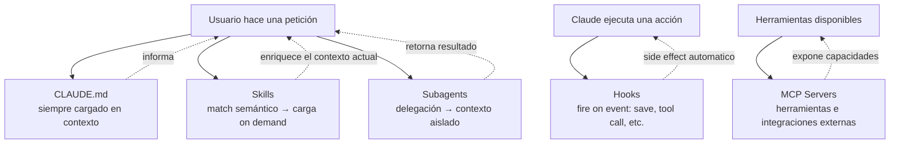

# Skills vs Otras Funcionalidades de Claude Code

> **Resumen Feynman (una frase):** Claude Code tiene cinco mecanismos de personalización
> que no compiten entre sí — cada uno atiende un eje distinto: qué siempre aplica
> (CLAUDE.md), qué aplica cuando es relevante (skills), qué pasa cuando ocurre un evento
> (hooks), quién ejecuta la tarea (subagents), y qué herramientas externas hay disponibles
> (MCP).

---

## 1) Analogía sencilla

Piensa en un equipo de cocina profesional:

- **CLAUDE.md** = las reglas del restaurante pegadas en la pared: "nunca usar sal con
  yodo, siempre usar aceite de oliva extra virgen". Aplican a todo el mundo, todo el tiempo.
- **Skills** = las recetas especializadas que solo saca el chef cuando alguien pide ese
  plato. Si nadie pide ceviche, la receta de ceviche no ocupa espacio en la mesa.
- **Hooks** = el temporizador que suena cada vez que se abre el horno. Un evento dispara
  una acción automáticamente, sin que nadie lo pida.
- **Subagents** = los sous-chefs que trabajan en su propia estación aislada. Les das una
  tarea, trabajan independientemente y te traen el resultado.
- **MCP servers** = los proveedores externos (el pescadero, el sommelier). Dan acceso a
  recursos que no existen dentro de la cocina.

Ninguno reemplaza al otro. Los cinco coexisten.

---

## 2) ¿Qué es realmente?

Cada mecanismo tiene un eje de activación diferente:

| Mecanismo | Eje de activación | Scope | Persistencia |
|-----------|-------------------|-------|-------------|
| **CLAUDE.md** | Siempre (cada conversación) | Proyecto o global | Permanente en contexto |
| **Skills** | Petición del usuario (semántico) | Personal o proyecto | Lazy — solo cuando aplica |
| **Hooks** | Evento (file save, tool call) | Proyecto | Event-driven |
| **Subagents** | Delegación explícita | Contexto aislado | Contexto separado |
| **MCP servers** | Herramienta disponible | Global o proyecto | Integración externa |

---

## 3) ¿Cómo funciona cada uno en relación con los demás?



### CLAUDE.md vs Skills

| Criterio | CLAUDE.md | Skills |
|----------|-----------|--------|
| ¿Cuándo carga? | Siempre, en cada conversación | Solo cuando hay match |
| ¿Para qué? | Estándares que siempre aplican | Expertise específico por tarea |
| Ejemplo | "Nunca modificar el schema de BD" | Checklist de PR review |
| Riesgo si se abusa | Contexto inflado con info irrelevante | Activaciones inesperadas |

### Skills vs Subagents

| Criterio | Skills | Subagents |
|----------|--------|-----------|
| Contexto | Se suman al contexto actual | Corren en contexto **aislado** |
| Comunicación | Instrucciones que informan razonamiento | Reciben tarea, retornan resultado |
| Tool access | Restringido con `allowed-tools` | Puede ser diferente al principal |
| Uso típico | "Cómo debo hacer X" | "Haz X por mí y tráeme el resultado" |

### Skills vs Hooks

| Criterio | Skills | Hooks |
|----------|--------|-------|
| Disparo | Petición del usuario (request-driven) | Evento del sistema (event-driven) |
| Ejemplo de trigger | "Revisa este PR" | Cada vez que Claude guarda un archivo |
| Tipo de acción | Añade conocimiento/instrucciones | Ejecuta side effects automaticos |
| Conciencia del usuario | Visible (Claude indica que usó el skill) | Puede ser transparente |

---

## 4) ¿Cuándo usar cada uno?

**Usa CLAUDE.md cuando:**
- La instrucción debe aplicar en **toda** conversación sin excepción.
- Son estándares de proyecto: "siempre TypeScript strict mode", "nunca modificar prod directamente".
- El contexto que ocupa es pequeño y siempre justificado.

**Usa Skills cuando:**
- El conocimiento es relevante **algunas veces**, no siempre.
- Son procedimientos detallados que contaminarían cada conversación si estuvieran en CLAUDE.md.
- Quieres que Claude aplique expertise automáticamente cuando la situación lo requiere.

**Usa Hooks cuando:**
- Necesitas que algo ocurra en cada evento específico, sin depender de si el usuario lo pide.
- Validaciones automáticas: lint on save, formato on commit.
- Side effects de acciones de Claude que deben ser consistentes.

**Usa Subagents cuando:**
- Quieres delegar trabajo a un contexto aislado para no contaminar la conversación principal.
- La subtarea requiere herramientas o permisos diferentes.
- Necesitas paralelismo o separación de concerns entre tareas.

**Usa MCP servers cuando:**
- Necesitas integración con sistemas externos (bases de datos, APIs, servicios).
- Las capacidades requeridas no existen dentro de Claude Code nativo.

---

## 5) Ejemplo práctico mínimo

**Setup típico para un proyecto de datos en Protección:**

```
# CLAUDE.md — siempre activo
- Nunca ejecutar queries destructivas en producción sin confirmación explícita
- Usar Python type hints en todo código nuevo
- Las DAGs de Airflow deben tener SLA definido

# .claude/skills/airflow-dag-review/   — carga cuando reviso DAGs
# .claude/skills/bq-query-review/      — carga cuando reviso queries de BigQuery
# ~/.claude/skills/commit-message/     — carga al crear commits (personal, todos los proyectos)

# Hooks (en settings)
# - on file save *.py → run ruff check
# - on tool call Write (*.sql) → validate no DROP/TRUNCATE en prod

# Subagents
# Cuando pido "analiza este dataset completo" → delega a subagent con acceso a BQ

# MCP servers
# - BigQuery MCP server para queries directas
# - GitHub MCP server para gestión de PRs
```

Nótese que **ninguno reemplaza al otro**: el hook corre ruff en cada save aunque no haya
ningún skill activo, el skill de DAG review solo carga cuando se pide una revisión, y
CLAUDE.md define los invariantes que no pueden violarse nunca.

---

## 6) Conexiones con otros conceptos

- `→ contrasta:` [[01_que_son_skills]] — aquí se establece qué NO son los skills, por comparación con los otros mecanismos.
- `→ aplica en:` [[04_claude_code/_overview]] — este mapa de decisión es central para el curso 4.
- `→ aplica en:` [[03_mcp/_overview]] — la distinción skills vs MCP servers es crítica al diseñar integraciones.
- `→ extiende:` [[_comparativas/claude_code_customization_features]] — nota transversal que consolida esta comparativa con más detalle.

---

## 7) Preguntas Feynman

1. Tienes una regla: "En este proyecto, nunca hagas commits directamente a `main`."
   ¿Va en CLAUDE.md, en un skill, o en un hook? ¿Por qué?

2. Un colega pone el checklist completo de code review (200 líneas) directamente en
   CLAUDE.md. ¿Cuál es el problema concreto de hacer eso y cómo lo resolverías?

3. Explica la diferencia entre un skill de "PR review" y un subagent que hace PR review.
   ¿En qué escenario usarías cada uno?

4. ¿Puede un skill y un hook ejecutarse en el mismo flujo de trabajo? Da un ejemplo
   donde ambos tengan sentido.

5. Alguien te dice "MCP servers son básicamente skills más poderosos". ¿Por qué esa
   afirmación es incorrecta? ¿Qué dimensión fundamental ignora?

---

## 8) Tarjetas Anki

**Q:** ¿Cuál es la diferencia fundamental entre CLAUDE.md y un skill en términos de cuándo carga?
**A:** CLAUDE.md carga en **cada conversación**, siempre. Los skills cargan **on demand**,
solo cuando Claude hace match semántico entre la petición y la description del skill.

**Q:** ¿Cuál es el eje de activación de los hooks vs. el de los skills?
**A:** Hooks son **event-driven** (se disparan ante un evento: file save, tool call).
Skills son **request-driven** (se activan basados en lo que el usuario pide).

**Q:** ¿En qué se diferencia un subagent de un skill en términos de contexto?
**A:** Un skill añade instrucciones al **contexto actual** de la conversación. Un subagent
corre en un **contexto aislado** — recibe una tarea, la ejecuta independientemente y
retorna el resultado.

**Q:** ¿Cuándo se debe preferir CLAUDE.md sobre un skill para una instrucción?
**A:** Cuando la instrucción debe aplicar **siempre**, en toda conversación, sin excepción.
Si es relevante solo a veces, es mejor como skill.

**Q:** ¿Qué categoría representa MCP servers respecto a skills?
**A:** Una categoría **completamente distinta** — MCP provee herramientas e integraciones
externas. Skills proveen conocimiento e instrucciones dentro del contexto de Claude.

---

## 9) Lo que no es obvio (trampas y confusiones frecuentes)

**CLAUDE.md inflado es el antipatrón más común.**
Es tentador poner todo en CLAUDE.md porque "siempre aplica". El resultado es un contexto
saturado con 2.000 líneas de instrucciones donde el 80% es irrelevante para la tarea
actual. La señal de alarma: si tu CLAUDE.md tiene secciones sobre PR review, commit
messages, onboarding Y estándares de código, probablemente 3 de esas 4 secciones
deberían ser skills.

**Los hooks no son skills lentos — son una abstracción diferente.**
Un hook no "activa conocimiento" — ejecuta código. No le pregunta a Claude si debe
correr; simplemente corre. Un skill informa el razonamiento de Claude. Un hook lo
bypasea completamente para ejecutar side effects.

**Subagents no son skills paralelos.**
La tentación: "necesito que Claude haga dos cosas a la vez, uso dos skills". No. Dos
skills activos simultáneamente solo suman instrucciones al mismo contexto. Un subagent
crea un proceso separado. Son patrones fundamentalmente distintos.

**MCP ≠ skill con herramientas externas.**
Un MCP server expone capacidades (tools, resources) al modelo. Un skill inyecta
instrucciones en el contexto. Podrías tener un skill que diga "cuando analices datos
de BigQuery, sigue estos pasos" Y un MCP server que provea la conexión a BigQuery — son
complementarios, no alternativos.

---

### Registro personal

- Qué me sorprendió o conectó con algo que ya sabía: El mapa mental de "request-driven
  vs event-driven" es exactamente la distinción entre un endpoint HTTP y un trigger en
  Cloud Functions / Pub/Sub. Misma arquitectura conceptual, diferente capa.
- Dudas que quedaron abiertas: ¿Puede un hook invocar un skill? ¿O son capas
  completamente independientes que nunca se tocan?
- Siguientes pasos: Auditar mi CLAUDE.md actual de otros proyectos y mover a skills lo
  que no necesita ser siempre visible.
