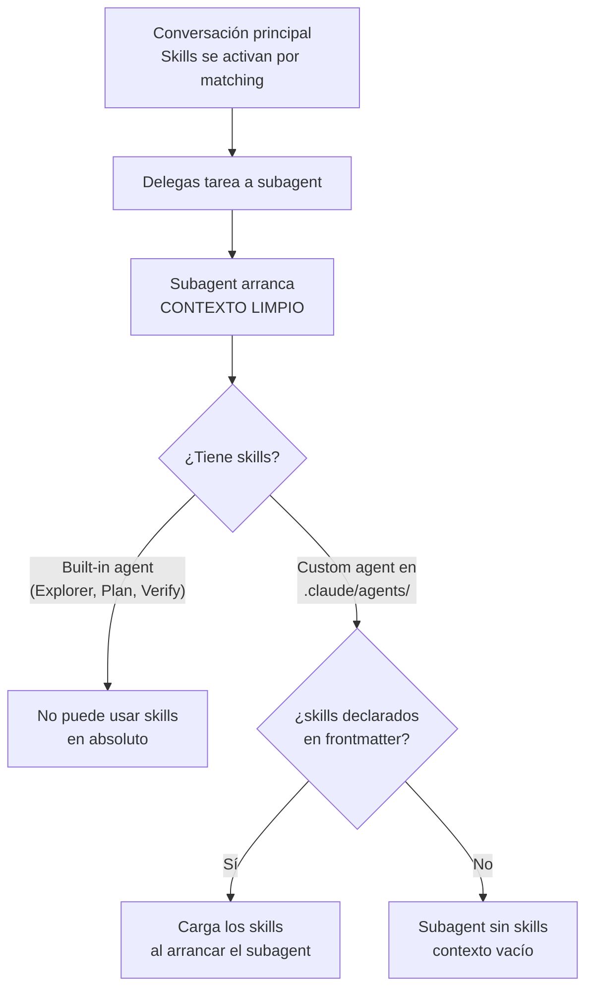

# Compartiendo Skills

> **Resumen Feynman (una frase):** Un skill compartido vale exponencialmente más que uno
> personal — hay tres canales de distribución (repo, plugin, enterprise) con diferente
> alcance y prioridad, y un gotcha crítico: los subagentes no heredan skills
> automáticamente, hay que declararlos explícitamente en su frontmatter.

---

## 1) Analogía sencilla

Imagina que escribiste un checklist de auditoría de contratos tan bueno que quieres
que todo tu equipo lo use:

- **Repo commit** = fotocopias el checklist y lo dejas en la carpeta compartida del
  proyecto. Todo el que trabaja en ese proyecto lo tiene automáticamente.
- **Plugin** = publicas el checklist en un catálogo profesional. Cualquier empresa del
  sector puede descargarlo e instalarlo.
- **Enterprise managed settings** = la dirección jurídica lo convierte en política
  corporativa obligatoria. Nadie puede ignorarlo ni reemplazarlo con su versión personal.

Y el gotcha de subagents: si contratas a un asistente temporal (subagent) para hacer
parte del trabajo, él empieza desde cero — **no ha leído tus checklists** a menos que
se los des explícitamente al asignarlo.

---

## 2) ¿Qué es realmente?

Tres mecanismos de distribución con diferente alcance, esfuerzo y prioridad de jerarquía:

| Método | Alcance | Cómo llega al usuario | Prioridad en jerarquía |
|--------|---------|----------------------|----------------------|
| **Repo commit** (`.claude/skills/`) | Equipo del proyecto | `git pull` | Project (3°) |
| **Plugin** | Comunidad / múltiples repos | Marketplace de Claude Code | Plugin (4°, más baja) |
| **Enterprise managed settings** | Toda la organización | Admin despliega centralmente | Enterprise (1°, más alta) |

---

## 3) ¿Cómo funciona cada método?

### 3a. Repo commit — el método más simple

```
mi-repo/
  .claude/
    skills/          ← skills del proyecto, versionados con el código
      dag-review/
        SKILL.md
      bq-query-review/
        SKILL.md
    agents/          ← subagents custom del proyecto
    hooks/           ← hooks del proyecto
    settings.json    ← configuración del proyecto
```

Cualquiera que clone el repo obtiene los skills en el siguiente `git pull`.
Los updates se distribuyen como cualquier otro cambio de código.

**Ideal para:**
- Estándares de código del equipo
- Workflows específicos del proyecto
- Skills que referencian la estructura del codebase

### 3b. Plugins — distribución cross-repo

En el proyecto del plugin, la estructura de skills replica la de `.claude/`:

```
mi-plugin/
  skills/
    frontend-review/
      SKILL.md
    accessibility-audit/
      SKILL.md
```

Se publica en un marketplace y otros usuarios lo instalan en Claude Code.

**Ideal para:** skills reutilizables que no son específicos de un proyecto particular.

### 3c. Enterprise managed settings — despliegue organizacional

```json
{
  "strictKnownMarketplaces": [
    {
      "source": "github",
      "repo": "acme-corp/approved-plugins"
    },
    {
      "source": "npm",
      "package": "@acme-corp/compliance-plugins"
    }
  ]
}
```

El admin despliega centralmente. Los skills enterprise **no pueden ser sobreescritos**
por skills personales o de proyecto con el mismo nombre.

`strictKnownMarketplaces` define además desde qué fuentes pueden instalarse plugins —
control sobre la cadena de suministro de extensiones.

**Ideal para:** estándares obligatorios, compliance, seguridad, prácticas que **deben**
ser consistentes en toda la organización. La palabra clave es "must".

### 3d. Skills + Subagents — el gotcha



**Los subagents custom** se definen en `.claude/agents/` con un archivo markdown:

```yaml
---
name: frontend-security-accessibility-reviewer
description: "Use this agent when you need to review frontend code for accessibility..."
tools: Bash, Glob, Grep, Read, WebFetch, WebSearch, Skill
model: sonnet
color: blue
skills: accessibility-audit, performance-check
---
```

El campo `skills` lista los skills que se cargan **al arrancar el subagent** — no on
demand como en la conversación principal. Todos los skills listados están siempre en
contexto durante la vida del subagent.

---

## 4) ¿Cuándo usar cada método?

| Situación | Método |
|-----------|--------|
| Estándares del equipo en un repo específico | Repo commit |
| Skills útiles para múltiples proyectos o la comunidad | Plugin |
| Política obligatoria de toda la organización | Enterprise managed settings |
| Quiero que un subagent aplique skills específicos | Custom agent con campo `skills` |
| Quiero que Explorer/Plan/Verify usen un skill | ❌ No es posible — solo custom agents |

---

## 5) Ejemplo práctico mínimo

**Custom subagent para revisión de DAGs en Protección:**

```bash
# 1. Los skills del proyecto ya existen en el repo
# .claude/skills/airflow-dag-review/SKILL.md  ← ya creado
# .claude/skills/bq-query-review/SKILL.md     ← ya creado

# 2. Crear el agente custom (via /agents o manualmente)
mkdir -p .claude/agents
```

```yaml
# .claude/agents/pipeline-reviewer.md
---
name: pipeline-reviewer
description: "Use this agent to review Airflow DAGs and BigQuery queries for
             compliance with Protección's data pipeline standards."
tools: Bash, Glob, Grep, Read, Skill
model: sonnet
color: purple
skills: airflow-dag-review, bq-query-review
---

You are a specialized pipeline reviewer for Protección's data infrastructure.
Apply both skills to every review request.
Report findings grouped by: critical, warning, suggestion.
```

Ahora cuando delegues: "revisa este DAG con el pipeline-reviewer", el subagent arranca
con ambos skills ya cargados y los aplica a todo lo que hace.

---

## 6) Conexiones con otros conceptos

- `→ extiende:` [[02_creating_your_first_skill]] — aquí la creación individual se convierte en distribución a escala.
- `→ extiende:` [[04_skills_vs_other_features]] — profundiza la relación skills ↔ subagents que esa nota dejó abierta.
- `→ requiere:` [[03_configuration_and_multi_file_skills]] — el campo `allowed-tools` de skills cobra más sentido cuando hay subagents con permisos acotados.
- `→ aplica en:` [[04_claude_code/_overview]] — el patrón de subagents + skills es un patrón central de Claude Code en equipos.
- `→ aplica en:` [[_comparativas/claude_code_customization_features]] — actualizar la tabla con el detalle de distribución.

---

## 7) Preguntas Feynman

1. Tu equipo tiene un skill de `code-review` en el repo y tú tienes uno personal con
   el mismo nombre. ¿Cuál gana? ¿Cómo cambiaría la respuesta si la empresa despliega
   uno enterprise con el mismo nombre?

2. ¿Por qué los built-in agents (Explorer, Plan, Verify) no pueden usar skills y los
   custom agents sí? ¿Qué implicación de diseño tiene eso para cómo estructuras tu flujo?

3. En la conversación principal, los skills cargan on demand. En un subagent custom,
   los skills cargan al arrancar. ¿Qué consecuencia tiene esto para el context window
   del subagent si listas 10 skills en su frontmatter?

4. ¿Cuándo tiene sentido publicar un skill como plugin en vez de simplemente meterlo
   en el repo del proyecto? ¿Qué pregunta debes hacerte para tomar esa decisión?

5. Un administrador enterprise usa `strictKnownMarketplaces` para restringir los plugins
   a un repo interno aprobado. ¿Qué problema de seguridad está mitigando con eso?

---

## 8) Tarjetas Anki

**Q:** ¿Cómo se comparten skills de proyecto con todo el equipo automáticamente?
**A:** Colocándolos en `.claude/skills/` dentro del repo y commiteándolos a Git. Cualquiera
que clone o haga `git pull` los recibe automáticamente.

**Q:** ¿Por qué los subagents no ven los skills de la conversación principal por defecto?
**A:** Los subagents arrancan con un **contexto limpio** — no heredan el contexto de la
conversación principal. Para que un subagent use skills, deben declararse explícitamente
en el campo `skills` de su frontmatter.

**Q:** ¿Qué agents de Claude Code pueden usar skills y cuáles no?
**A:** Solo los **custom agents** definidos en `.claude/agents/` pueden usar skills (si
los declaran en `skills:`). Los built-in agents (Explorer, Plan, Verify) no pueden usar
skills en absoluto.

**Q:** ¿Cuándo se cargan los skills en un subagent custom vs. en la conversación principal?
**A:** En subagent custom: **al arrancar** (todos los declarados, siempre). En conversación
principal: **on demand**, solo cuando hay match semántico.

**Q:** ¿Qué controla `strictKnownMarketplaces` en enterprise managed settings?
**A:** Define desde qué fuentes (repos de GitHub, paquetes npm) se permite instalar plugins
en la organización — control de la cadena de suministro de extensiones.

---

## 9) Lo que no es obvio (trampas y confusiones frecuentes)

**El gotcha de subagents es el error más costoso en producción.**
Configuras skills cuidadosamente, tu conversación principal funciona perfecto, delegas
a un subagent y las revisiones son inconsistentes. Causa: el subagent nunca tuvo los
skills. No hay warning — simplemente no los hereda.

**Skills en subagents = eager loading, no lazy loading.**
En la conversación principal los skills cargan on demand cuando hay match. En un subagent
custom, todos los skills declarados en `skills:` se cargan al arrancar. Si declaras 8
skills en un subagent, los 8 están en contexto desde el primer mensaje. Ten esto en
cuenta para no saturar el contexto del subagent con skills que rara vez usará.

**Explorer, Plan y Verify son agentes built-in — no los puedes extender con skills.**
Si necesitas que una tarea de exploración use un skill de onboarding, debes crear tu
propio agente custom `explorer-with-onboarding` en `.claude/agents/`. No hay forma de
inyectar skills en los built-ins.

**Plugin ≠ "skill para muchos proyectos del equipo".**
Si tus skills son para tu equipo pero viven en múltiples repos del equipo, la solución
es un repo de plugins interno — no publicarlos en un marketplace público. El mecanismo
es el mismo, pero la distribución es controlada vía `strictKnownMarketplaces`.

**La carpeta `.claude/` es la unidad de configuración del proyecto.**
`agents/`, `hooks/`, `skills/` y `settings.json` viven todos ahí. Cuando pienses en
"qué va a Git", la respuesta es: todo `.claude/` excepto lo que sea explícitamente
personal.

---

### Registro personal

- Qué me sorprendió o conectó con algo que ya sabía: El patrón de subagent con skills
  declarados en frontmatter es análogo a los init containers de Kubernetes — cargas el
  contexto necesario al arrancar el pod antes de que empiece a servir tráfico. La
  diferencia es que aquí pagas en tokens, no en tiempo de startup.
- Dudas que quedaron abiertas: ¿Puede un subagent custom descubrir y cargar skills
  on demand como lo hace la conversación principal, o siempre es eager loading desde
  el frontmatter? ¿Hay un mecanismo híbrido?
- Siguientes pasos: Crear el agente `pipeline-reviewer` para Protección con los skills
  `airflow-dag-review` y `bq-query-review` — el ejemplo de la sección 5 está listo
  para implementar.
