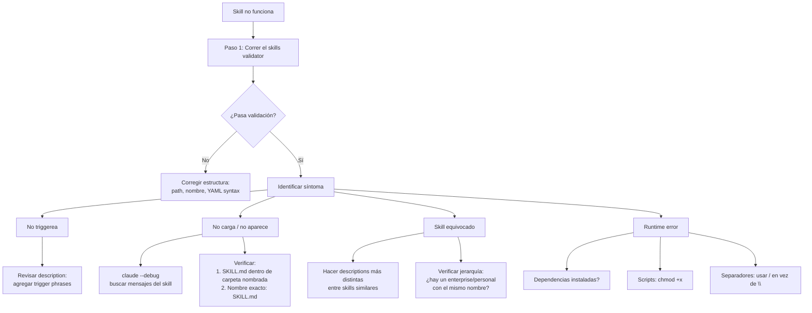

# Troubleshooting de Skills

> **Resumen Feynman (una frase):** Los fallos de skills caen en cuatro categorías
> predecibles — no dispara, no carga, carga el equivocado, falla en ejecución — y cada
> una tiene una causa raíz casi siempre obvia si sabes dónde mirar.

---

## 1) Analogía sencilla

Imagina que tienes un asistente con un archivador de recetas especializadas. Hay cuatro
formas en que puede fallar:

1. **No busca la receta** — nunca conectó lo que pediste con que existe una receta para eso.
2. **No puede abrir el archivador** — la carpeta está mal ubicada o el nombre está mal escrito.
3. **Saca la receta equivocada** — dos recetas tienen descripciones tan parecidas que se confunde.
4. **La receta existe pero el ingrediente no está** — la instrucción dice "usa trufa negra" pero no hay.

Cada fallo tiene una solución diferente. El primer paso siempre es el mismo: antes de
buscar el problema tú mismo, pídele al validador que revise la estructura.

---

## 2) ¿Qué es realmente?

Un mapa de síntoma → causa raíz → solución para los cuatro tipos de fallo:

| Síntoma | Causa raíz más probable | Solución |
|---------|------------------------|----------|
| Skill no se activa | Description con poco overlap semántico | Agregar trigger phrases |
| Skill no aparece en lista | Estructura de archivos incorrecta | Verificar path y nombre exacto |
| Se activa el skill equivocado | Descriptions demasiado similares | Hacerlas más específicas y distintas |
| Skill de mayor prioridad interfiere | Conflicto de nombre en la jerarquía | Renombrar el skill propio |
| Plugin skills no aparecen | Cache desactualizado | Limpiar cache, reiniciar, reinstalar |
| Error en ejecución | Dependencias, permisos, separadores de path | Ver checklist runtime |

---

## 3) ¿Cómo funciona el diagnóstico? (flujo sistemático)



### Diagnóstico por síntoma

**1. Skill no triggerea**

El matching es semántico, no exacto. Si tu petición no tiene suficiente overlap con
la `description`, no hay match. Solución: agregar frases de trigger que reflejen cómo
realmente formulas las peticiones.

```yaml
# Antes (vago):
description: Helps with performance.

# Después (trigger phrases explícitas):
description: Profiles and optimizes code performance. Use when asked to "profile this",
             "why is this slow", "make this faster", "optimize performance", or when
             analyzing execution time.
```

**2. Skill no carga**

Dos requisitos estructurales que se rompen con frecuencia:

```
✅ Correcto:
~/.claude/skills/
  mi-skill/          ← carpeta nombrada
    SKILL.md         ← exactamente "SKILL.md" (SKILL en mayúsculas, .md en minúsculas)

❌ Incorrecto:
~/.claude/skills/
  SKILL.md           ← archivo directo en la raíz de skills (sin carpeta)
  mi-skill/
    skill.md         ← nombre en minúsculas → no detectado
    Skill.md         ← capitalización incorrecta → no detectado
```

Comando de diagnóstico:
```bash
claude --debug
# Buscar en la salida mensajes que mencionen el nombre del skill
# Generalmente apunta directo al problema
```

**3. Skill equivocado / conflicto de prioridad**

Si dos skills tienen nombres idénticos, la jerarquía decide: Enterprise > Personal >
Project > Plugin. Si tu skill personal está siendo ignorado por uno enterprise con el
mismo nombre, las opciones son:
- Renombrarlo (camino más fácil): `code-review` → `backend-code-review`
- Hablar con el admin sobre el skill enterprise

**4. Plugin skills no aparecen**

```bash
# Secuencia de recuperación:
# 1. Limpiar cache de Claude Code
# 2. Reiniciar Claude Code
# 3. Reinstalar el plugin
# Si persiste → estructura del plugin incorrecta → correr el validator sobre el plugin
```

**5. Runtime errors**

```bash
# Dependencias
pip install paquete-requerido   # o npm install, etc.
# Documentar dependencias en el SKILL.md para que Claude sepa qué necesita

# Permisos de scripts
chmod +x .claude/skills/mi-skill/scripts/validate.sh

# Path separators — siempre forward slash, incluso en Windows
# ✅ references/architecture-guide.md
# ❌ references\architecture-guide.md
```

---

## 4) ¿Cuándo usar el validator vs. `claude --debug`?

| Herramienta | Úsala para |
|-------------|-----------|
| **Skills validator** | Primer paso siempre — detecta problemas estructurales (YAML, paths, nombres) antes de ejecutar |
| **`claude --debug`** | Cuando el validator pasa pero el skill no aparece — muestra errores de carga en tiempo real |

---

## 5) Checklist rápido de troubleshooting

```
□ ¿Corre el validator sin errores?
□ ¿El SKILL.md está DENTRO de una carpeta nombrada (no en la raíz de skills/)?
□ ¿El nombre del archivo es exactamente "SKILL.md" (S-K-I-L-L en mayúsculas, .md en minúsculas)?
□ ¿Reiniciaste Claude Code después del último cambio?
□ ¿La description tiene suficientes trigger phrases que matcheen cómo pides las cosas?
□ ¿Las descriptions de todos tus skills son suficientemente distintas entre sí?
□ ¿Hay un skill de mayor prioridad con el mismo nombre?
□ Para scripts: ¿tienen permiso de ejecución (chmod +x)?
□ ¿Los paths en el SKILL.md usan forward slashes?
□ Para plugins: ¿limpiaste cache y reinstalaste?
```

---

## 6) Conexiones con otros conceptos

- `→ requiere:` [[02_creating_your_first_skill]] — los requisitos estructurales (carpeta nombrada, nombre exacto, restart) son los que se validan aquí.
- `→ requiere:` [[01_que_son_skills]] — entender el matching semántico es prerequisito para diagnosticar "no triggerea".
- `→ requiere:` [[05_sharing_skills]] — los conflictos de prioridad solo tienen sentido habiendo entendido la jerarquía Enterprise > Personal > Project > Plugin.
- `→ requiere:` [[03_configuration_and_multi_file_skills]] — los errores de runtime de scripts y paths se originan en la estructura multi-archivo.

---

## 7) Preguntas Feynman

1. Tu skill `performance-optimizer` nunca se activa aunque existe y pasa el validator.
   ¿Cuál es el primer cambio que harías y cómo sabrías si funcionó?

2. Creaste un skill hace 10 minutos, el validator no reporta errores, pero no aparece
   en la lista de skills disponibles. ¿Cuáles son los dos pasos de diagnóstico en orden?

3. Tienes tres skills: `review`, `code-review`, y `frontend-review`. Claude está usando
   el incorrecto en varias situaciones. Sin eliminar ninguno, ¿qué cambiarías?

4. Un script en tu skill falla con "Permission denied". ¿Qué comando corres y por qué
   ese error ocurre en primer lugar?

5. ¿Por qué el validator debe ser siempre el primer paso, antes de `claude --debug` o
   de revisar la description?

---

## 8) Tarjetas Anki

**Q:** Un skill existe y pasa el validator pero no se activa. ¿Cuál es la causa más probable?
**A:** La `description` no tiene suficiente overlap semántico con cómo el usuario formula
la petición. Solución: agregar trigger phrases que reflejen el vocabulario real del usuario.

**Q:** ¿Cuáles son los dos requisitos estructurales para que Claude detecte un skill?
**A:** 1) El `SKILL.md` debe estar **dentro de una carpeta nombrada** (no en la raíz de
`skills/`). 2) El archivo debe llamarse exactamente `SKILL.md` — `SKILL` en mayúsculas,
`.md` en minúsculas.

**Q:** ¿Qué hace `claude --debug` en el contexto de troubleshooting de skills?
**A:** Muestra errores de carga en tiempo real. Útil cuando el skill pasa el validator
pero no aparece en la lista de skills disponibles — generalmente apunta directo al problema.

**Q:** Un script en un skill falla con "Permission denied". ¿Cuál es el fix?
**A:** `chmod +x ruta/al/script.sh` — los scripts referenciados por un skill necesitan
permiso de ejecución explícito.

**Q:** ¿Por qué se deben usar forward slashes en paths dentro de SKILL.md incluso en Windows?
**A:** Claude Code procesa los paths independientemente del OS. Los backslashes de Windows
(`\`) pueden no interpretarse correctamente en el contexto del skill.

---

## 9) Lo que no es obvio (trampas y confusiones frecuentes)

**El validator no detecta problemas de matching — solo problemas estructurales.**
Si el validator pasa y el skill aún no triggerea, el problema es semántico (description),
no estructural. Son dos capas de diagnóstico diferentes.

**El "restart required" aplica también después de arreglar el problema.**
Corriges la estructura, corres el validator (pasa), pruebas el skill... y sigue fallando.
Causa: no reiniciaste Claude Code después de la corrección. El índice sigue siendo el
del arranque anterior.

**Descriptions demasiado largas también pueden causar problemas de matching.**
Aunque el límite es 1.024 caracteres, una description que intenta cubrir todos los casos
posibles puede diluir la señal semántica. Más específico suele ser mejor que más exhaustivo.

**`chmod +x` no es solo para Linux/Mac.**
En WSL o Git Bash en Windows, los scripts también necesitan el permiso. Si desarrollas
en Windows pero el skill va a correr en un entorno Linux (CI, contenedor), el permiso
debe estar commiteado correctamente en Git (`git update-index --chmod=+x script.sh`).

**Un skill puede pasar el validator y aún tener un YAML mal estructurado en el cuerpo.**
El validator verifica el frontmatter. Si el cuerpo del SKILL.md tiene indentación
incorrecta en bloques de código o caracteres especiales sin escapar, puede causar
comportamientos erráticos durante la ejecución aunque la validación estructural pase.

---

### Registro personal

- Qué me sorprendió o conectó con algo que ya sabía: El flujo de diagnóstico (validator
  primero, luego `--debug`, luego revisar la description) es idéntico al que uso con
  errores de Airflow: primero valido el DAG (`airflow dags validate`), luego reviso los
  logs, luego reviso la lógica. La misma disciplina de no saltarse capas.
- Dudas que quedaron abiertas: ¿El skills validator es una herramienta oficial de
  Anthropic o de la comunidad? ¿Se actualiza con cada versión del open standard de skills?
- Siguientes pasos: Configurar el validator en mi entorno como parte del pre-commit hook
  del repo de Protección, para que los skills se validen automáticamente antes de
  hacer push.
