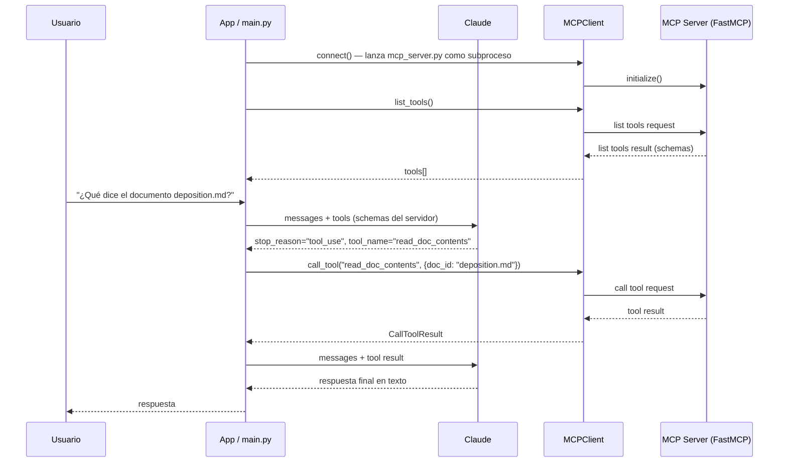

# Model Context Protocol (MCP)

> **Resumen Feynman (una frase):** MCP es el protocolo que le permite a una aplicación
> delegar la definición y ejecución de herramientas a un servidor especializado, para que
> el desarrollador no tenga que escribir schemas JSON ni funciones de integración a mano.

---

## 1) Analogía sencilla

Imagina que abres un restaurante (tu aplicación con Claude). Normalmente tendrías que
contratar cocineros, diseñar el menú, construir la cocina, comprar los ingredientes y
escribir cada receta desde cero. Eso es lo que ocurre cuando implementas herramientas
directamente con la API de Claude.

Con MCP, en cambio, existe un **proveedor de servicios de cocina** (el servidor MCP) que ya
tiene todo listo:

- Una **carta de servicios** (tools) que Claude puede pedir cuando lo necesite.
- Una **despensa visible** (resources) donde tu app puede ir a buscar datos sin esperar a que Claude los pida.
- **Recetas estandarizadas** (prompts) pre-probadas por el chef, que cualquier restaurante puede usar tal cual.

Tu trabajo se reduce a conectarte a ese proveedor y dejar que Claude coordine los pedidos.

---

## 2) ¿Qué es realmente?

MCP (Model Context Protocol) es una **capa de comunicación estandarizada** entre una
aplicación (cliente MCP) y un servidor especializado (servidor MCP). El servidor expone
tres tipos de capacidades:

| Primitiva | Qué es | Quién la invoca | Cuándo |
|-----------|--------|-----------------|--------|
| **Tool** | Función ejecutable | Claude (vía tool use) | Reactivo: cuando Claude decide que la necesita |
| **Resource** | Dato addressable por URI | El cliente directamente | Proactivo: cuando el usuario menciona un documento |
| **Prompt** | Plantilla de mensaje pre-evaluada | El cliente directamente | Cuando el usuario invoca un slash command |

El servidor MCP hace por el desarrollador lo que de otro modo requeriría:
escribir schemas JSON, implementar funciones de ejecución, manejar errores y mantener
todo sincronizado con la API de Claude.

**Protocolo de transporte:** stdio (mismo equipo), HTTP o WebSockets (servidor remoto).
El más común en desarrollo es **stdio** — el cliente lanza el servidor como subproceso y
se comunican por stdin/stdout.

---

## 3) ¿Cómo funciona? (mecanismo interno)

### 3.1 El servidor — FastMCP + tres decoradores

```python
from pydantic import Field
from mcp.server.fastmcp import FastMCP
from mcp.server.fastmcp.prompts import base

mcp = FastMCP("NombreServidor", log_level="ERROR")
```

**Tool** — acción reactiva que Claude invoca:

```python
@mcp.tool(
    name="read_doc_contents",
    description="Lee el contenido de un documento y lo retorna como string"
)
def read_document(
    doc_id: str = Field(description="Id del documento a leer")
):
    if doc_id not in docs:
        raise ValueError(f"Doc with id {doc_id} not found")
    return docs[doc_id]
```

El SDK de FastMCP **genera el schema JSON automáticamente** desde la firma de la función y
los `Field()`. No hay que escribir el schema a mano.

**Resource** — dato addressable por URI:

```python
# Recurso directo (URI estática)
@mcp.resource("docs://documents", mime_type="application/json")
def list_docs() -> list[str]:
    return list(docs.keys())

# Recurso templado (URI con parámetro — el SDK lo parsea y lo pasa como kwarg)
@mcp.resource("docs://documents/{doc_id}", mime_type="text/plain")
def fetch_doc(doc_id: str) -> str:
    if doc_id not in docs:
        raise ValueError(f"Doc with id {doc_id} not found")
    return docs[doc_id]
```

**Prompt** — plantilla de mensaje que retorna una lista de mensajes:

```python
@mcp.prompt(
    name="format",
    description="Reformatea el documento en Markdown."
)
def format_document(
    doc_id: str = Field(description="Id del documento a formatear")
) -> list[base.Message]:
    prompt = f"""
Tu objetivo es reformatear el documento <document_id>{doc_id}</document_id>
usando sintaxis Markdown. Usa la herramienta 'edit_document' para guardar los cambios.
"""
    return [base.UserMessage(prompt)]
```

**Entrypoint del servidor:**

```python
if __name__ == "__main__":
    mcp.run(transport="stdio")
```

---

### 3.2 El cliente — MCPClient

El cliente MCP es una **clase wrapper sobre `ClientSession`** del SDK de MCP.
Se gestiona con `AsyncExitStack` para garantizar limpieza de recursos:

```python
from mcp import ClientSession, StdioServerParameters, types
from mcp.client.stdio import stdio_client
from contextlib import AsyncExitStack
from pydantic import AnyUrl
import json

class MCPClient:
    def __init__(self, command: str, args: list[str], env=None):
        self._command = command
        self._args = args
        self._session: ClientSession | None = None
        self._exit_stack = AsyncExitStack()

    async def connect(self):
        server_params = StdioServerParameters(
            command=self._command, args=self._args, env=self._env
        )
        stdio_transport = await self._exit_stack.enter_async_context(
            stdio_client(server_params)
        )
        _stdio, _write = stdio_transport
        self._session = await self._exit_stack.enter_async_context(
            ClientSession(_stdio, _write)
        )
        await self._session.initialize()

    async def list_tools(self) -> list[types.Tool]:
        result = await self._session.list_tools()
        return result.tools

    async def call_tool(self, tool_name: str, tool_input: dict):
        return await self._session.call_tool(tool_name, tool_input)

    async def list_prompts(self) -> list[types.Prompt]:
        result = await self._session.list_prompts()
        return result.prompts

    async def get_prompt(self, prompt_name: str, args: dict[str, str]):
        result = await self._session.get_prompt(prompt_name, args)
        return result.messages

    async def read_resource(self, uri: str):
        result = await self._session.read_resource(AnyUrl(uri))
        resource = result.contents[0]
        if isinstance(resource, types.TextResourceContents):
            if resource.mimeType == "application/json":
                return json.loads(resource.text)
            return resource.text

    async def cleanup(self):
        await self._exit_stack.aclose()
        self._session = None

    async def __aenter__(self):
        await self.connect()
        return self

    async def __aexit__(self, *_):
        await self.cleanup()
```

---

### 3.3 Flujo completo de una conversación con herramientas MCP



---

### 3.4 Recursos vs. Tools: diferencia clave

| | **Tools** | **Resources** |
|---|---|---|
| **Iniciador** | Claude decide llamarlas | El cliente las solicita directamente |
| **Cuándo** | Reactivo (Claude necesita hacer algo) | Proactivo (usuario menciona `@documento`) |
| **Cómo** | `call_tool(name, input)` | `read_resource(uri)` |
| **URI** | N/A — identificado por nombre | `docs://documents/{doc_id}` |

---

### 3.5 Prompts como slash commands

En el cliente, los prompts aparecen como autocompletado (ej. `/format`). El flujo:

1. El servidor define `@mcp.prompt(name="format", ...)` con parámetros.
2. El cliente llama `list_prompts()` para mostrar opciones al usuario.
3. El usuario elige y provee argumentos.
4. El cliente llama `get_prompt("format", {"doc_id": "plan.md"})`.
5. El servidor retorna `[UserMessage(...)]` listo para enviar a Claude.

El valor es que esos prompts son **escritos y evaluados por el autor del servidor**, no por
el usuario final — garantizan calidad sin que el usuario sepa nada de prompt engineering.

---

### 3.6 Inspección con MCP Inspector

```bash
# Requiere Node.js instalado (npx)
mcp dev mcp_server.py
```

Abre en `http://localhost:5173`. Permite:
- Conectarse al servidor y ver las tres primitivas (tools, resources, prompts).
- Invocar herramientas manualmente con formularios de parámetros.
- Verificar resultados y errores antes de integrar con la app real.

---

## 4) ¿Cuándo usarlo?

**Usar MCP cuando:**
- Quieres integrar servicios externos (GitHub, Jira, Slack) sin escribir schemas JSON desde cero.
- El servidor MCP oficial del servicio ya existe (AWS, Linear, etc.) — solo conectas.
- Construyes una aplicación que otros desarrolladores ampliarán con sus propios servidores.
- Necesitas que Claude Code acceda a herramientas personalizadas de tu equipo.

**No usar MCP cuando:**
- Tienes 1-2 herramientas simples y totalmente propias — tool use directo es más simple.
- El overhead de stdio/subproceso no es tolerable (ej. serverless con cold starts extremos).

---

## 5) Ejemplo práctico mínimo

Servidor mínimo funcional:

```python
from mcp.server.fastmcp import FastMCP
from pydantic import Field

mcp = FastMCP("MiServidor")
docs = {"readme.txt": "Contenido del readme"}

@mcp.tool(name="leer_doc", description="Lee un documento por su id")
def leer(doc_id: str = Field(description="Id del doc")) -> str:
    return docs.get(doc_id, "No encontrado")

if __name__ == "__main__":
    mcp.run(transport="stdio")
```

Cliente mínimo de prueba:

```python
import asyncio
from mcp_client import MCPClient

async def main():
    async with MCPClient(command="uv", args=["run", "mcp_server.py"]) as client:
        tools = await client.list_tools()
        print(tools)
        result = await client.call_tool("leer_doc", {"doc_id": "readme.txt"})
        print(result)

asyncio.run(main())
```

---

## 6) Conexiones con otros conceptos

- `→ extiende:` [[02_claude_api/07x_tool_use/070_tool_use]] — MCP usa el mismo mecanismo de tool use bajo el capó; añade la capa de servidor que genera los schemas automáticamente.
- `→ requiere:` [[02_claude_api/01x_api_fundamentals/010_fundamentos_api_y_conversaciones]] — entender el flujo stateless de la API es prerequisito para entender cómo el cliente MCP inserta las tools en cada request.
- `→ aplica en:` [[04_claude_code/_overview]] — Claude Code es un cliente MCP; puede conectarse a cualquier servidor MCP con `claude mcp add`.
- `→ contrasta:` [[02_claude_api/07x_tool_use/070_tool_use]] — Tool use directo: tú escribes el schema y ejecutas la función. MCP: el servidor lo hace por ti. Ambos terminan en el mismo loop `stop_reason == "tool_use"`.

---

## 7) Preguntas Feynman

1. Si el servidor MCP genera los schemas automáticamente desde los decoradores Python, ¿cómo le llega a Claude ese schema? ¿Quién hace el puente?
2. ¿Cuál es la diferencia entre llamar a `call_tool()` desde el cliente y llamar a `read_resource()`? ¿Por qué existen dos mecanismos distintos?
3. Un prompt MCP retorna `list[base.Message]`. ¿Por qué es una lista de mensajes y no un string? ¿Qué ventaja tiene eso al integrarlo con Claude?
4. Si el servidor MCP corre como subproceso (stdio), ¿qué pasa con el estado en memoria (ej. el diccionario `docs`) cuando el cliente se desconecta y vuelve a conectar?
5. ¿Por qué el Inspector de MCP requiere Node.js si el servidor está escrito en Python?

---

## 8) Tarjetas Anki

**Q:** ¿Cuáles son las tres primitivas de MCP y qué rol cumple cada una?
**A:** **Tools** (acciones reactivas que Claude invoca), **Resources** (datos proactivos que el cliente solicita por URI), **Prompts** (plantillas pre-evaluadas que el cliente expone como slash commands).

**Q:** ¿Qué hace FastMCP con la firma de una función decorada con `@mcp.tool`?
**A:** Genera automáticamente el schema JSON para Claude usando los tipos de Python y los `Field()` de Pydantic, eliminando la necesidad de escribir el schema a mano.

**Q:** ¿Cuál es la diferencia entre un resource directo y uno templado en MCP?
**A:** El **directo** tiene URI estática (`docs://documents`) y devuelve datos fijos. El **templado** tiene URI con parámetros (`docs://documents/{doc_id}`) y el SDK parsea el parámetro y lo pasa como kwarg a la función.

**Q:** ¿Qué retorna `get_prompt()` en el cliente MCP y para qué sirve?
**A:** Retorna `list[base.Message]` — mensajes listos para enviar directamente a Claude. Permite usar prompts pre-probados por el autor del servidor sin que el usuario final sepa de prompt engineering.

**Q:** ¿Por qué `AsyncExitStack` es importante en el cliente MCP?
**A:** Garantiza limpieza ordenada de recursos asíncronos (sesión, transporte stdio) aunque ocurran excepciones — equivalente al `with` statement pero para contextos async anidados.

---

## 9) Lo que no es obvio (trampas y confusiones frecuentes)

**MCP no reemplaza tool use — lo encapsula.** El loop `stop_reason == "tool_use"` sigue existiendo en tu app. Lo que cambia es quién define los schemas y quién ejecuta las funciones: el servidor MCP, no tu código de aplicación.

**Los resources no son consultados por Claude automáticamente.** Es el *cliente* (tu app) quien decide cuándo llamar `read_resource()`. Típicamente cuando el usuario menciona `@documento` en la UI — no esperes que Claude los solicite solo.

**`is not` vs `not in` en Python:** Un error clásico al verificar pertenencia a un dict es usar `if doc_id is not docs:` en vez de `if doc_id not in docs:`. El primero compara identidad de objetos (siempre True para un string vs un dict); el segundo verifica membresía. Ver corrección aplicada en [mcp_server.py:24](010x_mcp/cli_project/mcp_server.py).

**El Inspector requiere Node.js** aunque el servidor sea Python. El Inspector web es una app Node.js que se lanza con `npx`. Si `mcp dev` no funciona, verificar que `node` y `npx` estén en el PATH.

**Windows + asyncio + subprocesos:** Al usar stdio en Windows con `asyncio`, el event loop debe configurarse con `WindowsProactorEventLoopPolicy` antes de `asyncio.run()`. Los `ResourceWarning` de "I/O operation on closed pipe" en `__del__` son ruido benigno del cleanup de pipes — no indican fallo funcional.

**El estado del servidor es por sesión (in-memory).** El diccionario `docs` en el servidor vive solo mientras el subproceso está activo. Si el cliente se reconecta, se lanza un nuevo proceso y el estado se reinicia. Para persistencia real se necesita storage externo.

---

### Registro personal

- Qué me sorprendió o conectó con algo que ya sabía: La separación entre resources (proactivos) y tools (reactivos) es exactamente el patrón pull vs push que ya conozco de pipelines de datos en Airflow.
- Dudas que quedaron abiertas: ¿Cómo manejan los servidores MCP la autenticación cuando el servidor es remoto (HTTP)?
- Siguientes pasos: Completar los TODOs del cli_project (prompt `summarize`), probar el Inspector una vez instalado Node.js, avanzar a Course 3.
