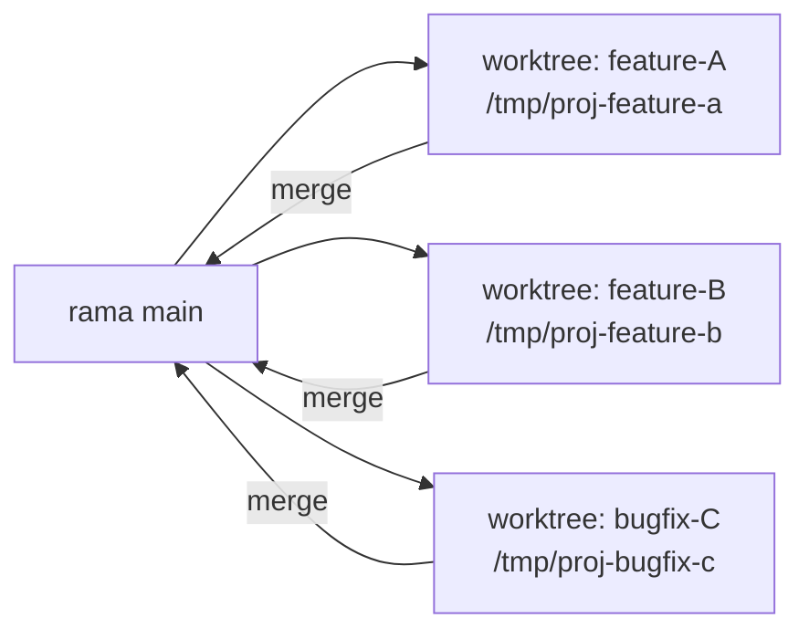
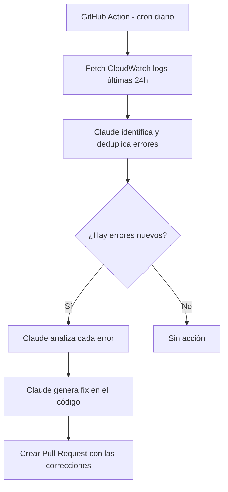
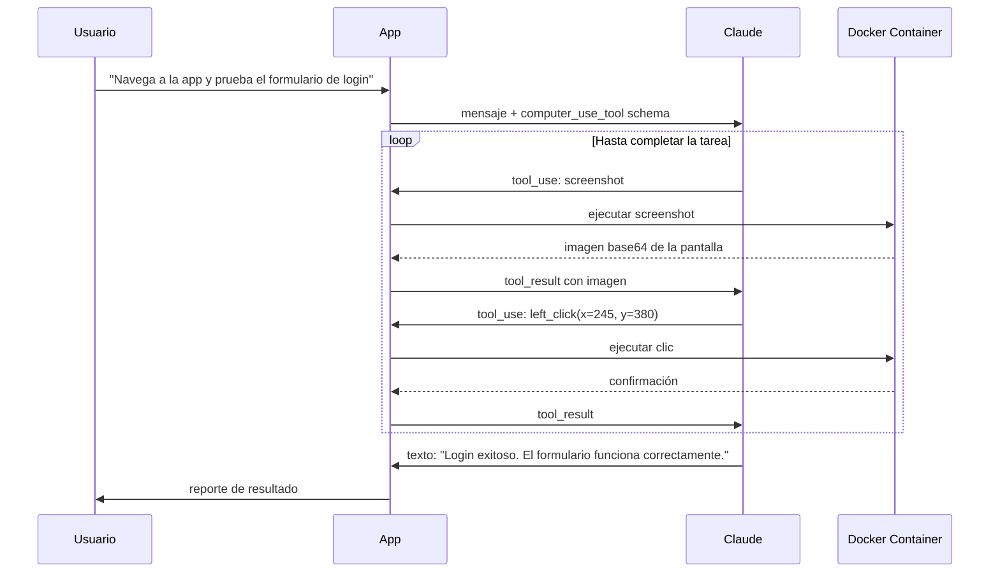

# Anthropic Apps — Claude Code y Computer Use

> **Resumen Feynman (una frase):** Claude Code es un ingeniero de software colaborativo
> que opera en tu terminal y trabaja con archivos; Computer Use es ese mismo modelo pero
> mirando una pantalla y controlando mouse y teclado — ambos son aplicaciones concretas
> del loop de tool use de la API.

---

## 1) Analogía sencilla

**Claude Code** es como contratar a un ingeniero senior que trabaja en tu oficina: puede
leer todos los archivos del proyecto, modificar código, ejecutar comandos y conectarse a
servicios externos. Le das una instrucción en lenguaje natural y él gestiona la ejecución.

**Computer Use** es el mismo ingeniero, pero ahora trabajando de forma remota con acceso
a una computadora virtual: ve la pantalla con capturas de imagen, hace clic, escribe
texto y navega interfaces exactamente como lo haría un humano. Solo que en vez de ojos,
usa el modelo de visión de Claude; y en vez de manos, usa la API de herramientas.

La diferencia clave: Claude Code opera sobre **archivos y terminales** (estructurado);
Computer Use opera sobre **interfaces visuales** (no estructurado, cualquier pantalla).

---

## 2) ¿Qué son realmente?

Son dos **aplicaciones de agente** desplegadas por Anthropic que demuestran cómo se
construye un agente sobre la API de Claude:

| | **Claude Code** | **Computer Use** |
|---|---|---|
| **Interfaz** | Terminal / IDE | Pantalla (screenshots) |
| **Entrada** | Texto en terminal | Texto + capturas de pantalla |
| **Salida** | Ediciones de archivos, comandos | Clics, teclas, movimientos de mouse |
| **Implementación** | Cliente MCP integrado | Referencia en Docker |
| **Caso de uso principal** | Desarrollo de software | QA, automatización de UI |

Ambos usan **tool use** bajo el capó — el mismo mecanismo `stop_reason == "tool_use"` de
la API, con herramientas que ejecutan acciones en el mundo real.

---

## 3) ¿Cómo funciona?

### 3.1 Claude Code — flujo de trabajo

**Setup inicial:**

```bash
# 1. Instalar (requiere Node.js)
npm install -g @anthropic-ai/claude-code

# 2. Autenticar
claude

# 3. En un proyecto, inicializar
claude init    # Claude escanea el codebase y genera CLAUDE.md
```

`CLAUDE.md` es el **archivo de memoria de proyecto** — se incluye automáticamente en cada
request. Claude lo usa como contexto persistente sobre arquitectura y convenciones.

**Tipos de memoria:**

| Tipo | Alcance | Dónde vive |
|------|---------|-----------|
| Project | Compartido con el equipo | `CLAUDE.md` en la raíz del repo |
| Local | Solo tu máquina | `.claude/CLAUDE.md` (en `.gitignore`) |
| User | Todos tus proyectos | `~/.claude/CLAUDE.md` |

**Estrategias de prompting efectivas:**

_Método 1 — Tres pasos:_
```
1. Identifica los archivos relevantes, pide a Claude que los analice.
2. Describe la feature, pide que planifique (sin código aún).
3. Pide que implemente el plan.
```

_Método 2 — Test-driven:_
```
1. Da el contexto relevante.
2. Pide a Claude que sugiera tests para la feature.
3. Selecciona los tests que quieres.
4. Pide a Claude que escriba código hasta que los tests pasen.
```

---

### 3.2 Claude Code + MCP — expansión de capacidades

Claude Code es un **cliente MCP nativo**. Puedes conectarlo a cualquier servidor MCP:

```bash
claude mcp add nombre-servidor comando-de-inicio
# Ejemplo:
claude mcp add doc-processor "uv run main.py"
```

Casos de uso comunes:

| Servidor MCP | Capacidad agregada |
|---|---|
| Sentry | Monitoreo de errores en producción |
| Jira | Gestión de tickets |
| Slack | Comunicación del equipo |
| Custom | Herramientas internas del equipo |

---

### 3.3 Paralelización con Git Work Trees

**Problema:** múltiples instancias de Claude Code modificando los mismos archivos
simultáneamente generan conflictos y código inválido.

**Solución:** Git Work Trees — copias completas del proyecto en directorios separados,
cada una en su propia rama:



```bash
# Crear work tree para una feature
git worktree add /tmp/mi-proyecto-feature-x -b feature-x

# Claude Code en ese directorio trabaja en aislamiento total
cd /tmp/mi-proyecto-feature-x
claude "implementa el feature X siguiendo el patrón del módulo Y"
```

Los conflictos de merge al integrar de vuelta pueden resolverlos instancias adicionales
de Claude Code. El límite de escala es la capacidad del desarrollador para gestionar
tareas simultáneas, no el número de instancias.

**Custom commands** — automatizar la creación de work trees:

```
.claude/commands/nueva-feature.md
↓ contiene un prompt con $ARGUMENTS como placeholder
```

---

### 3.4 Debugging automatizado con GitHub Actions

Patrón de **detección y corrección de errores en producción sin intervención manual**:



Ideal para errores de configuración entre entornos — los que pasan en producción pero no
en local (model IDs incorrectos, variables de entorno faltantes, etc.).

---

### 3.5 Computer Use — visión + control de interfaz

**Flujo técnico:** es exactamente el mismo loop de tool use de la API, pero con un schema
especial que Claude expande internamente:

```python
# Schema mínimo (Claude lo expande a full schema internamente)
computer_use_tool = {
    "type": "computer_20250124",
    "name": "computer",
    "display_width_px": 1280,
    "display_height_px": 800,
}
```

El schema expandido incluye una función `action` con argumentos:
`screenshot`, `mouse_move`, `left_click`, `right_click`, `type`, `key`, `scroll`, etc.

**Loop de ejecución:**



**Implementación:** Anthropic provee una **implementación de referencia en Docker** con
el código de ejecución de mouse/teclado ya construido. No hay que implementar el
entorno de computación desde cero:

```bash
# Levantar la referencia de Computer Use
docker run -p 5900:5900 -p 8501:8501 ghcr.io/anthropic/anthropic-quickstarts:computer-use-demo-latest
```

---

## 4) ¿Cuándo usarlo?

**Claude Code:**
- Desarrollo de features complejas que requieren contexto de múltiples archivos
- Code review y refactoring con contexto arquitectural
- Debugging de errores que requieren leer logs + modificar código
- Tareas repetitivas que requieren conocimiento del proyecto (migrations, boilerplate)
- Escalar productividad con paralelización vía work trees

**Computer Use:**
- QA automatizado de interfaces web que no tienen API testeable
- Automatización de flujos en aplicaciones legacy sin APIs
- Scraping de sitios que requieren interacción (login, navegación dinámica)
- Testing de compatibilidad visual en múltiples escenarios

**No usar Computer Use cuando:**
- Existe una API directa — siempre es más confiable que controlar la UI
- La tarea requiere latencia baja — el loop screenshot→acción es lento
- Se necesita alta precisión en coordenadas — las capturas pueden variar

---

## 5) Ejemplo práctico mínimo

**Claude Code — debugging automatizado básico:**

```yaml
# .github/workflows/auto-debug.yml
name: Auto Debug
on:
  schedule:
    - cron: '0 8 * * *'   # diario a las 8am
jobs:
  debug:
    runs-on: ubuntu-latest
    steps:
      - uses: actions/checkout@v4
      - name: Fetch logs
        run: aws logs get-log-events --log-group /prod/app > logs.txt
      - name: Claude Code fix
        run: |
          claude "Lee logs.txt, identifica errores únicos, 
                  analiza cada uno y propone un fix en el código.
                  Crea un commit con los cambios."
      - name: Create PR
        run: gh pr create --title "auto-fix: errores de producción $(date)"
```

**Computer Use — screenshot y click básico:**

```python
import anthropic

client = anthropic.Anthropic()

response = client.messages.create(
    model="claude-opus-4-8",
    max_tokens=1024,
    tools=[{
        "type": "computer_20250124",
        "name": "computer",
        "display_width_px": 1280,
        "display_height_px": 800,
    }],
    messages=[{
        "role": "user",
        "content": "Toma un screenshot y dime qué ves en la pantalla."
    }]
)
# El loop de ejecución va aquí — ejecutar tool_use blocks
# hasta que stop_reason != "tool_use"
```

---

## 6) Conexiones con otros conceptos

- `→ requiere:` [[02_claude_api/07x_tool_use/070_tool_use]] — ambas apps son implementaciones del loop `stop_reason == "tool_use"`. Entender tool use es prerequisito.
- `→ extiende:` [[02_claude_api/010x_mcp/100_mcp]] — Claude Code es un cliente MCP; sus capacidades se amplían conectando servidores MCP con `claude mcp add`.
- `→ aplica en:` [[04_claude_code/_overview]] — el curso 4 profundiza en Claude Code como herramienta de desarrollo real; esta nota es la introducción conceptual.
- `→ contrasta:` [[02_claude_api/07x_tool_use/070_tool_use]] — las herramientas built-in (Web Search, Code Execution) no requieren implementación del entorno; Computer Use sí requiere proveer el entorno Docker.

---

## 7) Preguntas Feynman

1. Claude Code usa CLAUDE.md como memoria de proyecto. ¿Qué diferencia hay entre un CLAUDE.md en la raíz del repo (Project memory) y uno en `~/.claude/CLAUDE.md` (User memory)? ¿Cuándo usarías cada uno?
2. ¿Por qué los Git work trees resuelven el problema de paralelizar Claude Code, pero simplemente abrir múltiples terminales de Claude en el mismo directorio no lo resuelve?
3. En Computer Use, Claude no tiene acceso directo al estado interno de la aplicación — solo ve screenshots. ¿Qué limitación fundamental tiene esto para tareas que requieren inspeccionar variables o estados de red?
4. El debugging automatizado con GitHub Actions crea un PR con los fixes. ¿Por qué es importante que genere un PR en lugar de hacer merge directo a main?
5. ¿Qué diferencia arquitectural fundamental hay entre el Text Editor Tool (que requiere implementación propia) y Computer Use (que tiene implementación de referencia de Anthropic)?

---

## 8) Tarjetas Anki

**Q:** ¿Qué comando genera el CLAUDE.md inicial en un proyecto y qué hace internamente?
**A:** `claude init` — Claude escanea el codebase para entender arquitectura y convenciones de código, luego genera un CLAUDE.md que se incluye automáticamente en todos los requests futuros como contexto de proyecto.

**Q:** ¿Por qué se usan Git work trees para paralelizar Claude Code en vez de ramas normales?
**A:** Las ramas normales comparten el mismo directorio de trabajo — múltiples instancias modificarían los mismos archivos simultáneamente causando conflictos. Los work trees crean copias físicamente separadas del proyecto en directorios distintos, permitiendo aislamiento total.

**Q:** ¿Cuál es el schema mínimo para habilitar Computer Use y qué hace Claude con él?
**A:** `{"type": "computer_20250124", "name": "computer", "display_width_px": N, "display_height_px": N}` — Claude lo expande internamente a un schema completo con acciones: screenshot, mouse_move, left_click, type, key, scroll, etc.

**Q:** ¿Qué tres tipos de memoria tiene Claude Code y cuál es el alcance de cada uno?
**A:** **Project** (CLAUDE.md en raíz del repo — compartido con el equipo), **Local** (.claude/CLAUDE.md — solo tu máquina), **User** (~/.claude/CLAUDE.md — todos tus proyectos en cualquier equipo).

**Q:** En el patrón de debugging automatizado, ¿por qué usar GitHub Actions + CloudWatch en lugar de que el desarrollador revise los logs manualmente?
**A:** Automatiza la detección diaria de errores de producción (que no aparecen en desarrollo), deduplica errores similares, genera fixes con contexto del código fuente y crea PRs revisables — sin intervención manual y sin que el desarrollador tenga que buscar en logs.

---

## 9) Lo que no es obvio (trampas y confusiones frecuentes)

**Claude Code no es solo un chatbot de código.** Es un agente con acceso real al filesystem, terminal, y servicios externos. El salto conceptual es tratarlo como un ingeniero colaborador, no como un autocompletado avanzado. Las instrucciones detalladas multiplican los resultados.

**Computer Use es lento por diseño.** Cada acción requiere un ciclo: tomar screenshot → enviar a Claude → recibir instrucción → ejecutar → repetir. Para tareas que tienen una API disponible, Computer Use siempre será más lento, frágil y costoso. Es la opción cuando no existe otra.

**El schema de Computer Use parece pequeño pero se expande.** El `type: "computer_20250124"` es un stub — Claude lo conoce internamente y genera el schema completo de acciones. El mismo patrón aplica al Text Editor Tool (`text_editor_20250124`). No confundir esto con que "no hay schema".

**CLAUDE.md puede saturarse.** Si se llena con información irrelevante, el contexto que llega a Claude es peor que no tener nada. La técnica de progressive disclosure (referencias a archivos externos en vez de contenido inline) aplica aquí igual que en los Skills.

**El método de tres pasos no es sugerencia, es arquitectura.** Pedir análisis → plan → implementación en tres prompts separados es significativamente más confiable que un prompt único. Claude tiene contexto completo en cada paso y puede corregir el rumbo antes de escribir código.

---

### Registro personal

- Qué me sorprendió o conectó con algo que ya sabía: El patrón de debugging automatizado con GitHub Actions es exactamente lo que haría un SRE senior con scripts de bash + on-call runbooks, pero delegando el razonamiento sobre el error a Claude en vez de tener reglas hardcodeadas. Directo al stack de Protección con CloudWatch y los pipelines de Airflow.
- Dudas que quedaron abiertas: ¿Cómo maneja Claude Code los conflictos de merge cuando dos work trees modifican el mismo archivo? ¿Lo resuelve automáticamente o pide intervención?
- Siguientes pasos: Curso 4 (Claude Code in Action) para profundizar en flujos de desarrollo reales con Claude Code como herramienta principal.
