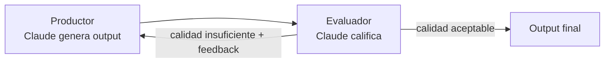
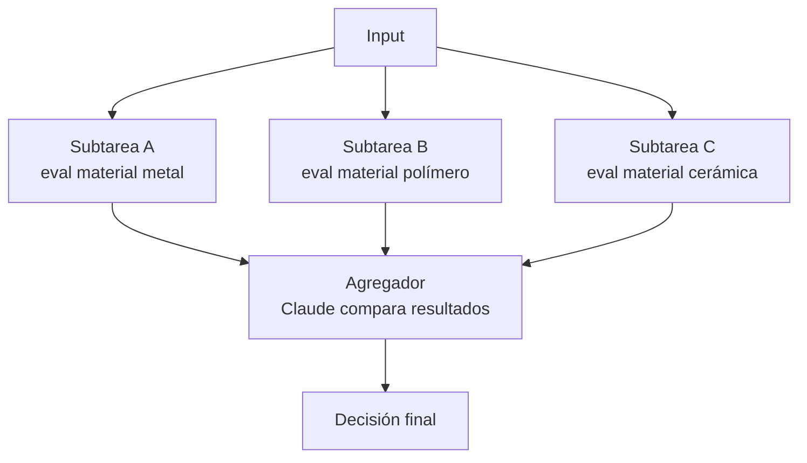
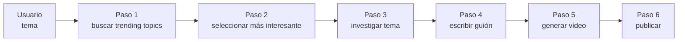
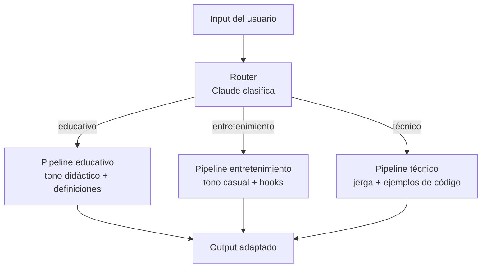
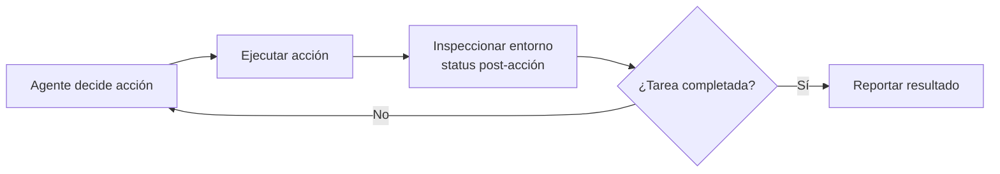
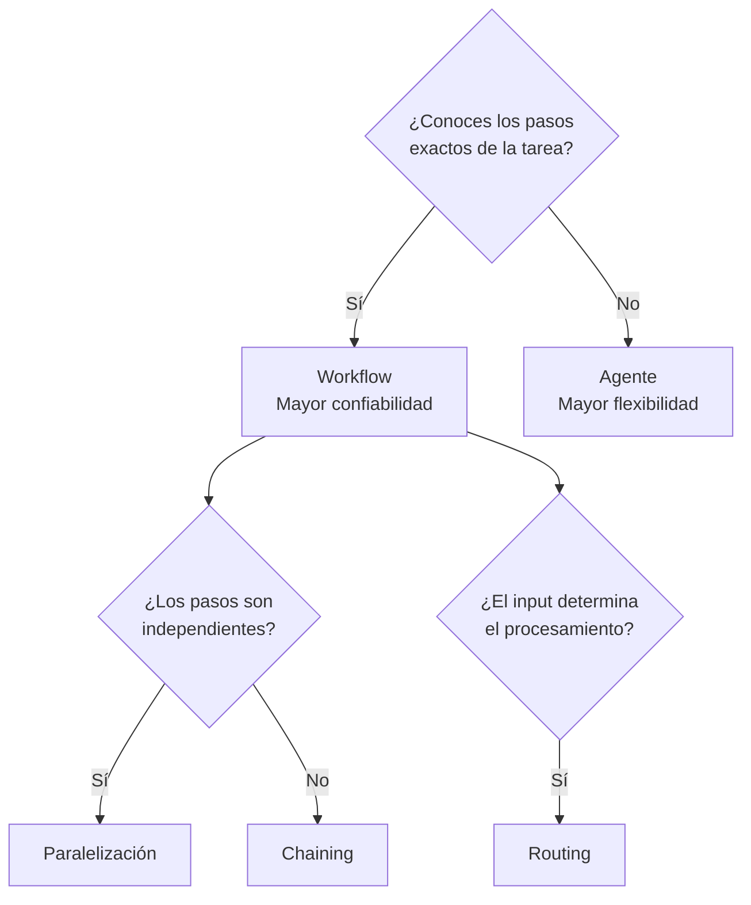

# Agentes y Workflows

> **Resumen Feynman (una frase):** Un workflow es una receta con pasos fijos que Claude
> sigue en orden; un agente es un chef con herramientas genéricas que improvisa la
> secuencia — la elección entre ambos depende de cuánto sabes de antemano sobre los pasos.

---

## 1) Analogía sencilla

Imagina que necesitas organizar una mudanza.

Un **workflow** es contratar una empresa de mudanzas con proceso estandarizado:
empaquetar → cargar camión → transportar → descargar → desempaquetar. Los pasos son
fijos, en orden conocido, y el resultado es predecible. Si falla un paso, sabes exactamente
dónde buscar el problema.

Un **agente** es contratar a un experto en logística y decirle solo el destino final.
Él evalúa la situación, decide si necesita grúa o camión pequeño, resuelve imprevistos
(el sofá no cabe por la puerta → desmontarlo), y adapta el plan en tiempo real.
Más flexible, pero también más impredecible.

La regla de oro: **usa workflow cuando conoces los pasos exactos; usa agente cuando no**.

---

## 2) ¿Qué son realmente?

**Workflow** = serie predefinida de llamadas a Claude donde los pasos, su orden y
sus inputs/outputs son conocidos de antemano. Claude ejecuta cada paso sin decidir
la secuencia global.

**Agente** = Claude con acceso a un conjunto de herramientas abstractas, donde Claude
mismo planifica dinámicamente qué herramientas usar y en qué orden para cumplir la tarea.

| | **Workflow** | **Agente** |
|---|---|---|
| **Pasos** | Predefinidos por el developer | Decididos por Claude en runtime |
| **Herramientas** | Específicas por paso | Abstractas y reutilizables |
| **Testabilidad** | Alta — flujo determinista | Baja — flujo variable |
| **Tasa de éxito** | Alta | Menor (complejidad delegada) |
| **Flexibilidad** | Baja | Alta |
| **Cuándo usar** | Pasos conocidos | Pasos desconocidos |

---

## 3) ¿Cómo funcionan? (mecanismo interno)

### 3.1 Patrones de Workflow

#### Evaluador-Optimizador

El patrón más fundamental: un productor genera output, un evaluador lo califica,
y el loop continúa hasta cumplir un criterio de calidad.



Ejemplo real del curso: convertidor imagen → modelo 3D.
Claude describe la imagen → CADQuery genera el modelo → Claude compara rendering con
original → si no coincide, vuelve al paso 2 con feedback.

---

#### Paralelización

Dividir una tarea compleja en subtareas independientes que se ejecutan simultáneamente,
luego agregar los resultados.



**Por qué paralelo en vez de un solo prompt:** cada subtarea se enfoca en una sola
consideración — sin el "ruido" de las otras. Además, los prompts individuales se pueden
evaluar y mejorar de forma independiente.

---

#### Chaining (encadenamiento)

El output de un paso es el input del siguiente. Ideal cuando una sola llamada con
muchos constraints produce outputs que ignoran algunos de ellos.



**Cuándo chaining resuelve un problema real:** si un prompt largo con muchos "no hagas X"
produce outputs que ignoran algunos constraints — dividir en pasos donde cada uno
se enfoca en un aspecto es más confiable que un prompt monolítico.

---

#### Routing (enrutamiento)

Un paso inicial clasifica el input y lo dirige al pipeline especializado correcto.



El router es solo una llamada de clasificación — barata, rápida. El valor está en que
cada pipeline downstream tiene prompts y herramientas optimizados para su categoría.

---

### 3.2 Diseño de Agentes

#### Herramientas abstractas > herramientas especializadas

El principio central del diseño de agentes: proveer herramientas genéricas que se
pueden combinar de formas inesperadas, no herramientas hiper-especializadas de un solo uso.

| Herramientas específicas ❌ | Herramientas abstractas ✅ |
|---|---|
| `refactor_function()` | `bash` (ejecuta cualquier comando) |
| `install_numpy()` | `web_fetch` (obtiene cualquier URL) |
| `run_pytest()` | `file_write` (escribe cualquier archivo) |

Claude Code usa exactamente este patrón: `bash`, `web_fetch`, `file_write` como
primitivas que el agente combina creativamente para resolver tareas de desarrollo.

La misma lógica del proyecto de recordatorios del curso: `get_current_datetime` +
`add_duration_to_datetime` + `set_reminder` resuelven conjuntamente un rango amplio
de tareas relacionadas con tiempo — no solo "set reminder".

---

#### Environment Inspection (inspección del entorno)

Los agentes necesitan **observar el resultado de cada acción** para adaptar su siguiente
paso. Sin feedback del entorno, operan a ciegas.

Ejemplos concretos:
- **Computer Use**: tomar screenshot después de cada clic — Claude no puede predecir
  exactamente cómo cambia la UI tras una acción.
- **Edición de código**: leer el archivo antes de modificarlo — el agente necesita
  conocer el estado actual, no asumirlo.
- **Video agent**: usar Whisper para verificar captions, FFmpeg para extraer frames y
  validar que el video generado cumple los requisitos antes de publicar.



---

### 3.3 Cuándo usar qué



---

## 4) ¿Cuándo usarlo?

**Workflows — preferir cuando:**
- Los pasos son conocidos y el orden es fijo
- Se necesita alta tasa de éxito y resultados predecibles
- El flujo debe ser fácilmente testeable y debuggeable
- El usuario quiere un producto que "siempre funciona"

**Paralelización — específicamente cuando:**
- Las subtareas son independientes entre sí
- Cada subtarea requiere enfoque sin "ruido" de las otras
- Los prompts individuales necesitan evaluación y mejora por separado

**Chaining — específicamente cuando:**
- Claude ignora constraints en prompts largos monolíticos
- Cada paso produce un output que el siguiente refina o verifica
- La secuencia global tiene una narrativa clara (buscar → seleccionar → escribir → publicar)

**Routing — específicamente cuando:**
- El mismo tipo de tarea requiere tratamientos cualitativamente distintos según el input
- Existe una taxonomía clara y estable de categorías

**Agentes — usar solo cuando:**
- La flexibilidad es genuinamente necesaria (pasos impredecibles)
- El mismo toolset debe resolver una variedad amplia de tareas
- Se acepta menor tasa de éxito a cambio de versatilidad

**Regla de prioridad:** workflows primero, agentes como último recurso. Los usuarios
prefieren un producto que funciona 100% sobre uno "inteligente" que falla el 20%.

---

## 5) Ejemplo práctico mínimo

**Evaluador-Optimizador en Python:**

```python
import anthropic

client = anthropic.Anthropic()
MODEL = "claude-sonnet-4-6"

def produce(topic: str, feedback: str = "") -> str:
    prompt = f"Escribe un párrafo sobre: {topic}"
    if feedback:
        prompt += f"\n\nFeedback de la iteración anterior: {feedback}"
    response = client.messages.create(
        model=MODEL, max_tokens=500,
        messages=[{"role": "user", "content": prompt}]
    )
    return response.content[0].text

def evaluate(output: str, criteria: str) -> dict:
    response = client.messages.create(
        model=MODEL, max_tokens=200,
        messages=[{"role": "user", "content":
            f"Evalúa este texto según: {criteria}\n\nTexto: {output}\n\n"
            f"Responde con JSON: {{\"score\": 1-10, \"feedback\": \"...\"}}"
        }]
    )
    import json
    return json.loads(response.content[0].text)

# Loop evaluador-optimizador
topic = "ventajas del aprendizaje automático"
criteria = "claridad, ejemplos concretos, longitud adecuada"
feedback = ""

for iteration in range(3):
    output = produce(topic, feedback)
    result = evaluate(output, criteria)
    print(f"Iteración {iteration + 1} — score: {result['score']}")
    if result["score"] >= 8:
        break
    feedback = result["feedback"]

print("Output final:", output)
```

---

## 6) Conexiones con otros conceptos

- `→ requiere:` [[02_claude_api/07x_tool_use/070_tool_use]] — los agentes son extensiones directas del loop de tool use; entender `stop_reason == "tool_use"` y el dispatcher `run_tool` es prerequisito.
- `→ extiende:` [[02_claude_api/011x_anthropic_apps/110_anthropic_apps]] — Claude Code y Computer Use son implementaciones concretas de agentes; esta nota da el marco conceptual detrás de ellos.
- `→ contrasta:` [[02_claude_api/07x_tool_use/070_tool_use]] — el Batch Tool fuerza paralelización dentro de una llamada; la paralelización de workflows opera entre llamadas completas a Claude.
- `→ aplica en:` [[04_claude_code/_overview]] — el curso 4 construye flujos reales de desarrollo que combinan patterns de workflows y agentes con Claude Code.

---

## 7) Preguntas Feynman

1. Tienes que construir un sistema que toma un documento legal de 50 páginas y genera un resumen ejecutivo. ¿Workflow o agente? ¿Qué patrón de workflow usarías y por qué?
2. ¿Por qué una herramienta `bash` genérica es mejor para un agente que una herramienta `run_tests` específica, si ambas pueden ejecutar tests?
3. El patrón evaluador-optimizador puede entrar en un loop infinito si el evaluador nunca da score suficiente. ¿Qué mecanismo de salida necesita siempre este patrón?
4. ¿Por qué el routing workflow necesita que el clasificador inicial sea una llamada separada a Claude en lugar de incluir la clasificación en el prompt del pipeline especializado?
5. Un agente de Computer Use toma screenshots después de cada clic. ¿Qué problema de diseño resolvería si en cambio tuviera acceso directo al DOM de la página?

---

## 8) Tarjetas Anki

**Q:** ¿Cuál es la regla de decisión principal entre workflow y agente?
**A:** Usa **workflow** cuando conoces los pasos exactos y su secuencia. Usa **agente** cuando los pasos son desconocidos o variables. En caso de duda, workflow — los usuarios prefieren un producto que siempre funciona sobre uno flexible que falla ocasionalmente.

**Q:** ¿Qué es el patrón evaluador-optimizador y cuándo se usa?
**A:** Productor genera output → evaluador califica con criterio objetivo → si calidad insuficiente, productor recibe feedback y regenera. Se usa cuando se necesita output de calidad garantizada y se puede medir esa calidad automáticamente (por ejemplo: imagen vs. rendering 3D, texto vs. checklist de criterios).

**Q:** ¿Por qué la paralelización de workflows da mejor calidad que un prompt único con múltiples tareas?
**A:** Cada subtarea recibe una llamada enfocada sin "ruido" de las otras consideraciones. Además, los prompts individuales de cada subtarea pueden evaluarse y optimizarse por separado con un pipeline de evals.

**Q:** ¿Qué es Environment Inspection y por qué es esencial para los agentes?
**A:** Es el mecanismo por el cual el agente observa el resultado de cada acción antes de decidir la siguiente. Sin inspección, el agente opera sobre suposiciones. Ejemplos: screenshot tras cada clic en Computer Use, leer el archivo antes de editarlo en code agents.

**Q:** ¿Cuál es el principio de diseño de herramientas para agentes?
**A:** Herramientas abstractas y genéricas > herramientas especializadas de un solo uso. Ejemplo: `bash` + `web_fetch` + `file_write` resuelven un rango infinito de tareas por combinación; `run_pytest` solo sirve para ejecutar tests.

---

## 9) Lo que no es obvio (trampas y confusiones frecuentes)

**"Agente" no significa "mejor".** El término suena más avanzado que "workflow", pero en la práctica los workflows tienen tasas de éxito más altas porque el developer mantiene el control del flujo. Usar agentes cuando los pasos son conocidos es complejidad innecesaria.

**El chaining no es solo "dividir en pasos".** El valor está en que cada paso tiene un propósito semántico claro y el output de uno es naturalmente el input del siguiente. Dividir un prompt en dos mitades arbitrarias no es chaining — es burocracia.

**El routing no clasifica en la misma llamada que procesa.** La clasificación debe ser una llamada separada y barata (Haiku es suficiente). Si el router y el procesador van en la misma llamada, pierdes la ventaja de poder actualizar los pipelines downstream de forma independiente.

**El evaluador-optimizador necesita criterios objetivos, no subjetivos.** "Que suene bien" es un criterio que lleva al loop indefinido. "Score ≥ 8 en claridad, 1 ejemplo concreto, < 200 palabras" es evaluable consistentemente.

**Environment Inspection añade latencia — pero es insustituible.** No es un paso "bonus". Sin inspección, el agente comete errores compuestos: cada acción incorrecta que no se detecta a tiempo genera más acciones incorrectas encima. El costo de inspección siempre es menor que el costo de recuperar un estado inválido.

---

### Registro personal

- Qué me sorprendió o conectó con algo que ya sabía: El patrón evaluador-optimizador es exactamente lo que hacemos en MLOps con loops de reentrenamiento + evaluación de modelos. El "evaluador" es nuestro conjunto de métricas (AUC, precision, recall) y el "productor" es el pipeline de entrenamiento. La diferencia es que aquí Claude es tanto productor como evaluador.
- Dudas que quedaron abiertas: ¿Existe un framework estándar de Anthropic para implementar estos patrones de workflow, o cada developer los construye desde cero? ¿El Agent SDK que ofrece Claude está relacionado con esto?
- Siguientes pasos: Curso 3 (Introduction to MCP) — construir servidores y clientes MCP desde cero en Python.
