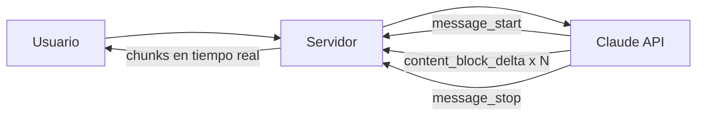

# Response Streaming

> **Resumen Feynman (una frase):** Streaming muestra la respuesta de Claude fragmento a
> fragmento conforme se genera, en vez de esperar los 10-30 segundos que puede tardar la
> respuesta completa — mejora radicalmente la percepción de velocidad del usuario.

---

## 1) Analogía sencilla

Imagina que pediste una pizza. Dos opciones:
- **Sin streaming**: el repartidor espera a que estén listas todas las pizzas del pedido
  y llega con todo junto después de 30 minutos.
- **Con streaming**: el cocinero te va mandando las porciones conforme las saca del horno.
  Ves actividad inmediata aunque el pedido completo tarde lo mismo.

El tiempo total de generación no cambia — lo que cambia es cuándo el usuario empieza
a ver resultados.

---

## 2) ¿Qué es realmente?

Sin streaming, el servidor espera la respuesta completa antes de enviarla.
Con streaming, Claude envía eventos de texto a medida que genera cada fragmento.

**Tipos de eventos en el stream:**

| Evento | Cuándo ocurre | Contiene |
|--------|--------------|---------|
| `message_start` | Al inicio | Reconocimiento inicial, sin texto |
| `content_block_start` | Antes del texto | Señal de que empieza generación |
| `content_block_delta` | Repetido | **Los chunks de texto** — el más importante |
| `content_block_stop` | Al terminar | Señal de fin de bloque |
| `message_stop` | Al final | Generación completa |

---

## 3) ¿Cómo funciona? (mecanismo interno)



**Dos métodos de implementación:**

```python
# Método 1: Básico — iterar sobre eventos
with client.messages.stream(
    model=MODEL,
    max_tokens=1000,
    messages=[{"role": "user", "content": "Explica la fotosíntesis"}]
) as stream:
    for text in stream.text_stream:
        print(text, end="", flush=True)   # Imprime chunk a chunk

# Método 2: Capturar el mensaje final completo para guardar
with client.messages.stream(...) as stream:
    for text in stream.text_stream:
        print(text, end="", flush=True)
    final_message = stream.get_final_message()  # Mensaje completo ensamblado
```

**`text_stream`** extrae solo los chunks de texto de los eventos `content_block_delta`.
**`get_final_message()`** ensambla todos los chunks en el mensaje completo — útil para
guardar en base de datos.

---

## 4) ¿Cuándo usarlo?

**Siempre en interfaces de usuario.** Si el usuario ve el texto generándose, el tiempo
de espera percibido cae dramáticamente aunque el tiempo real sea el mismo.

**No necesario en:**
- Pipelines batch sin UI (evalúa outputs, procesa documentos)
- Requests internos donde solo importa el resultado final
- Extracción estructurada donde necesitas el JSON completo

---

## 5) Ejemplo práctico mínimo

```python
def stream_response(user_message: str):
    """Muestra la respuesta en tiempo real y retorna el texto completo"""
    full_text = ""

    with client.messages.stream(
        model=MODEL,
        max_tokens=1000,
        messages=[{"role": "user", "content": user_message}]
    ) as stream:
        for chunk in stream.text_stream:
            print(chunk, end="", flush=True)
            full_text += chunk

    print()  # Nueva línea al final
    return full_text

# Guardar en BD después del stream
result = stream_response("Analiza las tendencias del mercado pensional en Colombia")
db.save(result)
```

---

## 6) Conexiones con otros conceptos

- `→ requiere:` [[01_fundamentos_api_y_conversaciones]] — streaming es una variación del request base.
- `→ extiende:` [[32_fine_grained_tool_calling]] — cuando usas tools con streaming, hay eventos adicionales `input_json_delta`.
- `→ contrasta:` [[13_running_the_eval]] — en pipelines de evaluación batch el streaming no aporta valor.

---

## 7) Preguntas Feynman

1. ¿Cambiar a streaming reduce el tiempo total de generación de Claude?
2. ¿Por qué necesitas `get_final_message()` si ya tienes los chunks individuales?
3. En un pipeline de Airflow que procesa documentos en batch, ¿usarías streaming? ¿Por qué?

---

## 8) Tarjetas Anki

**Q:** ¿Qué tipo de evento en el stream contiene los fragmentos de texto generados?
**A:** `content_block_delta` — es el evento que se repite con cada chunk de texto.

**Q:** ¿Para qué sirve `stream.get_final_message()`?
**A:** Para obtener el mensaje completo ensamblado después del stream — útil para guardar en base de datos o procesamiento posterior.

**Q:** ¿El streaming reduce el tiempo total de generación?
**A:** No — el tiempo de generación es el mismo. Solo permite mostrar resultados progresivos al usuario, mejorando la experiencia percibida.

---

## 9) Lo que no es obvio

**`flush=True` es obligatorio para que el streaming sea visible en terminal.**
Sin `flush=True`, Python puede acumular los chunks en buffer y mostrarlos todos juntos
al final, perdiendo el efecto visual del streaming.

**En web apps, streaming requiere Server-Sent Events (SSE) o WebSockets.**
El streaming del SDK de Python funciona en el servidor. Para que el usuario del browser
lo vea en tiempo real, necesitas un mecanismo de push (SSE es el más simple para este caso).

**Streaming + tool use requiere manejo adicional.**
Cuando Claude genera argumentos para una tool call durante streaming, los eventos son
`input_json_delta` no `content_block_delta`. El stream no termina hasta que Claude
recibe el resultado de la tool. → [[32_fine_grained_tool_calling]]

---

## Notebooks de práctica

| Notebook | Qué cubre |
|----------|----------|
| [041_response_streaming.ipynb](041_response_streaming.ipynb) | Streaming con `text_stream` · `get_final_message()` · visualización chunk a chunk |
| [042_controlling_output.ipynb](042_controlling_output.ipynb) | Pre-filling de mensajes de asistente · stop sequences · generación de datos estructurados |

---

### Registro personal
- Qué conecta con mi trabajo: El patrón de streaming es idéntico a los generators de Python que uso en Airflow para procesar datos en memoria limitada — yield en vez de return.
- Dudas abiertas: ¿Cómo implemento streaming en una Cloud Function de GCP para un chatbot web?
- Siguientes pasos: Ver técnicas de control del output.
