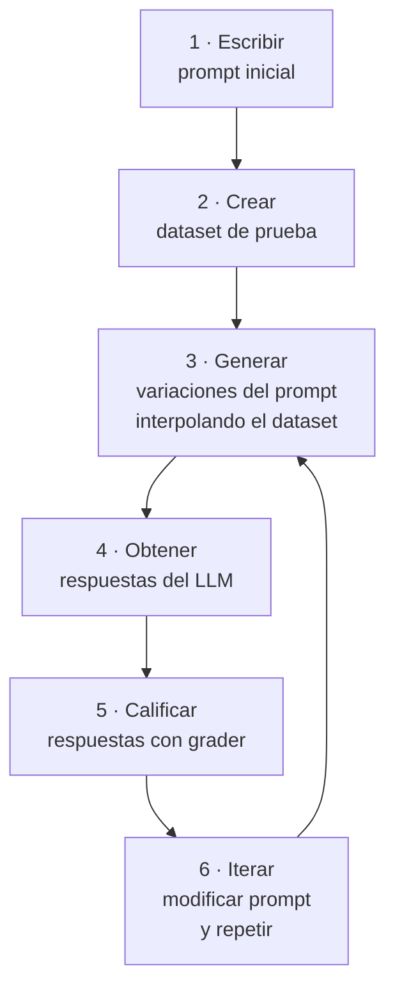

# Prompt Evaluation

> **Resumen Feynman (una frase):** Evaluar prompts es construir un pipeline automatizado
> que genera un dataset de casos de prueba, corre cada caso contra el prompt, y asigna
> un puntaje objetivo — para iterar con datos en vez de intuición.

---

## 1) Analogía sencilla

Imagina que escribiste un manual de atención al cliente y quieres saber si funciona.
Tienes tres opciones:

1. **Lo lees tú mismo dos veces y lo mandas a producción** → trampa.
2. **Se lo das a tres colegas para que prueben algunos casos** → trampa.
3. **Construyes un simulacro con 50 clientes ficticios, grabas las respuestas y las
   califica un jurado con criterios objetivos** → lo que recomienda el curso.

La evaluación automatizada de prompts es esa tercera opción: un pipeline que corre tu
prompt contra muchos casos de prueba y te devuelve un puntaje, para que puedas comparar
versiones del prompt con datos reales.

---

## 2) ¿Qué es realmente?

**Prompt Evaluation = pipeline de 6 pasos para medir y mejorar la calidad de un prompt.**

La motivación es concreta: los ingenieros sistemáticamente sub-testean prompts. Probar
manualmente dos o tres casos no es representativo. Sin un puntaje objetivo, no sabes si
un cambio en el prompt mejoró o empeoró el resultado.

### Las tres rutas después de escribir un prompt

| Ruta | Descripción | Veredicto |
|------|-------------|-----------|
| 1 | Probar una o dos veces y mandarlo a producción | ❌ Trampa |
| 2 | Probar con inputs propios y ajustar corner cases a mano | ❌ Trampa |
| 3 | Pasar por un pipeline de evaluación con puntaje objetivo | ✅ Recomendado |

### Los tres tipos de grader

| Tipo | Cómo funciona | Cuándo usarlo |
|------|--------------|---------------|
| **Code grader** | Validación programática (sintaxis, longitud, regex) | Outputs con formato verificable (JSON, Python, regex) |
| **Model grader** | Otro llamado al LLM que puntúa el output original | Calidad semántica, seguimiento de instrucciones |
| **Human grader** | Una persona evalúa cada respuesta | Máxima precisión — costoso y lento |

---

## 3) ¿Cómo funciona? (mecanismo interno)

### El pipeline de 6 pasos



### Generación del dataset

El dataset es un array de objetos JSON con los inputs de prueba. Se puede construir
manualmente o con Claude (usando Haiku por velocidad y costo):

```python
def generate_dataset():
    prompt = """Generate 10 diverse test cases for a code assistant prompt.
    Each case should be a different programming task."""

    response = client.messages.create(
        model="claude-haiku-4-5-20251001",   # Haiku: más rápido y barato para esto
        max_tokens=2000,
        messages=[{"role": "user", "content": prompt}],
        # Pre-filling + stop sequence para JSON limpio
        # (ver nota de controlling output)
    )
    # Parsear JSON y guardar en dataset.json
```

**Estructura del dataset:**
```json
[
  {"task": "Write a Python function to sort a list of dictionaries by a key"},
  {"task": "Create a regex to validate email addresses"},
  {"task": "Write a JSON config for a CI/CD pipeline"}
]
```

### Ejecución del eval — las tres funciones clave

```python
def run_prompt(test_case: dict) -> str:
    """Mezcla el test case con el prompt y obtiene la respuesta del LLM"""
    prompt = f"Please solve the following task:\n{test_case['task']}"
    return chat([{"role": "user", "content": prompt}])

def run_test_case(test_case: dict) -> dict:
    """Corre el prompt, califica el resultado, retorna resumen"""
    output = run_prompt(test_case)
    score = grade(output, test_case)        # grade() = el grader elegido
    return {"output": output, "test_case": test_case, "score": score}

def run_eval(dataset: list) -> list:
    """Itera sobre todo el dataset, retorna resultados con puntajes"""
    return [run_test_case(case) for case in dataset]

# Puntaje final del prompt = promedio de todos los scores
avg_score = sum(r["score"] for r in results) / len(results)
```

### Model grader — implementación

El grader de modelo hace un request adicional a Claude para evaluar el output:

```python
def model_grader(output: str, test_case: dict) -> int:
    grader_prompt = f"""Evaluate this output on a scale of 1-10.
    
    Task: {test_case['task']}
    Output: {output}
    
    Provide:
    - Strengths
    - Weaknesses  
    - Reasoning
    - Score (1-10)
    """
    # Pre-fill con ```json y stop sequence ``` para extraer JSON limpio
    response = client.messages.create(
        model="claude-haiku-4-5-20251001",
        max_tokens=500,
        messages=[
            {"role": "user",      "content": grader_prompt},
            {"role": "assistant", "content": "```json"},  # pre-fill
        ],
        stop_sequences=["```"]
    )
    result = json.loads(response.content[0].text)
    return result["score"]
```

> **Por qué pedir reasoning además del score:** Si el grader solo devuelve un número,
> tiende a dar valores centrales (5-6). Al pedir fortalezas/debilidades primero, el
> score final es más discriminativo.

### Code grader — implementación

Para outputs que deben ser código o datos estructurados válidos:

```python
def validate_json(output: str) -> int:
    try:
        json.loads(output)
        return 10
    except json.JSONDecodeError:
        return 0

def validate_python(output: str) -> int:
    try:
        ast.parse(output)
        return 10
    except SyntaxError:
        return 0

def validate_regex(output: str) -> int:
    try:
        re.compile(output)
        return 10
    except re.error:
        return 0

# Score combinado: semántica + sintaxis
def combined_score(model_score: int, output: str, format: str) -> float:
    syntax_score = {"json": validate_json, "python": validate_python,
                    "regex": validate_regex}[format](output)
    return (model_score + syntax_score) / 2
```

El dataset debe incluir un campo `"format"` para que el grader sepa qué validador usar:
```json
{"task": "Write a JSON schema for a user profile", "format": "json"}
```

---

## 4) ¿Cuándo usarlo?

| Situación | Acción |
|-----------|--------|
| Prompt que irá a producción | Siempre correr eval antes de deployar |
| Comparar dos versiones de un prompt | Eval en ambas, comparar puntaje promedio |
| Output es código/JSON/regex | Code grader (rápido, objetivo, gratuito) |
| Output es texto libre o sigue instrucciones complejas | Model grader |
| Dataset pequeño (< 50 casos) | Manual o Claude/Haiku para generarlo |
| Dataset grande o diverso | Haiku automatizado con categorías definidas |

---

## 5) Ejemplo práctico integrado

```python
import json, ast, re
from anthropic import Anthropic

client = Anthropic()

PROMPT_V1 = "Please solve the following task:\n{task}"

PROMPT_V2 = """Solve the following programming task.
Respond ONLY with the requested code or data — no explanations, no comments.

Task: {task}
Format: {format}
"""

# Dataset generado con Haiku
dataset = [
    {"task": "Validate Colombian email addresses", "format": "regex"},
    {"task": "Config BigQuery connection",          "format": "json"},
    {"task": "Function to chunk a list by size",   "format": "python"},
]

def run_eval_version(prompt_template: str, dataset: list) -> float:
    scores = []
    for case in dataset:
        output = run_prompt(prompt_template, case)
        score  = combined_score(model_grader(output, case), output, case["format"])
        scores.append(score)
    return sum(scores) / len(scores)

score_v1 = run_eval_version(PROMPT_V1, dataset)   # Ej: 3.2
score_v2 = run_eval_version(PROMPT_V2, dataset)   # Ej: 7.8
print(f"V1: {score_v1:.1f} → V2: {score_v2:.1f}")
```

---

## 6) Conexiones con otros conceptos

- `→ requiere:` [[01_fundamentos_api_y_conversaciones]] — el eval usa `client.messages.create()` con los mismos patrones base.
- `→ requiere:` [[04_response_streaming]] — N/A en eval (se necesita el output completo para gradear).
- `→ extiende:` [[06_prompt_engineering]] — las técnicas de prompt engineering se aplican y se miden con este pipeline.
- `→ aplica en:` [[09_structured_data]] — el code grader usa la misma lógica de pre-fill + stop sequence para obtener JSON limpio.

---

## 7) Preguntas Feynman

1. ¿Por qué el grader de modelo debe pedir strengths/weaknesses/reasoning además del score numérico?
2. Tienes un prompt que genera resúmenes de documentos legales. ¿Usarías code grader o model grader? ¿Por qué?
3. ¿Por qué se usa Haiku en vez de Sonnet para generar el dataset de prueba y para el grader?
4. Tu prompt obtiene un score promedio de 6.2. ¿Cómo usarías los resultados individuales del eval para decidir qué cambiar en el prompt?
5. ¿Cuál es el riesgo de usar el mismo modelo como grader que como evaluado?

---

## 8) Tarjetas Anki

**Q:** ¿Cuáles son los tres tipos de grader en un pipeline de evaluación?
**A:** Code grader (validación programática), model grader (LLM evalúa el output) y human grader (persona evalúa). El score siempre debe ser un número objetivo.

**Q:** ¿Por qué el model grader debe pedir razonamiento además del score?
**A:** Sin razonamiento previo, el modelo tiende a dar scores centrales (5-6). Al pedir strengths/weaknesses/reasoning primero, el score final es más discriminativo y útil.

**Q:** ¿Cuál es la fórmula del combined score en el code grader?
**A:** `(model_score + syntax_score) / 2` — combina evaluación semántica con validación de sintaxis.

**Q:** ¿Qué modelo se recomienda usar para generar datasets de prueba y para el model grader?
**A:** Haiku — es más rápido y barato. El grading es una tarea de alto volumen donde el costo se acumula; no necesitas la inteligencia de Sonnet/Opus para puntuar outputs.

**Q:** ¿Cuáles son las tres funciones clave del pipeline de evaluación?
**A:** `run_prompt` (mezcla test case + prompt, obtiene respuesta), `run_test_case` (corre prompt + califica), `run_eval` (itera sobre todo el dataset).

---

## 9) Lo que no es obvio

**El dataset no necesita ser grande para ser útil.**
Con 10-20 casos bien elegidos (que cubran corner cases, casos normales y casos edge)
obtienes un proxy confiable. Datasets de miles de casos solo tienen sentido cuando
tienes muchas variaciones del prompt para comparar en producción.

**El model grader tiene un sesgo de "tono".**
Si el output tiene el mismo estilo que el sistema de grading (por ejemplo, ambos son
de Claude), puede ser más indulgente. Para reducir el sesgo, usa modelos diferentes
para generar y para gradear, o incluye ejemplos calibrados en el grader prompt.

**Un puntaje promedio alto no es suficiente — revisa la distribución.**
Un prompt con score promedio 7.0 que tiene algunos 2.0 es peor que uno con score 6.5
uniforme. Los outliers bajos indican corner cases que fallarán en producción.

**El code grader es binario (0 o 10) — eso es una limitación.**
Si el JSON es válido pero semánticamente incorrecto, igual recibe 10. Siempre combínalo
con model grader para capturar la calidad del contenido, no solo la validez sintáctica.

**Generar el dataset con el mismo modelo que evalúas crea sesgo de distribución.**
Claude generará test cases que parecen razonables para Claude. Para detectar
debilidades reales, incluye algunos casos manuales basados en fallos reales que hayas
observado, o usa un modelo diferente para la generación.

---

## Notebooks de práctica

| Notebook | Qué cubre |
|----------|----------|
| [051_prompt_evals.ipynb](051_prompt_evals.ipynb) | Pipeline de eval básico · `run_prompt` · `run_eval` · generación del dataset con Haiku |
| [052_prompt_evals_grader.ipynb](052_prompt_evals_grader.ipynb) | Model grader con strengths/weaknesses/score · fix del `JSONDecodeError` por backslashes |
| [053_prompt_evals_fns.ipynb](053_prompt_evals_fns.ipynb) | Code grader · `validate_json/python/regex` · score combinado (model + syntax) / 2 |
| [054_prompt_evals_complete.ipynb](054_prompt_evals_complete.ipynb) | Pipeline completo integrado con todos los graders |

**Datos generados:** `dataset.json` — casos de prueba de tareas AWS (JSON, Python, regex)

---

### Registro personal
- Qué conecta con mi trabajo: En Protección podríamos usar este pipeline para evaluar
  prompts de extracción de datos de documentos pensionales antes de deployarlos. El
  code grader con `validate_json` es directo para nuestros pipelines de BigQuery que
  esperan JSON estructurado.
- Dudas abiertas: ¿Cómo manejar concurrencia en el eval para correr muchos test cases
  en paralelo sin superar los rate limits de la API?
- Siguientes pasos: Ver las técnicas de prompt engineering que se miden con este pipeline.
