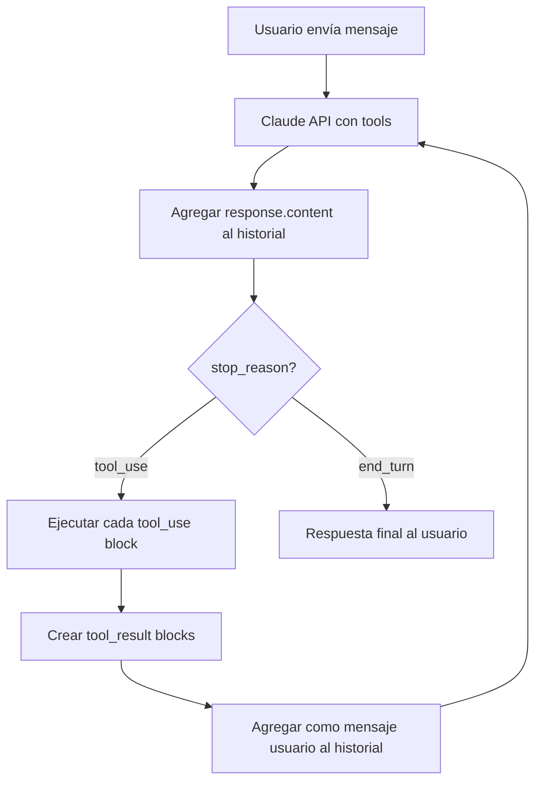

# Tool Use con Claude

> **Resumen Feynman (una frase):** Las tools extienden a Claude más allá de su conocimiento
> de entrenamiento permitiéndole invocar funciones externas — el developer define la función
> Python, el esquema JSON que la describe, y el loop que orquesta las llamadas hasta que
> Claude deja de pedir tools y entrega la respuesta final.

---

## 1) Analogía sencilla

Imagina a un analista brillante que sabe todo lo que existía hasta 2024 pero no puede
consultar nada nuevo: ni precios actuales, ni el clima, ni si tu servidor está caído.

Las tools son su línea directa al mundo real. Tú le dices: "Si necesitas la fecha de
hoy, llama a `get_datetime`. Si necesitas calcular días, llama a `add_duration`."
Él decide cuándo llamar, tú ejecutas la llamada y le pasas el resultado. Él lo integra
y responde.

La clave: **él no ejecuta el código — tú lo ejecutas y le mandas la respuesta.** Claude
solo sabe qué tool pedir y cómo usar el resultado.

---

## 2) ¿Qué es realmente?

**Tool use = ciclo de 5 pasos donde Claude solicita funciones externas y tú las ejecutas.**

| Paso | Quién actúa | Qué ocurre |
|------|-------------|-----------|
| 1 | Tú → Claude | Envías el request con lista de tools disponibles (`tools=[...]`) |
| 2 | Claude | Evalúa si necesita datos externos; si sí, responde con `stop_reason="tool_use"` y un bloque `tool_use` |
| 3 | Tú | Ejecutas la función Python solicitada |
| 4 | Tú → Claude | Reenvías el historial completo + un mensaje usuario con bloque `tool_result` |
| 5 | Claude | Integra el resultado y genera la respuesta final (o pide otra tool) |

### Anatomía de una tool

Cada tool tiene dos partes independientes:

```python
# PARTE 1: La función Python — la lógica real
def get_current_datetime(date_format: str = "%Y-%m-%d %H:%M:%S") -> str:
    if not date_format:
        raise ValueError("date_format cannot be empty")
    return datetime.now().strftime(date_format)

# PARTE 2: El schema JSON — lo que Claude "ve"
get_current_datetime_schema = ToolParam({
    "name": "get_current_datetime",
    "description": "Returns the current date and time. Use when the user asks about the current time, today's date, or needs the current datetime for calculations. Returns a formatted datetime string.",
    "input_schema": {
        "type": "object",
        "properties": {
            "date_format": {
                "type": "string",
                "description": "Format string for datetime (e.g., '%Y-%m-%d'). Defaults to '%Y-%m-%d %H:%M:%S'."
            }
        },
        "required": []
    }
})
```

Claude solo ve el schema. La función Python es invisble para él.

---

## 3) ¿Cómo funciona? (mecanismo interno)

### 3a. Cambio en la estructura de mensajes

Con tools, el `content` de un mensaje deja de ser un solo bloque de texto y puede
contener **múltiples bloques**:

```
# Sin tools — content simple
response.content = [TextBlock(text="La respuesta es...")]

# Con tools — content multi-bloque
response.content = [
    TextBlock(text="Déjame verificar la fecha actual."),
    ToolUseBlock(
        id="toolu_01abc",
        name="get_current_datetime",
        input={"date_format": "%Y-%m-%d"}
    )
]
```

**Consecuencia crítica:** al agregar la respuesta del asistente al historial, ya no
puedes hacer `add_assistant_message(messages, response.content[0].text)`. Debes
agregar **todo** el `response.content`:

```python
messages.append({"role": "assistant", "content": response.content})
```

### 3b. El bloque tool_result

Cuando ejecutas la tool, mandas el resultado en un mensaje de usuario con este formato:

```python
{
    "role": "user",
    "content": [
        {
            "type": "tool_result",
            "tool_use_id": "toolu_01abc",   # ← debe coincidir con el ID del tool_use block
            "content": json.dumps(result),   # ← siempre string
            "is_error": False                # ← True si la función lanzó excepción
        }
    ]
}
```

El `tool_use_id` es el link que conecta la petición con el resultado. Cuando Claude
hace múltiples tool calls simultáneas, cada una tiene su propio ID y su propio result.

### 3c. El loop de conversación



**Las tres funciones clave del loop:**

```python
def run_conversation(messages: list, tools: list) -> str:
    """Loop principal: llama a Claude hasta que no haya más tool requests"""
    while True:
        response = client.messages.create(
            model=MODEL, max_tokens=4096,
            tools=tools, messages=messages
        )
        messages.append({"role": "assistant", "content": response.content})

        if response.stop_reason != "tool_use":
            break                                    # fin del loop

        tool_results = run_tools(response)
        messages.append({"role": "user", "content": tool_results})

    return text_from_message(response)


def run_tools(response) -> list:
    """Procesa todos los tool_use blocks de un mensaje"""
    results = []
    for block in response.content:
        if block.type == "tool_use":
            output, is_error = run_tool(block.name, block.input)
            results.append({
                "type": "tool_result",
                "tool_use_id": block.id,
                "content": json.dumps(output),
                "is_error": is_error
            })
    return results


def run_tool(name: str, inputs: dict) -> tuple:
    """Dispatcher: enruta por nombre de tool"""
    try:
        if name == "get_current_datetime":
            return get_current_datetime(**inputs), False
        elif name == "add_duration_to_datetime":
            return add_duration_to_datetime(**inputs), False
        elif name == "set_reminder":
            return set_reminder(**inputs), False
        else:
            return f"Unknown tool: {name}", True
    except Exception as e:
        return str(e), True
```

### 3d. Múltiples tools y tool chaining

Claude puede encadenar tools secuencialmente para resolver queries compuestas:

```
Usuario: "¿Qué día es 103 días desde hoy?"

→ Claude: tool_use → get_current_datetime()
← Resultado: "2026-05-19"

→ Claude: tool_use → add_duration_to_datetime(start="2026-05-19", days=103)
← Resultado: "2026-08-30"

→ Claude: "103 días desde hoy es el 30 de agosto de 2026."
```

Agregar una nueva tool requiere solo 3 pasos:
1. Implementar la función Python
2. Crear su schema JSON
3. Agregar el schema a la lista `tools` y un caso al dispatcher `run_tool`

### 3e. Batch Tool — ejecución paralela

Por defecto, Claude raramente envía múltiples `tool_use` blocks en un mismo mensaje.
El Batch Tool lo fuerza creando una meta-tool que recibe una lista de invocaciones:

```python
batch_tool_schema = ToolParam({
    "name": "batch",
    "description": "Run multiple tools in parallel. Use when multiple independent tool calls can be executed simultaneously.",
    "input_schema": {
        "type": "object",
        "properties": {
            "invocations": {
                "type": "array",
                "items": {
                    "type": "object",
                    "properties": {
                        "tool_name": {"type": "string"},
                        "input": {"type": "object"}
                    }
                }
            }
        },
        "required": ["invocations"]
    }
})

def run_batch(invocations: list) -> list:
    results = []
    for inv in invocations:
        output, is_error = run_tool(inv["tool_name"], json.loads(inv["input"]))
        results.append({"tool": inv["tool_name"], "result": output, "error": is_error})
    return results
```

En vez de 3 round-trips, Claude hace 1 llamada a `batch` con 3 invocaciones.

### 3f. Tools para datos estructurados

En vez de pre-filling + stop sequences para extraer JSON, se puede definir una tool
cuyo schema ES la estructura deseada, y forzar su invocación:

```python
# Forzar que Claude siempre use esta tool específica
response = client.messages.create(
    model=MODEL,
    max_tokens=1000,
    tools=[extraction_schema],
    tool_choice={"type": "tool", "name": "extract_data"},   # ← fuerza la tool
    messages=[{"role": "user", "content": text_to_parse}]
)

# El JSON estructurado está en el input del tool_use block (no hay tool_result)
structured_data = response.content[0].input
```

**Trade-off vs pre-filling:**
- Pre-filling: más simple, suficiente para casos directos.
- Tool: más confiable, necesario para estructuras complejas o cuando la consistencia es crítica.

---

## 4) ¿Cuándo usarlo?

| Situación | Solución |
|-----------|---------|
| Claude necesita datos en tiempo real (fecha, clima, precio) | Tool para llamada a API externa |
| Claude debe realizar cálculos que suele hacer mal (fechas, aritmética compleja) | Tool de cálculo determinista |
| Claude debe ejecutar una acción (guardar reminder, enviar email) | Tool de efecto secundario |
| Necesitas JSON estructurado confiable de un texto | Tool con `tool_choice` + schema |
| Múltiples tools independientes que podrían correr en paralelo | Batch Tool |
| La función ya es código probado y más confiable que la generación del modelo | Tool para cualquier operación crítica |

---

## 5) Ejemplo práctico integrado — Asistente de recordatorios

```python
from datetime import datetime, timedelta
import json
from anthropic import Anthropic
from anthropic.types import ToolParam

client = Anthropic()
MODEL = "claude-sonnet-4-6"

# --- Tool functions ---

def get_current_datetime(date_format: str = "%Y-%m-%d %H:%M:%S") -> str:
    return datetime.now().strftime(date_format)

def add_duration_to_datetime(datetime_str: str, days: int = 0, hours: int = 0) -> str:
    dt = datetime.strptime(datetime_str, "%Y-%m-%d %H:%M:%S")
    return (dt + timedelta(days=days, hours=hours)).strftime("%Y-%m-%d %H:%M:%S")

def set_reminder(datetime_str: str, message: str) -> str:
    print(f"[REMINDER SET] {datetime_str}: {message}")
    return f"Reminder set for {datetime_str}: {message}"

# --- Schemas ---

TOOLS = [
    ToolParam({
        "name": "get_current_datetime",
        "description": "Returns the current date and time. Use when needing the current time or date.",
        "input_schema": {"type": "object", "properties": {
            "date_format": {"type": "string", "description": "strftime format string"}
        }, "required": []}
    }),
    ToolParam({
        "name": "add_duration_to_datetime",
        "description": "Adds days/hours to a datetime string. Use for date arithmetic.",
        "input_schema": {"type": "object", "properties": {
            "datetime_str": {"type": "string"},
            "days": {"type": "integer", "default": 0},
            "hours": {"type": "integer", "default": 0}
        }, "required": ["datetime_str"]}
    }),
    ToolParam({
        "name": "set_reminder",
        "description": "Sets a reminder for a specific datetime. Use when user asks to be reminded.",
        "input_schema": {"type": "object", "properties": {
            "datetime_str": {"type": "string"},
            "message": {"type": "string"}
        }, "required": ["datetime_str", "message"]}
    }),
]

# --- Loop de conversación ---

messages = [{"role": "user", "content": "Set a reminder for my doctor's appointment in 5 days at 10am"}]
print(run_conversation(messages, TOOLS))
# → Claude calls get_current_datetime → add_duration(days=5) → set_reminder → responde
```

---

## 6) Conexiones con otros conceptos

- `→ requiere:` [[010_fundamentos_api_y_conversaciones]] — el loop de tools extiende el multi-turn stateless; el historial manual sigue siendo la base.
- `→ extiende:` [[040_response_streaming]] — cuando se combina streaming con tools, aparecen eventos `input_json_delta` adicionales.
- `→ contrasta:` [[050_prompt_evaluation]] — el grader de model usa pre-filling para JSON; tools para structured data es la alternativa más confiable.
- `→ aplica en:` [[01_agent_skills/05_sharing_skills]] — los custom subagents de Claude Code usan el mismo concepto de tools declaradas en su frontmatter.

---

## 7) Preguntas Feynman

1. Claude hace una tool call. Tú agregas solo `response.content[0].text` al historial
   en vez de `response.content` completo. ¿Qué ocurre en el siguiente request?

2. ¿Por qué el `tool_use_id` es necesario? ¿Qué problema resuelve cuando Claude hace
   dos tool calls en el mismo mensaje?

3. Tienes una función Python que puede lanzar una excepción. ¿Cómo lo manejas en el
   bloque `tool_result` y qué hace Claude con un `is_error: true`?

4. ¿Por qué el Batch Tool "engaña" a Claude? ¿Por qué no puede Claude simplemente
   enviar múltiples `tool_use` blocks de forma nativa?

5. Necesitas extraer de un texto libre los campos `nombre`, `cedula` y `monto` como
   JSON. ¿Usarías pre-filling con stop sequences o el enfoque con `tool_choice`?
   ¿En qué criterio basas la decisión?

---

## 8) Tarjetas Anki

**Q:** ¿Qué `stop_reason` indica que Claude quiere ejecutar una tool?
**A:** `"tool_use"` — cuando aparece este stop reason, el mensaje del asistente contiene uno o más bloques de tipo `tool_use` con el nombre y argumentos de la función a ejecutar.

**Q:** ¿Por qué al usar tools se debe agregar `response.content` completo al historial en vez de solo el texto?
**A:** Con tools, el `content` puede tener múltiples bloques (texto + `tool_use`). Si solo guardas el texto, Claude pierde el rastro de qué tools pidió y el historial queda incoherente.

**Q:** ¿Qué tres campos obligatorios tiene un bloque `tool_result`?
**A:** `type: "tool_result"`, `tool_use_id` (coincide con el ID del tool_use block), y `content` (resultado serializado como string). Opcionalmente `is_error: bool`.

**Q:** ¿Dónde va el bloque `tool_result` en el historial de mensajes?
**A:** En un mensaje de **usuario** (`role: "user"`), no de asistente. Siempre se incluyen también los schemas de tools aunque no se usen de nuevo.

**Q:** ¿Cómo se fuerza a Claude a usar una tool específica para extracción estructurada?
**A:** Con el parámetro `tool_choice={"type": "tool", "name": "nombre_tool"}` en el request. El JSON extraído se encuentra en `response.content[0].input`.

**Q:** ¿Cuál es el propósito del Batch Tool?
**A:** Forzar a Claude a ejecutar múltiples tools en paralelo dentro de un solo round-trip, definiendo una meta-tool que acepta una lista de invocaciones y las ejecuta iterativamente.

---

## 9) Lo que no es obvio

**Claude no ejecuta código — tú ejecutas, él solicita y usa resultados.**
Este es el malentendido más frecuente. Claude analiza el resultado que le mandas y decide
qué hacer con él. Si mandas un resultado incorrecto, Claude lo usa igualmente. La
validación de los datos es tu responsabilidad.

**El historial crece rápido con tool use.**
Cada ciclo tool_use → tool_result agrega al menos 2 mensajes más al historial. En
conversaciones largas con muchas tools, el context window se llena más rápido. Considera
prompt caching para schemas y system prompts que no cambian.

**Debes incluir los schemas de tools en cada request aunque Claude ya no los use.**
Incluso en el request donde solo mandas el tool_result, debes re-incluir la lista `tools`.
Si no lo haces, la API lanza error porque el historial referencia tools que el request
actual no declara.

**`run_tool` como dispatcher es escalable pero frágil si no usas un registro.**
El patrón de `if name == "tool_a": ... elif name == "tool_b":` funciona para pocas tools.
Con 10+, considera un diccionario de funciones: `TOOL_REGISTRY = {"get_datetime": get_current_datetime, ...}` y llama con `TOOL_REGISTRY[name](**inputs)`.

**Tools para structured data vs pre-filling: la confiabilidad tiene un costo.**
El enfoque con `tool_choice` es más confiable pero requiere definir un JSON schema
completo, lo que agrega complejidad. Para extracciones simples de 2-3 campos, pre-filling
sigue siendo la opción más rápida de implementar.

---

## Notebooks de práctica

| Notebook | Qué cubre |
|----------|----------|
| [071_tools.ipynb](071_tools.ipynb) | Primer tool (`get_current_datetime`) · schema JSON · inspección del `ToolUseBlock` · ciclo completo tool → result |
| [072_tools_multiple_tools.ipynb](072_tools_multiple_tools.ipynb) | `run_conversation` loop · `run_tools` · `run_tool` dispatcher · tools encadenadas (`get_datetime` → `add_duration` → `set_reminder`) |
| [073_tool_streaming.ipynb](073_tool_streaming.ipynb) | Streaming con tools · eventos `input_json_delta` · snapshot acumulativo |
| [074_tool_streaming_completed.ipynb](074_tool_streaming_completed.ipynb) | Implementación completa de streaming con tool use |
| [075_text_editor_tool.ipynb](075_text_editor_tool.ipynb) | Text Editor Tool built-in · schema stub → expansión automática · operaciones de archivo |
| [076_web_search.ipynb](076_web_search.ipynb) | Web Search Tool built-in · `max_uses` · `allowed_domains` · citation blocks |

---

### Registro personal
- Qué conecta con mi trabajo: El patrón `run_conversation` → `run_tools` → `run_tool`
  es isomórfico con un DAG de Airflow: un orchestrator (run_conversation) que itera
  sobre tareas (tools), ejecuta cada una en orden, y usa los resultados para decidir
  el siguiente paso. La diferencia es que aquí el orchestrator es Claude, no Airflow.
- Dudas abiertas: ¿Puede Claude hacer tool calls en paralelo de forma nativa si le
  instruyes explícitamente en el system prompt, o siempre es secuencial sin el Batch Tool?
- Siguientes pasos: Implementar el asistente de recordatorios completo y experimentar
  con el Batch Tool para ver cuándo Claude lo usa vs. calls secuenciales.
