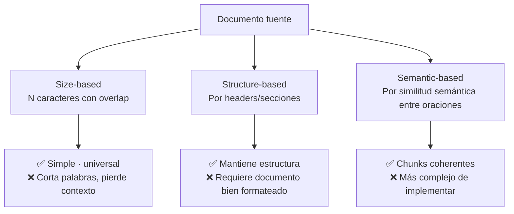
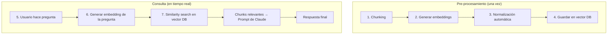

# RAG y Búsqueda Agéntica

> **Resumen Feynman (una frase):** RAG resuelve el problema de documentos grandes que no
> caben en el contexto: divide el documento en chunks, convierte cada chunk en un vector
> numérico, y cuando el usuario pregunta algo, recupera solo los chunks más relevantes
> para enviárselos a Claude — escalando desde un doc pequeño hasta miles de páginas sin
> cambiar el flujo.

---

## 1) Analogía sencilla

Tienes un libro de 1.000 páginas y alguien te pregunta algo sobre él. Dos opciones:

- **Opción A (sin RAG):** leer las 1.000 páginas en voz alta antes de responder.
  Imposible, agotador y caro.
- **Opción B (con RAG):** tienes el libro indexado. Buscas las 3 páginas más relevantes
  para esa pregunta específica, las lees, y respondes con esa información.

El índice es el vector database. La búsqueda de páginas relevantes es el similarity
search. Las 3 páginas que envías son los chunks que van al contexto de Claude.

El pipeline de mejora sigue la misma lógica: si el índice solo busca por palabras exactas
(BM25), puede perderse páginas relevantes que usan sinónimos. Si solo busca por significado
(embeddings), puede perderse páginas con términos técnicos específicos. La solución es
combinar ambos y luego dejar que Claude reordene los resultados por relevancia real.

---

## 2) ¿Qué es realmente?

**RAG (Retrieval Augmented Generation)** = técnica de dos fases para responder preguntas
sobre documentos grandes sin exceder el context window:

| Fase | Qué ocurre |
|------|-----------|
| **Pre-procesamiento** (una vez) | Dividir el documento → generar embeddings → guardar en vector DB |
| **Consulta** (en tiempo real) | Convertir pregunta a embedding → buscar chunks similares → enviar a Claude |

**Por qué no simplemente meter todo el documento en el contexto:**

| Enfoque | Limitación |
|---------|-----------|
| Documento completo en el prompt | Límite de tokens, menor calidad con prompts muy largos, mayor costo |
| RAG | Más complejo, requiere preprocesamiento, pero escala a miles de páginas |

---

## 3) ¿Cómo funciona? (mecanismo interno)

### 3a. Estrategias de chunking

Antes de poder buscar, hay que dividir el documento. La estrategia afecta directamente
la calidad de la recuperación.



**Size-based con overlap** — el más común en producción:
```python
def chunk_by_size(text: str, size: int = 500, overlap: int = 50) -> list[str]:
    chunks = []
    start = 0
    while start < len(text):
        end = start + size
        chunks.append(text[start:end])
        start += size - overlap   # overlap preserva contexto entre chunks
    return chunks
```

**Structure-based** — óptimo para markdown/HTML:
```python
def chunk_by_section(text: str) -> list[str]:
    # Divide en el encabezado markdown ##
    return [s.strip() for s in text.split("##") if s.strip()]
```

### 3b. Text Embeddings — el corazón de la búsqueda semántica

Un **embedding** es una lista de ~1.000 números (rango -1 a +1) que representa el
significado semántico de un texto. Textos con significado similar tienen vectores
similares aunque no compartan palabras exactas.

```python
# Anthropic recomienda Voyage AI para embeddings
import voyageai

vo = voyageai.Client(api_key="tu-voyage-key")

def generate_embedding(text: str | list[str]) -> list[float] | list[list[float]]:
    result = vo.embed(text, model="voyage-3", input_type="document")
    return result.embeddings[0] if isinstance(text, str) else result.embeddings
```

**¿Por qué semántico es mejor que keyword?**
- Keyword: busca "perro" → no encuentra "can", "mascota", "labrador"
- Semántico: busca "perro" → encuentra texto sobre animales domésticos aunque no diga "perro"

### 3c. El flujo RAG completo — 7 pasos



**Similitud de coseno** — la métrica que compara vectores:
```
cosine_similarity = cos(ángulo entre vectores) → rango -1 a 1
cosine_distance   = 1 - cosine_similarity       → rango 0 a 2
                                                  (0 = idénticos, 2 = opuestos)
```

```python
class VectorIndex:
    def __init__(self):
        self.vectors = []
        self.metadata = []

    def add_vector(self, embedding: list[float], meta: dict):
        self.vectors.append(np.array(embedding))
        self.metadata.append(meta)

    def search(self, query_embedding: list[float], top_k: int = 3) -> list[dict]:
        query = np.array(query_embedding)
        scores = [
            1 - (np.dot(query, v) / (np.linalg.norm(query) * np.linalg.norm(v)))
            for v in self.vectors
        ]
        top_indices = np.argsort(scores)[:top_k]
        return [{"distance": scores[i], **self.metadata[i]} for i in top_indices]
```

### 3d. BM25 — búsqueda léxica como complemento

BM25 (Best Match 25) es un algoritmo de recuperación por palabras clave que pondera
los términos por su rareza en el corpus: términos raros → mayor importancia; términos
comunes ("el", "de") → menor importancia.

**Por qué combinar semántico + léxico:**
- Embeddings pueden perder términos técnicos específicos ("Circular 007 SFC", "NIT específico")
- BM25 puede perder sinónimos y variaciones semánticas
- Juntos cubren ambos casos

```python
from rank_bm25 import BM25Okapi

class BM25Index:
    def __init__(self):
        self.docs = []
        self.bm25 = None

    def add_document(self, text: str, meta: dict):
        self.docs.append({"text": text, **meta})
        tokenized = [w.lower() for w in text.split() if w.isalpha()]
        # Reconstruir el índice con todos los documentos
        all_tokens = [[w.lower() for w in d["text"].split() if w.isalpha()]
                      for d in self.docs]
        self.bm25 = BM25Okapi(all_tokens)

    def search(self, query: str, top_k: int = 3) -> list[dict]:
        tokens = [w.lower() for w in query.split() if w.isalpha()]
        scores = self.bm25.get_scores(tokens)
        top_indices = np.argsort(scores)[::-1][:top_k]
        return [{"score": scores[i], **self.docs[i]} for i in top_indices]
```

### 3e. Multi-Index Pipeline con Reciprocal Rank Fusion

```python
class Retriever:
    def __init__(self):
        self.vector_index = VectorIndex()
        self.bm25_index   = BM25Index()

    def add_document(self, text: str, embedding: list[float]):
        self.vector_index.add_vector(embedding, {"content": text})
        self.bm25_index.add_document(text, {"content": text})

    def search(self, query: str, query_embedding: list[float], top_k: int = 5) -> list[dict]:
        vec_results = self.vector_index.search(query_embedding, top_k * 2)
        bm25_results = self.bm25_index.search(query, top_k * 2)
        return reciprocal_rank_fusion(vec_results, bm25_results, top_k)


def reciprocal_rank_fusion(list1, list2, top_k: int, k: int = 60) -> list[dict]:
    """RRF: score = Σ(1 / (rank + k)) para cada método"""
    scores = {}
    for rank, doc in enumerate(list1):
        key = doc["content"]
        scores[key] = scores.get(key, 0) + 1 / (rank + 1 + k)
    for rank, doc in enumerate(list2):
        key = doc["content"]
        scores[key] = scores.get(key, 0) + 1 / (rank + 1 + k)
    sorted_docs = sorted(scores.items(), key=lambda x: x[1], reverse=True)
    return [{"content": content, "rrf_score": score} for content, score in sorted_docs[:top_k]]
```

**Ejemplo RRF:**
```
Vector search → [doc2, doc7, doc6]
BM25 search   → [doc6, doc2, doc7]

doc2: 1/(1+60) + 1/(2+60) = 0.0164 + 0.0161 = 0.0325  ← mejor
doc6: 1/(3+60) + 1/(1+60) = 0.0159 + 0.0164 = 0.0323
doc7: 1/(2+60) + 1/(3+60) = 0.0161 + 0.0159 = 0.0320

Ranking final: [doc2, doc6, doc7]
```

### 3f. Reranking con LLM

Después de recuperar los candidatos, Claude reordena por relevancia real usando su
comprensión semántica:

```python
def rerank(query: str, candidates: list[dict], top_k: int = 3) -> list[dict]:
    doc_list = "\n".join([f"[{i}] {d['content'][:200]}" for i, d in enumerate(candidates)])

    rerank_prompt = f"""Given the query: "{query}"
Rank these documents from most to least relevant. Return only the indices in order.

<documents>
{doc_list}
</documents>"""

    messages = [{"role": "user", "content": rerank_prompt}]
    messages.append({"role": "assistant", "content": "```json"})

    response = client.messages.create(
        model="claude-haiku-4-5-20251001",   # Haiku suficiente para reranking
        max_tokens=200, messages=messages,
        stop_sequences=["```"]
    )
    ranked_indices = json.loads(response.content[0].text)
    return [candidates[i] for i in ranked_indices[:top_k]]
```

**Cuándo reranking tiene mayor impacto:** cuando la intención es ambigua o usa
terminología diferente al documento. Ejemplo: "equipo de ingeniería" vs "ENG team"
→ la búsqueda léxica falla, pero Claude entiende la equivalencia.

### 3g. Contextual Retrieval — enriquecer los chunks antes de indexar

**El problema:** cuando un chunk se extrae del documento, pierde su contexto.
Un chunk que dice "Los resultados mejoraron un 23%" no dice qué mejoró ni en qué período.

**La solución:** antes de indexar, pedir a Claude que genere una frase de contexto
para cada chunk basada en el documento completo:

```python
def add_context(chunk: str, source_document: str) -> str:
    """Genera contexto situacional para el chunk usando el documento fuente"""
    prompt = f"""Given this document:
<document>
{source_document[:3000]}   # Si el doc es muy largo: usar intro + chunks previos
</document>

Provide 1-2 sentences of context for this specific section:
<section>
{chunk}
</section>

Context should explain where this fits in the larger document."""

    context = client.messages.create(
        model="claude-haiku-4-5-20251001",
        max_tokens=150,
        messages=[{"role": "user", "content": prompt}]
    ).content[0].text

    return f"{context}\n\n{chunk}"   # contexto + chunk original


# En el pipeline de pre-procesamiento:
contextualized_chunks = [add_context(chunk, full_doc) for chunk in chunks]
# Ahora indexar los chunks contextualizados en vez de los originales
```

**Para documentos muy largos** — estrategia de contexto selectivo:
1. Incluir chunks iniciales (1-3) del documento → resumen/abstract
2. Incluir chunks inmediatamente anteriores al chunk objetivo → contexto local
3. Omitir chunks del medio → menos relevantes para contextualizar

---

## 4) ¿Cuándo usarlo?

| Escenario | Técnica |
|-----------|--------|
| Documento < ~50 páginas, consulta única | Documento completo en el prompt |
| Documento grande o múltiples documentos | RAG básico (chunking + embeddings) |
| Términos técnicos muy específicos | RAG + BM25 (híbrido) |
| Alta precisión necesaria, latencia tolerable | RAG + BM25 + Reranking |
| Chunks pierden contexto al extraerse | Contextual Retrieval antes de indexar |
| Documentos con estructura clara (markdown, HTML) | Structure-based chunking |
| Documentos sin estructura garantizada | Size-based chunking con overlap |

---

## 5) Ejemplo práctico integrado — Pipeline RAG para Protección

```python
import json
import numpy as np
import voyageai
from anthropic import Anthropic

client = Anthropic()
vo = voyageai.Client(api_key="voyage-key")

# --- Pre-procesamiento (se hace una sola vez) ---

def build_rag_pipeline(document_path: str) -> Retriever:
    with open(document_path) as f:
        full_doc = f.read()

    # 1. Chunking por secciones (el doc es markdown)
    raw_chunks = chunk_by_section(full_doc)

    # 2. Contextual Retrieval — enriquecer chunks
    ctx_chunks = [add_context(c, full_doc) for c in raw_chunks]

    # 3. Generar embeddings
    embeddings = generate_embedding(ctx_chunks)

    # 4. Indexar en retriever híbrido
    retriever = Retriever()
    for chunk, emb in zip(ctx_chunks, embeddings):
        retriever.add_document(chunk, emb)

    return retriever

# --- Consulta (en tiempo real) ---

def ask_document(query: str, retriever: Retriever) -> str:
    query_emb = generate_embedding(query)

    # Recuperar candidatos con búsqueda híbrida
    candidates = retriever.search(query, query_emb, top_k=10)

    # Reranking con LLM
    top_chunks = rerank(query, candidates, top_k=3)

    # Ensamblar prompt
    context = "\n\n---\n\n".join([c["content"] for c in top_chunks])
    prompt = f"""Answer the question based on the provided context only.

<context>
{context}
</context>

Question: {query}"""

    return client.messages.create(
        model="claude-sonnet-4-6",
        max_tokens=1000,
        messages=[{"role": "user", "content": prompt}]
    ).content[0].text


# Uso:
# retriever = build_rag_pipeline("politica_inversiones_2026.md")
# respuesta = ask_document("¿Cuál es el límite de inversión en renta variable?", retriever)
```

---

## 6) Conexiones con otros conceptos

- `→ requiere:` [[010_fundamentos_api_y_conversaciones]] — el prompt final con los chunks usa `client.messages.create()` estándar.
- `→ extiende:` [[070_tool_use]] — en pipelines agénticos, RAG puede exponerse como una tool: Claude decide cuándo buscar en el índice.
- `→ aplica en:` [[060_prompt_engineering_techniques]] — el prompt que ensambla los chunks recuperados se beneficia de XML tags y especificidad.

---

## 7) Preguntas Feynman

1. Tienes un documento de 500 páginas sobre normativa pensional de la SFC. ¿Qué estrategia
   de chunking eliges si el documento es un PDF escaneado sin estructura garantizada?

2. Dos chunks tienen cosine_distance de 0.1 y 0.8 respectivamente con la query del usuario.
   ¿Cuál es más relevante y por qué?

3. Un usuario pregunta "¿qué hizo el equipo de ciberseguridad en 2023?" pero el documento
   usa el término "cybersecurity team" en inglés. ¿Qué técnica de recuperación encontraría
   el documento correcto y cuál fallaría?

4. ¿Por qué el contextual retrieval se hace **antes** de indexar y no como un paso de
   post-procesamiento después de recuperar?

5. El reranking aumenta la precisión pero agrega latencia. ¿En qué tipo de aplicación
   aceptarías esa latencia y en cuál no?

---

## 8) Tarjetas Anki

**Q:** ¿Cuál es la diferencia fundamental entre búsqueda semántica (embeddings) y búsqueda léxica (BM25)?
**A:** Semántica busca por **significado** — encuentra sinónimos y conceptos relacionados aunque no compartan palabras. Léxica busca por **palabras exactas** — prioriza términos específicos y poco frecuentes en el corpus.

**Q:** ¿Qué mide el cosine_distance entre dos embeddings?
**A:** La distancia entre vectores de 0 a 2. Valores cercanos a 0 = alta similitud semántica. El complemento de cosine_similarity (que es el coseno del ángulo entre vectores, rango -1 a 1).

**Q:** ¿Qué es Reciprocal Rank Fusion (RRF) y para qué sirve?
**A:** Técnica para fusionar resultados de múltiples índices de búsqueda. Asigna score = Σ(1/(rank + k)) para cada documento según su posición en cada índice. Premia documentos que aparecen bien rankeados en múltiples métodos.

**Q:** ¿Cuál es el problema que resuelve el Contextual Retrieval?
**A:** Cuando un chunk se extrae del documento pierde su contexto original. El contexto se añade como una o dos frases generadas por Claude que explican la relación del chunk con el documento completo, antes de indexarlo.

**Q:** ¿Por qué el reranking usa Haiku en vez de Sonnet/Opus?
**A:** Porque es una tarea de alto volumen (muchos documentos a reordenar) donde la velocidad y el costo importan más que la inteligencia máxima. Haiku es suficiente para comparar relevancia de fragmentos cortos.

---

## 9) Lo que no es obvio

**La calidad del chunking es el factor más subestimado del RAG.**
Un pipeline perfecto de embeddings + BM25 + reranking con chunks mal hechos devuelve
resultados irrelevantes. El ejemplo del curso es ilustrativo: un chunk médico que menciona
"bug" (como síntoma) puede aparecer en una búsqueda de "software bugs" porque ambos
comparten la palabra, no el significado. El overlap en size-based chunking es la solución
más simple.

**Los embeddings del mismo modelo son comparables entre sí — nunca mezcles modelos.**
Si indexas con `voyage-3` y haces la query con `voyage-2`, los vectores no son comparables.
La similitud de coseno pierde todo su significado. El modelo de embedding debe ser el
mismo en pre-procesamiento y en consulta.

**Contextual Retrieval tiene un costo de procesamiento significativo.**
Genera una llamada a Claude por cada chunk. Con un documento de 200 chunks, son 200
llamadas. Usa Haiku para este paso y cachea el resultado — una vez generado el contexto
no necesita regenerarse a menos que el documento cambie.

**RRF con k=60 es el default canónico pero no siempre el óptimo.**
El parámetro k controla cuánto penaliza las posiciones bajas en el ranking. k=60 es
estándar en la literatura, pero para tu caso de uso específico puede valer la pena
experimentar con valores entre 20 y 100.

**El reranking no reemplaza la recuperación inicial — la complementa.**
Si los candidatos iniciales son malos (ningún chunk relevante en el top-10), el reranking
no puede crear relevancia de la nada. Primero asegura una recuperación amplia (top_k
generoso), luego reordena con el LLM.

---

## Notebooks de práctica

| Notebook | Qué cubre |
|----------|----------|
| [081_chunking.ipynb](081_chunking.ipynb) | Estrategias de chunking (size-based con overlap, structure-based por secciones) sobre `report.md` |
| [082_embeddings.ipynb](082_embeddings.ipynb) | Generación de embeddings con Voyage AI · setup de la API key · representación vectorial |
| [083_vectordb.ipynb](083_vectordb.ipynb) | Clase `VectorIndex` · `add_vector` + `search` · cosine distance · similarity search completo |
| [084_bm25.ipynb](084_bm25.ipynb) | Índice BM25 · tokenización · ponderación por rareza de términos · complemento al semántico |
| [085_hybrid.ipynb](085_hybrid.ipynb) | Pipeline híbrido · Reciprocal Rank Fusion · reranking con LLM · contextual retrieval |

**Documento fuente:** `report.md` — reporte interdisciplinario de investigación (corpus de prueba)
**Guía API:** `VoyageAI_API_Key_Directions.pdf` — instrucciones para obtener la key de Voyage AI

---

### Registro personal
- Qué conecta con mi trabajo: En Protección manejamos documentos regulatorios extensos
  de la SFC (circulares, resoluciones). Un RAG híbrido con contextual retrieval permitiría
  responder preguntas sobre cumplimiento regulatorio citando las secciones exactas. El
  BM25 es crítico aquí porque los documentos legales usan terminología muy específica
  (números de circulares, artículos, definiciones exactas) que los embeddings pueden perder.
- Dudas abiertas: ¿Voyage AI es el único proveedor recomendado por Anthropic o hay
  alternativas? ¿El SDK de Anthropic incluirá embeddings nativos en algún momento?
- Siguientes pasos: Construir un índice RAG sobre las circulares de la SFC más relevantes
  para el área de cumplimiento de Protección.
