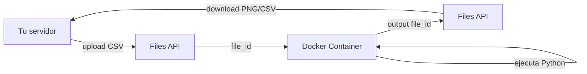

# Features de Claude

> **Resumen Feynman (una frase):** Claude no es solo texto-entra-texto-sale — tiene un conjunto
> de capacidades especializadas que amplían lo que puede percibir (imágenes, PDFs), cómo
> razona (Extended Thinking), cómo cita sus fuentes (Citations), cuánto cuesta operar a escala
> (Prompt Caching) y qué puede ejecutar directamente (Code Execution).

---

## 1) Analogía sencilla

Imagina que contratas a un analista senior para tu equipo en Protección. Viene con capacidades base (leer, escribir, razonar), pero también tiene habilidades especializadas que activas según la tarea:

- **Extended Thinking** → le pides que se tome 10 minutos para pensar antes de responderte, en vez de responder de inmediato. Sale una respuesta más elaborada pero tardas más.
- **Vision (imágenes/PDFs)** → le pasas un documento escaneado o una foto de una pantalla y él lo analiza. Sin esta habilidad, solo puede leer texto plano.
- **Citations** → le pides que cuando afirme algo, señale exactamente en qué página y párrafo lo leyó.
- **Prompt Caching** → si cada día le das el mismo mazo de 200 páginas de normativa SFC para contexto, en vez de releerlo completo cada vez, lo tiene marcado con notas adhesivas y solo relee lo nuevo.
- **Code Execution** → tiene acceso a una calculadora Python en un cuarto cerrado sin internet. Le pasas los datos por la puerta, él corre el análisis adentro, te saca el resultado por la misma puerta.

Cada feature resuelve un problema concreto. No se activan solas — las habilitas según la tarea.

---

## 2) ¿Qué son realmente?

Son **capacidades opcionales de la API de Claude** que se habilitan con parámetros adicionales en la request. Ninguna está activa por defecto (salvo el procesamiento de texto base).

| Feature | Qué habilita | Cómo se activa |
|---------|-------------|----------------|
| Extended Thinking | Razonamiento previo antes de responder | Parámetro `thinking={"type": "enabled", "budget_tokens": N}` |
| Vision (imágenes) | Análisis de imágenes en mensajes de usuario | Bloque `{"type": "image", "source": {...}}` en el content |
| PDF Support | Lectura de documentos PDF completos | Bloque `{"type": "document", "source": {...}}` en el content |
| Citations | Referencias a fuentes con ubicación exacta | `"citations": {"enabled": true}` en la request |
| Prompt Caching | Reutilización de procesamiento previo | `"cache_control": {"type": "ephemeral"}` en bloques |
| Code Execution | Ejecución de Python en Docker aislado | Tool `{"type": "code_execution_20250825"}` + Files API |

---

## 3) ¿Cómo funciona cada feature?

### Extended Thinking

Claude procesa la respuesta en dos fases antes de responder: una fase de *razonamiento interno* (thinking block) y luego la respuesta final (text block).

```python
response = client.messages.create(
    model="claude-sonnet-4-6",
    max_tokens=10000,           # debe ser > thinking_budget
    thinking={
        "type": "enabled",
        "budget_tokens": 2000   # mínimo 1024 tokens
    },
    messages=[{"role": "user", "content": "..."}]
)

# La respuesta tiene dos bloques
for block in response.content:
    if block.type == "thinking":
        print("Razonamiento:", block.thinking)  # texto interno
    elif block.type == "text":
        print("Respuesta final:", block.text)
```

**Detalles importantes:**
- El thinking block incluye una **firma criptográfica** — Anthropic la usa para detectar si el razonamiento fue alterado antes de pasarlo de nuevo al modelo en multi-turn.
- Existen **redacted thinking blocks**: cuando el safety system detecta contenido sensible en el razonamiento, lo encripta. El bloque se incluye igual para mantener continuidad de contexto.
- **Cuándo usarlo:** después de agotar las técnicas de prompt engineering y el score del eval sigue bajo. Es caro (los tokens de pensamiento se cobran) y lento.

---

### Vision — Imágenes y PDFs

Ambos se pasan como bloques dentro del `content` del mensaje de usuario. La diferencia es el `type` y el `media_type`.

```python
import base64

# Imagen (base64)
with open("imagen.png", "rb") as f:
    image_data = base64.standard_b64encode(f.read()).decode("utf-8")

messages = [{
    "role": "user",
    "content": [
        {
            "type": "image",
            "source": {
                "type": "base64",
                "media_type": "image/png",
                "data": image_data
            }
        },
        {"type": "text", "text": "Analiza esta imagen paso a paso..."}
    ]
}]

# PDF (misma lógica, distinto type)
with open("documento.pdf", "rb") as f:
    pdf_data = base64.standard_b64encode(f.read()).decode("utf-8")

messages = [{
    "role": "user",
    "content": [
        {
            "type": "document",
            "source": {
                "type": "base64",
                "media_type": "application/pdf",
                "data": pdf_data
            }
        },
        {"type": "text", "text": "Extrae los puntos clave..."}
    ]
}]
```

**Límites de imágenes:** máximo 100 por request. Las imágenes consumen tokens calculados por dimensiones en píxeles (ancho × alto). Claude puede también referenciar imágenes por URL en lugar de base64.

**Clave para buenas respuestas con imágenes:** el prompting importa más que la calidad de la imagen. Un prompt con instrucciones paso a paso + ejemplos one-shot produce resultados mucho más precisos que un prompt simple.

---

### Citations

Permite que Claude indique exactamente de dónde proviene cada afirmación al procesar documentos fuente.

```python
response = client.messages.create(
    model="claude-sonnet-4-6",
    max_tokens=1000,
    messages=[{
        "role": "user",
        "content": [
            {
                "type": "document",
                "source": {"type": "base64", "media_type": "application/pdf", "data": pdf_data},
                "title": "Circular 007 SFC",   # ← identificador del documento
                "citations": {"enabled": True}  # ← activa citations para este doc
            },
            {"type": "text", "text": "¿Cuáles son los requisitos de capital mínimo?"}
        ]
    }]
)
```

**Tipos de citation según el documento:**
- `citation_page_location` → para PDFs: documento, página inicio, página fin, texto citado.
- `citation_char_location` → para texto plano: posición del carácter en el bloque.

**Por qué importa:** construye transparencia hacia el usuario — puede verificar cada afirmación de Claude contra la fuente. Especialmente crítico en contextos regulatorios como Protección.

---

### Prompt Caching

El procesamiento de input es costoso computacionalmente. Si múltiples requests consecutivas comparten el mismo prefijo de contenido, ese trabajo se puede cachear.

```python
# System prompt con cache_control
system_prompt_con_cache = [{
    "type": "text",
    "text": "Eres un experto en normativa SFC... [500 líneas de contexto]",
    "cache_control": {"type": "ephemeral"}   # ← breakpoint aquí
}]

# Tool schemas con cache en el último elemento
tools_con_cache = [
    tool_schema_1,
    tool_schema_2,
    {**tool_schema_3, "cache_control": {"type": "ephemeral"}}  # ← cache en el último
]
```

**Reglas clave:**
- TTL: **1 hora** máximo. Después se descarta.
- Mínimo **1024 tokens** de contenido para que la caché se active.
- Máximo **4 breakpoints** por request.
- Orden de procesamiento: `tools → system prompt → messages`. El breakpoint cachea todo lo que está antes de él.
- Si cualquier contenido **antes** del breakpoint cambia, la caché se invalida completamente.
- La respuesta incluye `cache_creation_input_tokens` y `cache_read_input_tokens` para monitorear hits/misses.

**Cuándo tiene más impacto:** system prompts largos con documentos de referencia, schemas de tools complejos que se repiten en cada request, historial de conversación estático que crece en cada turno.

---

### Code Execution + Files API

Claude puede escribir y ejecutar código Python en contenedores Docker aislados en los servidores de Anthropic.

```python
# 1. Subir datos con Files API
file_metadata = client.beta.files.upload(
    file=("datos.csv", open("datos.csv", "rb"), "text/csv")
)
file_id = file_metadata.id

# 2. Request con code_execution tool y referencia al archivo
response = client.messages.create(
    model="claude-sonnet-4-6",
    max_tokens=10000,
    messages=[{
        "role": "user",
        "content": [
            {"type": "text", "text": "Analiza los drivers de churn en el dataset."},
            {"type": "container_upload", "file_id": file_id}  # ← archivo disponible en el container
        ]
    }],
    tools=[{"type": "code_execution_20250825", "name": "code_execution"}],
    extra_headers={"anthropic-beta": "code-execution-2025-08-25, files-api-2025-04-14"}
)

# 3. Descargar outputs generados (plots, reportes)
# La respuesta incluye file_ids de archivos generados en el container
client.beta.files.download(output_file_id)
```

**Limitación crítica:** los contenedores no tienen acceso a red. Solo pueden recibir datos vía Files API antes de ejecutar, y devolver resultados vía file_ids en la respuesta. No pueden hacer `pip install` en runtime ni conectarse a APIs externas.



---

## 4) ¿Cuándo usar cada feature?

| Situación | Feature |
|-----------|---------|
| Tarea de razonamiento complejo que el modelo falla con prompts optimizados | Extended Thinking |
| Extraer datos de imágenes, capturas de pantalla, documentos escaneados | Vision |
| Procesar PDFs completos con tablas, gráficas y texto mixto | PDF Support |
| Aplicación donde el usuario necesita verificar las fuentes de Claude | Citations |
| System prompt largo que se repite en muchas requests (>1024 tokens) | Prompt Caching |
| Análisis de datos, generación de gráficas, procesamiento de archivos sin necesidad de red | Code Execution |
| Datos muy grandes para incluir inline en cada request | Files API |

---

## 5) Ejemplo práctico integrado

Caso de uso: análisis de una circular de la SFC con respaldo en fuentes y caching del contexto.

```python
# System prompt cacheado (se reutiliza en cada pregunta)
system = [{
    "type": "text",
    "text": "Eres un experto en regulación financiera colombiana. Responde siempre citando la fuente.",
    "cache_control": {"type": "ephemeral"}
}]

# Pregunta con PDF + citations habilitadas
with open("circular_007.pdf", "rb") as f:
    pdf_b64 = base64.b64encode(f.read()).decode()

messages = [{
    "role": "user",
    "content": [
        {
            "type": "document",
            "source": {"type": "base64", "media_type": "application/pdf", "data": pdf_b64},
            "title": "Circular 007 SFC 2024",
            "citations": {"enabled": True}
        },
        {"type": "text", "text": "¿Qué obligaciones tiene el fondo sobre reporte de riesgo operacional?"}
    ]
}]

response = client.messages.create(
    model="claude-sonnet-4-6",
    max_tokens=2000,
    system=system,
    messages=messages
)

# La respuesta incluye texto + bloques de citation con página exacta
for block in response.content:
    if hasattr(block, "citations"):
        for citation in block.citations:
            print(f"Página {citation.start_page_number}: {citation.cited_text}")
```

---

## 6) Conexiones con otros conceptos

- `→ requiere:` [[02_claude_api/01x_api_fundamentals/010_fundamentos_api_y_conversaciones]] — todas las features usan el mismo `client.messages.create()` base.
- `→ extiende:` [[02_claude_api/07x_tool_use/070_tool_use]] — Code Execution es una tool del lado del servidor; Computer Use y Text Editor son tools del lado del cliente.
- `→ contrasta:` [[02_claude_api/08x_rag/080_rag_and_agentic_search]] — RAG resuelve el problema de documentos grandes con búsqueda previa; PDF Support lo resuelve cargando el documento completo. RAG escala mejor, PDF Support es más simple para documentos medianos.
- `→ aplica en:` [[02_claude_api/04x_streaming_and_output/040_response_streaming]] — Extended Thinking produce bloques adicionales (thinking) que deben manejarse en el streaming junto con los text blocks.

---

## 7) Preguntas Feynman

1. Tienes un chatbot que responde preguntas sobre las circulares de la SFC. Cada request incluye un system prompt de 3000 tokens. ¿Qué feature aplicas y qué condición debe cumplirse para que funcione?
2. Un usuario sube una imagen de una tabla de Excel escaneada y Claude extrae los datos incorrectamente. ¿Cuál es la causa más probable y cómo la corriges?
3. ¿Por qué Extended Thinking incluye una firma criptográfica en el thinking block? ¿Qué problema resuelve?
4. Quieres que Claude analice un CSV de 50.000 filas y genere un reporte con gráficas. ¿Puedes pasar el CSV directamente en el prompt? ¿Qué feature usarías y cuál es el flujo correcto?
5. ¿En qué se diferencia el problema que resuelve Citations del que resuelve RAG? ¿Podrían usarse juntos?

---

## 8) Tarjetas Anki

**Q:** ¿Cuál es el mínimo de tokens para que el Prompt Caching se active?
**A:** 1024 tokens. Contenido menor a ese umbral no se cachea aunque tenga `cache_control`.

**Q:** ¿Qué diferencia hay entre `citation_page_location` y `citation_char_location`?
**A:** `citation_page_location` es para PDFs (indica página inicio/fin). `citation_char_location` es para texto plano (indica posición del carácter). El tipo depende del documento fuente.

**Q:** ¿Por qué Code Execution no tiene acceso a la red y qué implica eso para el I/O?
**A:** Es una decisión de seguridad para aislar el sandbox. Implica que todos los datos deben entrar vía Files API antes de ejecutar, y todos los outputs (plots, archivos) salen como file_ids que se descargan con Files API.

**Q:** ¿Cuándo se invalida la caché de Prompt Caching?
**A:** Cuando cualquier contenido **antes** del breakpoint cambia. La caché es de prefijo exacto — un solo carácter diferente invalida todo lo que sigue.

**Q:** ¿Cuál es la diferencia entre Extended Thinking y un buen prompt con Tipo B (pasos)?
**A:** Tipo B guía el proceso de razonamiento externamente (tú defines los pasos). Extended Thinking deja que Claude razone internamente de forma libre antes de responder. Extended Thinking cuesta más tokens pero no requiere que conozcas el proceso ideal de razonamiento.

**Q:** ¿Cuántos breakpoints de caché se permiten por request y cuánto dura la caché?
**A:** Máximo 4 breakpoints por request. La caché dura hasta 1 hora (TTL ephemeral).

---

## 9) Lo que no es obvio

**Extended Thinking no reemplaza el prompt engineering — lo complementa.**
La recomendación es optimizar el prompt primero (4 técnicas + eval) y solo habilitar thinking si el score sigue siendo insuficiente. Habilitarlo desde el inicio es costoso sin garantía de mejora proporcional.

**En Vision, el prompting importa más que la imagen.**
Claude puede fallar con imágenes de alta calidad si el prompt es vago. Instrucciones detalladas paso a paso + ejemplos one-shot tienen más impacto que mejorar la resolución de la imagen.

**Citations no garantiza que Claude no alucine — garantiza que cuando cita, cita correctamente.**
Si el documento fuente no contiene la información, Claude puede generar texto sin citation (sin respaldo), que es la señal de que está interpolando. Las citations son presencia, no ausencia de error.

**Prompt Caching no reduce el costo de la primera request — lo aumenta ligeramente.**
La primera request escribe la caché (`cache_creation_input_tokens`), lo que es marginalmente más caro. El ahorro empieza desde la segunda request. Si cada request es única (dataset diferente cada vez), el caching no aporta.

**Code Execution y RAG resuelven problemas distintos aunque a veces parezcan alternativos.**
RAG es para búsqueda en colecciones grandes de documentos. Code Execution es para análisis computacional de datos estructurados. Para analizar un CSV grande, Code Execution es la respuesta. Para buscar en miles de PDFs normativos, RAG es la respuesta.

---

## Notebooks de práctica

| Notebook | Qué cubre |
|----------|----------|
| [091_thinking_complete.ipynb](091_thinking_complete.ipynb) | Extended Thinking · thinking budget · thinking blocks · redacted blocks · firma criptográfica |
| [092_images_and_pdfs.ipynb](092_images_and_pdfs.ipynb) | Vision · base64 encoding · image blocks · document blocks · prompting para imágenes |
| [093_citations_complete.ipynb](093_citations_complete.ipynb) | Citations en PDFs y texto plano · citation_page_location · citation_char_location · rendering de citas |
| [094_caching.ipynb](094_caching.ipynb) | Prompt Caching · cache_control en system prompt y tools · cache_creation vs cache_read tokens · invalidación |
| [095_code_execution.ipynb](095_code_execution.ipynb) | Code Execution tool · Files API upload/download · container_upload block · análisis de churn con plot |

**Archivos de datos:**
- `streaming.csv` — dataset de churn usado en `095_code_execution.ipynb`
- `churn_analysis_detailed.png` — plot generado por Claude dentro del container Docker
- `earth.pdf` — PDF de ejemplo usado en `092_images_and_pdfs.ipynb`

---

### Registro personal

- Qué me sorprendió: La firma criptográfica en Extended Thinking es un mecanismo de seguridad para multi-turn que no era obvio. En conversaciones largas, si se adultera el thinking block entre turnos, el modelo lo detecta.
- Qué conecta con mi trabajo: Prompt Caching es directamente aplicable a los pipelines de Protección donde el system prompt con normativa SFC es el mismo en cientos de requests diarias. Citations es clave para cualquier herramienta que responda preguntas sobre regulación — el área jurídica necesita poder rastrear de dónde viene cada afirmación. Code Execution podría reemplazar pasos de ETL simples donde hoy usamos scripts Python separados.
- Dudas abiertas: ¿Cuál es el costo exacto por token de thinking vs token normal? ¿Los tokens de thinking tienen descuento por caching también?
- Siguientes pasos: Curso 3 — Introduction to Model Context Protocol.
