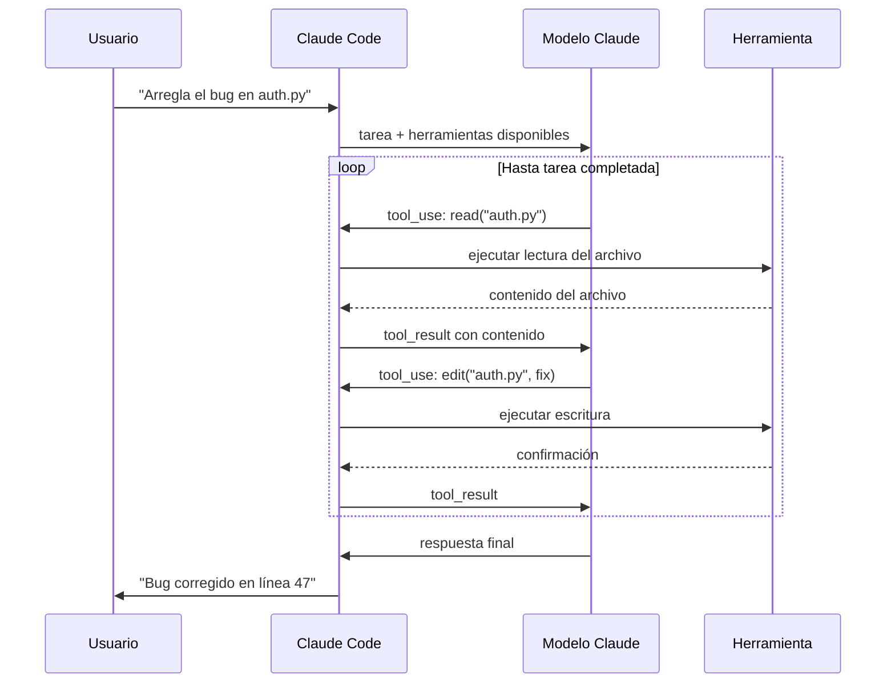

# ¿Qué es Claude Code?

> **Resumen Feynman (una frase):** Claude Code es un modelo de lenguaje con manos —
> puede pensar sobre tu código *y* actuar sobre él gracias a un sistema de herramientas
> que le permite leer archivos, ejecutar comandos e interactuar con sistemas externos.

---

## 1) Analogía sencilla

Un modelo de lenguaje estándar es como un consultor brillante atrapado en una cabina
telefónica: puede razonar sobre cualquier problema que le describas, pero no puede
abrir tu código, ejecutar tests ni desplegar nada — solo puede hablar.

Claude Code es ese mismo consultor, pero ahora tiene **manos**. Puede abrir archivos,
ejecutar comandos en la terminal, navegar por el navegador, comentar en GitHub y
llamar a servicios externos. Las manos son el **sistema de herramientas (tool use)**;
el cerebro es el modelo de lenguaje.

La diferencia clave: no es que Claude Code "sepa más código" — es que puede
**actuar** sobre el código, no solo hablar de él.

---

## 2) ¿Qué es realmente?

Claude Code es un **asistente de desarrollo** construido sobre el modelo Claude que
extiende las capacidades del LLM con un conjunto de herramientas (leer/escribir archivos,
ejecutar comandos, llamar APIs externas) mediante un loop de tool use.

**Por qué Claude específicamente y no otro LLM:**

| Ventaja | Impacto práctico |
|---|---|
| Calidad de tool use superior | Mejor comprensión de qué herramienta combinar en tareas complejas |
| Extensibilidad nativa (MCP) | Nuevas herramientas agregables sin modificar el core |
| Búsqueda directa en codebase | Sin indexación que envíe el código a servidores externos → mejor seguridad |

---

## 3) ¿Cómo funciona? (mecanismo interno)

### 3.1 El loop de tool use

Todo lo que Claude Code hace pasa por este ciclo:



El LLM **no** accede directamente a los archivos. Claude Code actúa como intermediario:
recibe las instrucciones de acción del LLM, las ejecuta en el sistema real, y devuelve
los resultados. El LLM solo procesa texto.

### 3.2 Capacidades demostradas en el curso

**Optimización de rendimiento:**
- Proyecto: librería Chalk (JavaScript, 429M descargas semanales)
- Proceso: Claude analizó benchmarks, perfiló con herramientas, creó listas de tareas,
  identificó cuellos de botella e implementó fixes
- Resultado: **mejora de 3.9× en throughput**

**Análisis de datos:**
- Proyecto: análisis de churn en plataforma de video streaming
- Proceso: Claude ejecutó celdas de Jupyter iterativamente, vio resultados,
  personalizó análisis sucesivos basándose en hallazgos previos
- Patrón clave: inspección del entorno entre cada paso (Environment Inspection)

**Automatización de UI con Playwright MCP:**
- Claude conectado a Playwright MCP server
- Abrió el navegador, tomó screenshots, actualizó estilos CSS, iteró sobre mejoras
- Demuestra que la extensibilidad vía MCP convierte a Claude Code en un agente de
  desarrollo completo, no solo un editor de texto

**Integración con GitHub Actions:**
- Claude Code corre dentro de pipelines CI/CD
- Herramientas disponibles: comentar issues/PRs, hacer commits, crear PRs
- Ejemplo de seguridad: detectó automáticamente exposición de PII en una revisión de PR
  analizando el flujo de datos en infraestructura Terraform → Lambda → partner externo

---

## 4) ¿Cuándo usarlo?

**Claude Code es el asistente adecuado cuando:**
- La tarea requiere leer/modificar múltiples archivos con contexto arquitectural
- Necesitas ejecutar comandos y ver resultados de forma iterativa
- Quieres integrar revisiones automáticas en tu pipeline CI/CD (GitHub Actions)
- Necesitas extender capacidades con herramientas externas (Playwright, Sentry, Jira)

**No reemplaza:**
- Un IDE para edición rápida de una línea
- Herramientas especializadas de profiling cuando se necesita granularidad extrema
- Revisión humana para decisiones de arquitectura o seguridad de alto riesgo

---

## 5) Ejemplo práctico mínimo

```bash
# Instalar Claude Code (requiere Node.js)
npm install -g @anthropic-ai/claude-code

# Iniciar en un proyecto
cd mi-proyecto
claude

# Claude Code tiene acceso a todos los archivos del proyecto
# Ejemplo de tarea:
# > "Analiza el rendimiento de la función process_batch en src/pipeline.py
#    y propone optimizaciones"
```

**Agregar un servidor MCP para extender capacidades:**

```bash
# Conectar Playwright para automatización de UI
claude mcp add playwright npx @playwright/mcp

# A partir de aquí Claude Code puede abrir browsers y tomar screenshots
```

---

## 6) Conexiones con otros conceptos

- `→ requiere:` [[02_claude_api/07x_tool_use/070_tool_use]] — el loop de tool use (`stop_reason == "tool_use"`) es el mecanismo central de todo lo que Claude Code hace. Sin entender ese loop, Claude Code parece magia.
- `→ extiende:` [[02_claude_api/011x_anthropic_apps/110_anthropic_apps]] — esta nota es la introducción superficial que el Curso 02 cubría; el Curso 04 profundiza en cada capacidad con implementación real.
- `→ requiere:` [[02_claude_api/010x_mcp/100_mcp]] — la extensibilidad con Playwright, Sentry o herramientas internas depende de entender el protocolo MCP y cómo Claude Code actúa como cliente MCP nativo.
- `→ aplica en:` [[04_claude_code/_overview]] — las secciones siguientes del curso (contexto, hooks, comandos, SDK) construyen sobre esta base.

---

## 7) Preguntas Feynman

1. Un LLM "solo procesa texto". ¿Cómo es posible entonces que Claude Code modifique archivos reales en tu disco? ¿Qué componente hace el trabajo que el LLM no puede hacer directamente?
2. La mejora de 3.9× en Chalk fue posible porque Claude pudo usar herramientas de profiling. ¿Por qué eso sería difícil o imposible con un LLM sin tool use, aunque le pasaras todo el código en el prompt?
3. Claude Code detectó una fuga de PII en el PR de infraestructura. ¿Qué tipo de "razonamiento sobre el flujo de datos" tuvo que hacer Claude, y qué herramientas probablemente usó para llegar a esa conclusión?
4. ¿Por qué la extensibilidad vía MCP es una ventaja de seguridad frente a soluciones que indexan el codebase en un servidor externo?
5. En el ejemplo de análisis de churn con Jupyter, Claude "ejecutó celdas iterativamente y personalizó análisis basándose en hallazgos previos". ¿Qué patrón de agent design (visto en el Curso 02) está aplicando aquí?

---

## 8) Tarjetas Anki

**Q:** ¿Por qué los LLMs necesitan un sistema de herramientas (tool use) para ser asistentes de desarrollo útiles?
**A:** Los LLMs solo procesan y generan texto — no pueden leer archivos, ejecutar comandos ni interactuar con sistemas externos directamente. El sistema de herramientas actúa como "manos": Claude solicita una acción, el asistente la ejecuta en el mundo real, y devuelve el resultado como texto para que Claude continúe razonando.

**Q:** ¿Cuál fue el resultado del demo de optimización de Chalk en el curso, y qué proceso siguió Claude?
**A:** Mejora de **3.9× en throughput**. Proceso: analizar benchmarks → perfilar con herramientas → crear lista de tareas → identificar cuellos de botella → implementar fixes. Todo mediante el loop de tool use sin intervención manual del developer.

**Q:** ¿Qué ventaja de seguridad tiene Claude Code frente a asistentes que indexan el codebase?
**A:** Claude Code busca directamente en los archivos locales sin enviar el código a servidores externos para indexación. Los indexadores transmiten el codebase completo a infraestructura de terceros, lo que es inaceptable para código propietario o datos sensibles.

**Q:** ¿Cómo detectó Claude Code la fuga de PII en el demo de GitHub Actions?
**A:** Analizó el flujo de datos completo: infraestructura Terraform → DynamoDB + S3 → Lambda function → partner externo. Identificó que el developer había añadido el email del usuario al output de la Lambda, y ese dato fluía hacia el partner sin que fuera intencional.

**Q:** ¿Qué es el "loop de tool use" en Claude Code y cuándo termina?
**A:** Claude solicita una herramienta → Claude Code la ejecuta → resultado vuelve a Claude → Claude decide si necesita más herramientas o puede responder. El loop termina cuando Claude genera una respuesta de texto final (`stop_reason != "tool_use"`).

---

## 9) Lo que no es obvio (trampas y confusiones frecuentes)

**"Claude Code escribe código mejor porque sabe más sobre código."** Falso. La ventaja competitiva es la **calidad de tool use**: qué herramientas combinar, en qué orden, y cómo interpretar los resultados para decidir el siguiente paso. Un modelo con peor tool use puede saber tanto código pero ser menos efectivo como asistente.

**La extensibilidad no es un feature adicional — es la arquitectura.** Claude Code no tiene una lista fija de capacidades. Su utilidad escala con los MCP servers conectados. Playwright, Sentry, Jira, herramientas internas de Protección — todo se integra con el mismo comando `claude mcp add`.

**GitHub Actions no es solo para CI/CD.** El demo de detección de PII muestra que Claude Code en Actions puede razonar sobre *impacto de seguridad* de cambios — no solo si el código compila. Es una capa de revisión semántica automatizable.

**El análisis de datos con Jupyter no requirió notebooks pre-escritos.** Claude generó el código, lo ejecutó, vio los resultados y decidió los siguientes análisis de forma autónoma. El patrón de Environment Inspection (ver resultado antes de decidir el siguiente paso) es lo que hace esto posible — no es simplemente autocompletar código.

---

### Registro personal

- Qué me sorprendió o conectó con algo que ya sabía: La detección de PII en el flujo Terraform → Lambda → partner es exactamente el tipo de análisis que hacemos en Protección para cumplimiento SFC. Automatizar esa revisión en PRs eliminaría una categoría entera de revisiones manuales en el proceso de code review.
- Dudas que quedaron abiertas: ¿Cómo maneja Claude Code proyectos con cientos de miles de líneas donde leer todos los archivos es inviable? ¿Usa alguna estrategia de indexación local o depende del developer para orientarlo con `@archivo`?
- Siguientes pasos: Sección 02x — gestión avanzada de contexto (CLAUDE.md, Plan Mode, Thinking Mode, comandos de control de conversación).
