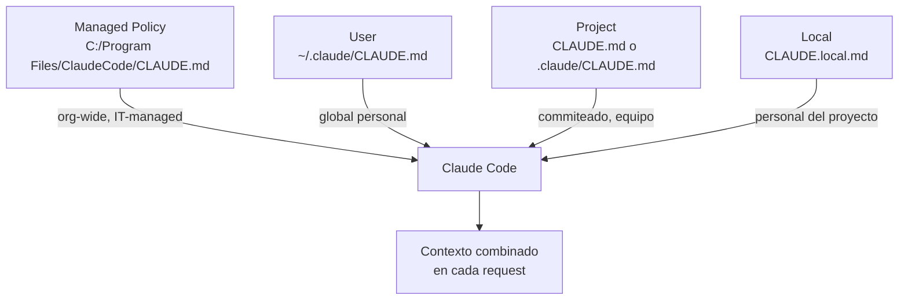
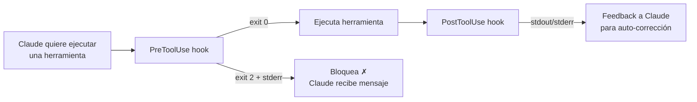

# Getting Hands On — Flujo completo de desarrollo con Claude Code

> **Resumen Feynman (una frase):** Claude Code no es un chatbot de código — es un colaborador
> que vive en tu terminal, lee tu proyecto, actúa sobre él y aprende las reglas que tú le
> impones a través de archivos de configuración, comandos personalizados, hooks y servidores MCP.

---

## 1) Analogía sencilla

Imagina que contratas un desarrollador nuevo pero extraordinariamente capaz. El primer día le das
un manual de onboarding (`CLAUDE.md`), acceso a tu repo, y le explicas las convenciones del
equipo. Él lee los archivos que necesita, ejecuta comandos, hace commits y te pide validación
antes de los cambios importantes.

Pero además puedes configurar "guardias de calidad": cada vez que él termina de editar un archivo
alguien corre el linter (hook post-tool), y si intenta leer el archivo de credenciales un guardia
lo bloquea automáticamente (hook pre-tool con exit 2). También puedes darle herramientas nuevas:
un browser, acceso a Jira, conexión a Sentry — eso son los servidores MCP.

---

## 2) ¿Qué es realmente?

Getting Hands On cubre la capa de **configuración y automatización** de Claude Code: cómo
darle contexto preciso, cómo controlarlo durante una sesión, cómo extender sus capacidades con
MCP y cómo enseñarle reglas de negocio a través de hooks y comandos personalizados.

El proyecto de práctica fue **uigen** — app Next.js 15 + Prisma + SQLite + `@ai-sdk/anthropic`
que genera componentes React a partir de prompts de lenguaje natural. Si no hay API key válida,
`getLanguageModel()` retorna un `MockLanguageModel` con respuestas enlatadas.

---

## 3) ¿Cómo funciona? (mecanismo interno)

### 3.1 Capas de configuración



| Tipo | Ubicación | ¿Se commitea? | Uso |
|------|-----------|---------------|-----|
| Managed Policy | `C:\Program Files\ClaudeCode\CLAUDE.md` | N/A (IT-managed) | Estándares org, seguridad, compliance — **no se puede excluir** |
| User | `~/.claude/CLAUDE.md` | No | Preferencias personales para todos los proyectos |
| Project | `CLAUDE.md` o `.claude/CLAUDE.md` | **Sí** | Convenciones del equipo, arquitectura del proyecto |
| Local | `CLAUDE.local.md` *(nota: no `CLAUDE.md.local`)* | No | Overrides personales del proyecto — agregar a `.gitignore` |

> **Carga**: los archivos se concatenan en orden de amplitud → especificidad. Reglas de subdirectorios se cargan *on demand* cuando Claude lee archivos en esos directorios, no al inicio.
>
> **Auto memory** (v2.1.59+): Claude también guarda aprendizajes automáticamente en `~/.claude/projects/<proyecto>/memory/MEMORY.md`. Las primeras 200 líneas se inyectan en cada sesión. Ver con `/memory`.

### 3.2 Ciclo de vida de una sesión

```mermaid
flowchart LR
  A[Prompt del usuario] --> B{¿Necesita\ncontexto?}
  B -->|@ archivo| C[Lee archivo específico]
  B -->|búsqueda| D[Grep/Glob en repo]
  C & D --> E[Claude razona y planifica]
  E --> F{¿Modo especial?}
  F -->|Shift+Tab: cicla modos\nhasta 'plan'| G[Plan detallado\nantes de actuar]
  F -->|Alt+T / Option+T| H[Extended thinking\nrazonamiento profundo]
  G & H --> I[Ejecuta herramientas\nRead/Edit/Bash/Git]
  I --> J{¿Hook\nconfigurado?}
  J -->|pre-tool: exit 2| K[Bloquea acción]
  J -->|post-tool: tsc/linter| L[Feedback automático]
  L --> I
  I --> M[Respuesta final]
```

### 3.3 Hooks — cómo funcionan

**Todos los tipos de hook disponibles:**

| Tipo | Cuándo se ejecuta | ¿Puede bloquear? |
|------|-------------------|-----------------|
| `PreToolUse` | Antes de que Claude ejecute una herramienta | **Sí** (exit 2) |
| `PostToolUse` | Después de que Claude ejecuta una herramienta | No |
| `Notification` | Cuando Claude pide permiso para usar una tool, o tras 60 s idle | No |
| `Stop` | Cuando Claude termina de responder | No |
| `SubagentStop` | Cuando un subagente (mostrado como "Task" en la UI) termina | No |
| `PreCompact` | Antes de una operación `/compact` (manual o automática) | No |
| `UserPromptSubmit` | Cuando el usuario envía un prompt, antes de que Claude lo procese | No |
| `SessionStart` | Al iniciar o reanudar una sesión | No |
| `SessionEnd` | Al terminar una sesión | No |



**El stdin varía por tipo de hook y por herramienta.** Cada tipo recibe un JSON distinto — conocer la estructura exacta es fundamental para escribir el script. Ejemplos:

```json
// PostToolUse sobre TodoWrite
{
  "session_id": "9ecf22fa-...",
  "transcript_path": "<ruta>",
  "hook_event_name": "PostToolUse",
  "tool_name": "TodoWrite",
  "tool_input": {
    "todos": [{ "content": "write a readme", "status": "pending", "id": "1" }]
  },
  "tool_response": {
    "oldTodos": [],
    "newTodos": [{ "content": "write a readme", "status": "pending", "id": "1" }]
  }
}
```

```json
// Stop hook — estructura completamente distinta, sin tool_input
{
  "session_id": "af9f50b6-...",
  "transcript_path": "<ruta>",
  "hook_event_name": "Stop",
  "stop_hook_active": false
}
```

**Técnica de debugging — interceptar el stdin antes de escribir el script:**
```json
"PostToolUse": [
  {
    "matcher": "*",
    "hooks": [{ "type": "command", "command": "jq . > /ruta/absoluta/post-log.json" }]
  }
]
```
Esto vuelca el JSON completo del evento al archivo `post-log.json`. Inspeccionarlo te dice exactamente qué estructura esperar en tu hook real — indispensable antes de parsear `tool_input` o `tool_response`.

**Estructura en `settings.local.json` (con rutas absolutas — ver gotcha abajo):**
```json
{
  "hooks": {
    "preToolUse": [
      {
        "matcher": "read|grep",
        "hooks": [{ "type": "command", "command": "node /ruta/absoluta/al/proyecto/hooks/read_hook.js" }]
      }
    ],
    "postToolUse": [
      {
        "matcher": "edit",
        "hooks": [{ "type": "command", "command": "npx tsc --no-emit" }]
      }
    ]
  }
}
```

> **Gotcha de seguridad — rutas absolutas obligatorias:** La documentación de Claude Code recomienda usar rutas absolutas (no relativas) para los scripts de hooks. Las rutas relativas como `./hooks/script.js` son vulnerables a ataques de *path interception* y *binary planting* — un atacante podría colocar un binario malicioso en una ruta que resuelva antes.
>
> **El problema**: las rutas absolutas hacen que `settings.local.json` no sea portable entre máquinas (cada desarrollador tiene el proyecto en un directorio distinto).
>
> **La solución del proyecto uigen**: se incluye un `settings.example.json` con el placeholder `$PWD`. Al correr `npm run setup`, el script `scripts/init-claude.js` reemplaza `$PWD` con la ruta absoluta real del proyecto en la máquina actual, copia el archivo y lo guarda como `settings.local.json`.
>
> ```
> settings.example.json  →  init-claude.js sustituye $PWD  →  .claude/settings.local.json
> (commiteado, portátil)                                        (gitignored, con ruta absoluta real)
> ```
>
> Este patrón permite compartir la configuración de hooks en el repo sin sacrificar la seguridad de las rutas absolutas.
```

**Hook de protección de `.env` (Node.js):**
```javascript
// hooks/read_hook.js
process.stdin.setEncoding("utf8");
let input = "";
process.stdin.on("data", (chunk) => (input += chunk));
process.stdin.on("end", () => {
  const toolCall = JSON.parse(input);
  const filePath = toolCall.tool_input?.path ?? "";
  if (filePath.includes(".env")) {
    console.error("Bloqueado: no se permite leer archivos .env");
    process.exit(2); // exit 2 = bloqueo
  }
  process.exit(0); // exit 0 = permitir
});
```

### 3.4 SDK — uso programático

> **Paquete correcto:** `@anthropic-ai/claude-agent-sdk`
> El video del curso usa el nombre antiguo `@anthropic-ai/claude-code` que ya **no funciona**.
> `@anthropic-ai/claude-code` es la CLI y no puede importarse.

**Instalación:**
```bash
mkdir sdk-demo && cd sdk-demo
npm init -y
npm install @anthropic-ai/claude-agent-sdk
```

**Ejemplo mínimo — la API retorna un stream asíncrono, no un array:**
```javascript
// index.mjs
import { query } from "@anthropic-ai/claude-agent-sdk";

for await (const message of query({ prompt: "List the files in the current directory" })) {
  console.log(JSON.stringify(message, null, 2));
}
```
El `for await` itera sobre los eventos de la conversación: tool calls, tool results y respuestas de texto — los mismos eventos que se ven en la CLI.

**Restringir herramientas — el default es acceso TOTAL:**
```javascript
// Por defecto el SDK tiene acceso al tool set completo.
// Para restringir, se pasa allowedTools (equivalente al flag --allowedTools de la CLI):
for await (const message of query({
  prompt: "Revisa auth.ts y sugiere mejoras de seguridad",
  options: {
    allowedTools: ["Read", "Glob"],  // solo lectura — nombres con mayúscula inicial
  },
})) {
  // procesar cada mensaje del stream
}
```

> **Cambio importante respecto al curso:** el video decía que el SDK era *read-only por defecto*
> y que había que agregar permisos de escritura. La documentación actual dice lo contrario:
> **acceso total por defecto** — se restringe con `allowedTools`, no se amplía.

---

## 4) ¿Cuándo usarlo?

| Situación | Mecanismo |
|-----------|-----------|
| Primer uso en un repo nuevo | `/init` → genera `CLAUDE.md` automático |
| Tarea compleja multi-archivo | Plan Mode: `Shift+Tab` hasta llegar a `plan` en el ciclo |
| Bug de lógica difícil de razonar | Extended Thinking: `Alt+T` (Win/Linux) o `Option+T` (Mac) |
| Controlar profundidad de razonamiento | `--effort low\|medium\|high\|xhigh\|max` al arrancar |
| Conversación larga y ruidosa | `/compact` — preserva conocimiento, limpia ruido |
| Cambio de tarea sin relación | `/clear` — inicio limpio |
| Prevenir errores recurrentes | `Esc` → dile a Claude "agrega a CLAUDE.md: nunca hagas X" |
| Ver y editar archivos de memoria | `/memory` → lista todos los CLAUDE.md y auto-memory |
| Pregunta rápida sin contaminar el contexto | `/btw <pregunta>` — respuesta en overlay efímero |
| Resumen de sesión al volver | `/recap` — genera resumen bajo demanda |
| Automatizar tarea repetitiva | Comando personalizado en `.claude/commands/` |
| Integrar browser, Jira, Sentry | `claude mcp add <nombre> <comando>` |
| CI/CD con revisión automática de PRs | `/install GitHub app` |
| Prevenir errores de tipos en TypeScript | Post-tool hook con `tsc --no-emit` |
| Prevenir código duplicado en queries | Post-tool hook que lanza Claude SDK como reviewer |
| Proteger secretos de lectura accidental | Pre-tool hook con exit 2 sobre `read\|grep` |

---

## 5) Referencia rápida de comandos y herramientas

> Esta sección es un cheatsheet de lo más valioso para el flujo de trabajo diario.
> Ordenado por frecuencia de uso esperada.

### Atajos de teclado

| Acción | Atajo | Notas |
|--------|-------|-------|
| Interrumpir respuesta en curso | `Esc` | Conserva el trabajo hecho hasta ese momento |
| Limpiar texto del prompt (o abrir rewind) | `Esc Esc` | Si el prompt está vacío, abre el menú de checkpointing para restaurar estado previo |
| Pegar screenshot/imagen del clipboard | `Ctrl+V` (Win) · `Cmd+V` (Mac en iTerm2) · `Alt+V` (WSL) | Inserta chip `[Image #N]` referenciable en el prompt |
| Ciclar modos de permisos | `Shift+Tab` | Ciclo: `default → acceptEdits → plan → auto → bypassPermissions` |
| Toggle extended thinking | `Alt+T` (Win/Linux) · `Option+T` (Mac) | En Fable 5 siempre está activo, el atajo no tiene efecto |
| Toggle fast mode | `Alt+O` (Win/Linux) · `Option+O` (Mac) | Usa Opus con output más rápido |
| Cambiar modelo sin limpiar prompt | `Alt+P` (Win/Linux) · `Option+P` (Mac) | |
| Mencionar archivo específico como contexto | `@` + ruta | Autocomplete de paths al escribir `@` |
| Comando o skill | `/` al inicio del prompt | Filtra escribiendo letras después del `/` |
| Shell mode — correr comando directamente | `!` al inicio del prompt | El output entra al contexto de la sesión |
| Enviar proceso bash a background | `Ctrl+B` | Usuarios de tmux: `Ctrl+B` dos veces |
| Toggle transcript viewer (tool calls detallados) | `Ctrl+O` | |
| Toggle task list | `Ctrl+T` | |

### Comandos `/` de Claude Code

| Comando | Descripción |
|---------|-------------|
| `/init` | Analiza el codebase, genera `CLAUDE.md` con arquitectura y archivos clave |
| `/memory` | Lista todos los CLAUDE.md y archivos de auto-memory cargados; toggle de auto-memory |
| `/compact` | Comprime historial preservando contexto aprendido — usar en sesiones largas |
| `/clear` | Borra toda la conversación — usar al cambiar de tarea |
| `/btw <pregunta>` | Pregunta lateral efímera sin afectar el historial — disponible incluso mientras Claude trabaja |
| `/recap` | Genera resumen de la sesión bajo demanda |
| `/hooks` | Abre configurador de hooks en modo interactivo |
| `/config` | Abre configuración de Claude Code (tema, modelo, vim mode, etc.) |
| `/rename <nombre>` | Renombra la sesión actual (visible en `/resume` y en el título del terminal) |
| `/schedule` | Crea tareas recurrentes (routines en infraestructura de Anthropic) |
| `/install GitHub app` | Instala la integración de Claude Code en GitHub (genera 2 GitHub Actions) |
| `/terminal-setup` | Instala el binding de `Shift+Enter` para multiline en VS Code, Cursor, Alacritty, Zed |
| `/<comando>` | Ejecuta comando personalizado definido en `.claude/commands/<comando>.md` |

### Comandos de terminal (shell)

| Comando | Descripción |
|---------|-------------|
| `claude` | Inicia sesión interactiva en el directorio actual |
| `claude -p "<prompt>"` | Modo print: ejecuta el prompt y sale (no interactivo) |
| `claude -c` | Continúa la conversación más reciente del directorio |
| `claude -r "<nombre\|id>"` | Reanuda sesión por nombre o ID |
| `claude --permission-mode plan` | Inicia directamente en Plan Mode |
| `claude --effort <nivel>` | Nivel de razonamiento: `low`, `medium`, `high`, `xhigh`, `max` |
| `claude --model <alias>` | Modelo: `sonnet`, `opus`, `haiku`, `fable` o ID completo |
| `claude --bg "<tarea>"` | Inicia como agente en background (retorna inmediatamente) |
| `claude -w <nombre>` | Inicia en git worktree aislado en `.claude/worktrees/<nombre>` |
| `claude mcp add <nombre> <cmd>` | Registra un servidor MCP en Claude Code |
| `claude mcp list` | Lista los servidores MCP registrados |
| `claude mcp remove <nombre>` | Elimina un servidor MCP |
| `claude agents` | Abre Agent View para monitorear sesiones en background |
| `claude update` | Actualiza Claude Code a la última versión |
| `claude auth login` | Inicia sesión (soporta `--console` para API key billing) |

### Servidores MCP mencionados en el curso

| Servidor | Capacidad | Comando de instalación |
|----------|-----------|------------------------|
| Playwright | Control de browser, screenshots, automatización web | `claude mcp add playwright npx @playwright/mcp` |
| GitHub (via Actions) | Comentarios, commits, creación de PRs | configurado automáticamente por `/install GitHub app` |

### Permisos y auto-aprobación de MCP

Para evitar aprobaciones manuales repetitivas en `settings.local.json`:
```json
{
  "allow": ["MCP__playwright__*", "MCP__github__*"]
}
```
El patrón es `MCP__<nombre-servidor>__<nombre-herramienta>` — el `*` aprueba todas las tools del servidor.

### Comandos personalizados — estructura

```
.claude/
└── commands/
    ├── audit.md        →  /audit
    ├── test-gen.md     →  /test-gen
    └── review.md       →  /review [archivo]
```

Archivo `audit.md` de ejemplo:
```markdown
Analiza las dependencias de este proyecto en busca de vulnerabilidades.
Usa `npm audit` y reporta los hallazgos con nivel de severidad.
Si se pasan argumentos, limita el análisis a: $arguments
```

### Hooks más útiles (recetas)

| Hook | Tipo | Efecto |
|------|------|--------|
| `tsc --no-emit` sobre `edit` | post-tool | Detecta errores de tipos y se los devuelve a Claude para que los corrija |
| Reviewer de duplicados via SDK | post-tool sobre `queries/` | Lanza Claude secundario, bloquea si hay duplicado |
| Protección `.env` | pre-tool sobre `read\|grep` | Exit 2 si el path incluye `.env` |
| Linter/formatter | post-tool sobre `edit` | Formatea automáticamente tras cada edición |

---

## 6) Ejemplo práctico mínimo

**Proyecto uigen — flujo completo:**

```bash
# 1. Clonar y configurar
git clone <repo>
cd uigen
cp .env.example .env        # agregar ANTHROPIC_API_KEY
npm run setup               # npm install + prisma generate + prisma migrate dev

# 2. Arrancar
npm run dev                 # http://localhost:3000

# 3. Agregar Playwright MCP para que Claude pueda ver el resultado
claude mcp add playwright npx @playwright/mcp

# 4. Pedir a Claude que genere y evalúe visualmente
# Claude abre localhost:3000, genera componente, analiza estilo, refina el prompt
```

**Hook TypeScript completo:**
```javascript
// hooks/type_check.sh (post-tool sobre "edit")
#!/bin/bash
INPUT=$(cat)
FILE=$(echo "$INPUT" | node -e "
  let d=''; process.stdin.on('data',c=>d+=c);
  process.stdin.on('end',()=>{
    const t=JSON.parse(d); console.log(t.tool_input?.path??'');
  });
")
if [[ "$FILE" == *.ts || "$FILE" == *.tsx ]]; then
  npx tsc --no-emit 2>&1
fi
```

---

## 7) Conexiones con otros conceptos

- `→ extiende:` [[04_claude_code/01x_what_is_claude_code/010_que_es_claude_code]] — el tool use loop descrito allí es la base de todo lo de esta sección
- `→ requiere:` [[02_claude_api/010x_mcp/100_mcp]] — los servidores MCP del SDK que se configuran aquí usan el protocolo estudiado en Curso 02
- `→ contrasta:` [[01_agent_skills/01_que_son_skills]] — Skills = instrucciones declarativas en markdown; Comandos personalizados = instrucciones de tarea disparadas manualmente; Hooks = automatizaciones disparadas por eventos de herramientas. Tres mecanismos distintos de personalización.
- `→ aplica en:` [[_comparativas/claude_code_customization_features]] — los 5 mecanismos de personalización (Skills, CLAUDE.md, Hooks, Subagents, MCP) son todos tangibles en esta sección

---

## 8) Preguntas Feynman

1. ¿Por qué un hook pre-tool con exit 0 no hace nada especial, y cuándo es correcto usarlo así?
2. Si un post-tool hook falla (exit != 0), ¿Claude bloquea la acción o solo recibe el mensaje de error?
3. ¿Qué diferencia hay entre `/compact` y `Esc Esc`? ¿Cuándo usarías cada uno?
4. ¿Por qué `getLanguageModel()` en uigen cae al mock si la API key dice `"your-api-key-here"`? ¿Qué pattern de seguridad demuestra esto?
5. El SDK de Claude Code tiene acceso total por defecto. ¿Qué implica eso al usarlo dentro de un hook de revisión de duplicados, y cómo lo restringirías de forma segura?

---

## 9) Tarjetas Anki

**Q:** ¿Cómo activo Plan Mode en Claude Code?
**A:** `Shift+Tab` cicla entre modos de permisos: `default → acceptEdits → plan → auto → bypassPermissions`. Presiona hasta llegar a `plan`. También puedes arrancar directamente con `claude --permission-mode plan`.

**Q:** ¿Qué exit code bloquea una herramienta en un pre-tool hook?
**A:** Exit 2. El mensaje en stderr se envía a Claude como feedback. Exit 0 = permitir.

**Q:** ¿Cómo agrego un servidor MCP a Claude Code desde terminal?
**A:** `claude mcp add <nombre> <comando-de-inicio>` — ejemplo: `claude mcp add playwright npx @playwright/mcp`

**Q:** ¿Qué hace `/compact` y cuándo usarlo?
**A:** Comprime el historial de conversación preservando el conocimiento que Claude adquirió sobre la tarea. Usar cuando la sesión es larga y hay mucho ruido (intentos fallidos, debugging repetitivo).

**Q:** ¿Dónde van los comandos personalizados y cómo se invocan?
**A:** En `.claude/commands/<nombre>.md`. Se invocan con `/<nombre>` desde Claude Code. Usan `$arguments` para recibir parámetros.

**Q:** ¿Cuáles son los cuatro tipos de `CLAUDE.md` y cuál es el nombre correcto del archivo local?
**A:** (1) Managed Policy (`C:\Program Files\ClaudeCode\CLAUDE.md`) — org-wide, IT-managed, no excluible. (2) User (`~/.claude/CLAUDE.md`) — global personal. (3) Project (`CLAUDE.md` en raíz) — commiteado, equipo. (4) Local (`CLAUDE.local.md`, no `CLAUDE.md.local`) — personal del proyecto, agregar a `.gitignore`.

---

## 10) Lo que no es obvio (trampas y confusiones frecuentes)

- **`#` ya no es el atajo para editar `CLAUDE.md`**: el curso lo mencionó como "Memory Mode", pero la documentación oficial actual no lo lista como atajo. La forma correcta es `/memory` para abrir el gestor, o pedirle directamente a Claude: *"agrega esto a CLAUDE.md: nunca hagas X"*. Claude lo escribe en el archivo con sus propias herramientas.
- **"Ultra think" era un workaround, no un comando oficial**: el atajo real para extended thinking es `Alt+T` (Win/Linux) o `Option+T` (Mac). En Fable 5, el extended thinking siempre está activo y el atajo no tiene efecto.
- **`Shift+Tab` cicla modos, no activa Plan Mode directamente**: el ciclo completo es `default → acceptEdits → plan → auto → bypassPermissions`. Para ir directo a plan sin ciclar: `claude --permission-mode plan` al arrancar.
- **El archivo local se llama `CLAUDE.local.md`, no `CLAUDE.md.local`**: el nombre correcto del archivo personal (no commiteado) es `CLAUDE.local.md` en la raíz del proyecto.
- **`Esc Esc` depende de si hay texto en el prompt**: si el prompt tiene texto, doble Escape lo borra (y guarda en historial para recuperar con `↑`). Solo si el prompt está vacío abre el menú de rewind/checkpointing.
- **Hooks post-tool no pueden bloquear**: solo los pre-tool hooks tienen poder de bloqueo (exit 2). Un post-tool hook con exit 2 solo envía feedback; la acción ya ocurrió.
- **El SDK tiene acceso TOTAL por defecto (cambio respecto al curso)**: el video decía que era read-only y había que habilitar escritura. La doc actual dice lo contrario: acceso completo por defecto, se restringe con `allowedTools: ["Read", "Glob"]`. Para un hook de revisión de duplicados, lo correcto ahora es restringir explícitamente a solo lectura.
- **Paquete renombrado**: `@anthropic-ai/claude-code` ya no funciona como import. El paquete correcto es `@anthropic-ai/claude-agent-sdk`. (`@anthropic-ai/claude-code` es la CLI y no puede importarse.)
- **La API del SDK es un stream, no una promesa**: `await query(...)` ya no es la forma correcta. El patrón actual es `for await (const message of query(...))`, que itera sobre los eventos de la conversación en tiempo real.
- **Rutas relativas en hooks son un riesgo de seguridad**: `./hooks/script.js` es vulnerable a *path interception*. La recomendación oficial es usar rutas absolutas. El patrón `settings.example.json` con placeholder `$PWD` + script de init resuelve la portabilidad sin sacrificar seguridad.
- **Reinicio obligatorio tras cambiar hooks**: Claude Code carga la configuración de hooks al iniciar. Cualquier cambio en `settings.local.json` requiere reiniciar Claude Code para tener efecto.
- **MCP en GitHub Actions requiere permisos explícitos**: no hay atajos con wildcard `*` en Actions — cada herramienta del servidor MCP debe listarse individualmente en la sección `permissions` del workflow.
- **Plan Mode ≠ Extended Thinking**: Plan Mode da *amplitud* (Claude lee más archivos y genera un plan antes de actuar). Extended Thinking da *profundidad* (razonamiento extendido para un problema difícil). Se pueden combinar pero ambos consumen tokens adicionales.
- **`/compact` y CLAUDE.md de subdirectorios**: después de `/compact`, los CLAUDE.md de la raíz del proyecto se reinyectan automáticamente. Los de subdirectorios *no* — se recargan la próxima vez que Claude lea un archivo en ese subdirectorio.

---

### Registro personal

- Qué me sorprendió o conectó con algo que ya sabía: El patrón de hook que lanza un Claude secundario via SDK para revisar duplicados es esencialmente el patrón Evaluador-Optimizador del Curso 02, pero implementado como infraestructura de desarrollo en lugar de lógica de aplicación.
- Dudas que quedaron abiertas: ¿Se pueden encadenar hooks? ¿Un post-tool hook puede disparar otro hook?
- Siguientes pasos: Implementar el hook de `tsc --no-emit` en el proyecto uigen y probar el Playwright MCP integrado en un GitHub Action.
