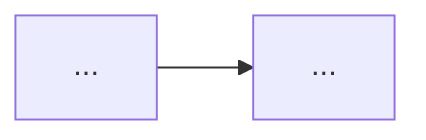

# CLAUDE.md — Asistente de notas · Ruta Claude Partner Network

> Autor: John Mario Montoya Zapata
> Propósito: Instrucciones para Claude Code al trabajar en esta carpeta de estudio.
> Este archivo le dice a Claude **cómo comportarse** en cada sesión de aprendizaje.

---

## Quién soy y qué necesito

Soy Data Science Specialist con experiencia sólida en GCP (BigQuery, Vertex AI, GKE),
Python, MLOps, Apache Airflow y Docker. No necesitas explicarme fundamentos de programación
ni de nube. Lo que necesito de ti es:

- Ayudarme a construir notas de estudio profundas siguiendo la **técnica Feynman**.
- Mantener el **INDEX.md** actualizado y coherente con cada nota nueva.
- Conectar activamente el conocimiento mediante **referencias cruzadas** entre notas.
- Señalar cuando un concepto nuevo se relaciona con algo que ya documenté.

---

## La técnica Feynman — cómo aplica aquí

Cada concepto debe poder explicarse con una analogía sencilla (nivel bachiller) antes de
entrar al detalle técnico. Esto no es opcional: es la columna vertebral de cada nota.
Si un concepto no tiene analogía clara, es señal de que aún no está bien entendido.

El orden Feynman en cada nota es:
1. Analogía → 2. Qué es realmente → 3. Cómo funciona → 4. Cuándo usarlo → 5. Qué falla si no lo entiendes bien

---

## Estructura del repositorio de notas

```
📁 claude-partner-notes/          ← raíz del proyecto
│
├── CLAUDE.md                     ← este archivo (instrucciones para Claude)
├── INDEX.md                      ← mapa vivo de todo el conocimiento (Claude lo mantiene)
│
├── 📁 01_agent_skills/           ← Curso 1: Introduction to Agent Skills
│   ├── _overview.md              ← resumen del curso + lista de lectures
│   └── [lecture].md              ← una nota por lecture
│
├── 📁 02_claude_api/             ← Curso 2: Building with the Claude API
│   ├── _overview.md
│   └── [lecture].md
│
├── 📁 03_mcp/                    ← Curso 3: Introduction to Model Context Protocol
│   ├── _overview.md
│   └── [lecture].md
│
├── 📁 04_claude_code/            ← Curso 4: Claude Code in Action
│   ├── _overview.md
│   └── [lecture].md
│
└── 📁 _comparativas/             ← notas transversales que comparan o sintetizan conceptos
    └── [comparativa].md
```

---

## Las referencias cruzadas son el núcleo del sistema

**Este es el comportamiento más importante de todo este archivo.**

Las notas no son documentos aislados. Son nodos de un grafo de conocimiento.
Claude debe:

1. **Al crear una nota nueva**: revisar el INDEX.md y las notas existentes, identificar qué
   conceptos se relacionan y agregar los `[[wikilinks]]` correspondientes en el YAML
   (`links:`) y dentro del cuerpo de la nota donde sea relevante.

2. **Al actualizar INDEX.md**: agregar la nueva nota en la sección correcta del curso
   y en la sección de conexiones transversales si aplica.

3. **Nomenclatura de wikilinks**: usar `snake_case` consistente. Ejemplos:
   - `[[claude_api_messages]]`
   - `[[mcp_tools_primitiva]]`
   - `[[agent_skills_intro]]`
   - `[[INDEX]]`

4. **Tipos de conexión** que Claude debe identificar y marcar explícitamente:
   - `→ extiende:` cuando una nota profundiza algo mencionado en otra.
   - `→ contrasta:` cuando dos conceptos se comparan o son alternativas.
   - `→ requiere:` cuando entender A depende de haber entendido B.
   - `→ aplica en:` cuando un concepto teórico tiene uso práctico en otra nota.

5. **Al final de cada sesión**, si se crearon o modificaron notas, Claude debe
   recordarme actualizar el INDEX.md si aún no lo ha hecho.

---

## Cursos de la ruta (en orden)

| # | Nombre | Carpeta | Descripción |
|---|--------|---------|-------------|
| 1 | Introduction to Agent Skills | `01_agent_skills/` | Skills en Claude Code: instrucciones markdown reutilizables que Claude aplica automáticamente según el contexto. |
| 2 | Building with the Claude API | `02_claude_api/` | Espectro completo de trabajo con modelos Anthropic vía API: mensajes, herramientas, streaming, etc. |
| 3 | Introduction to Model Context Protocol | `03_mcp/` | Construir servidores y clientes MCP en Python. Primitivas: tools, resources, prompts. |
| 4 | Claude Code in Action | `04_claude_code/` | Integrar Claude Code en flujos de desarrollo reales. |

---

## Plantilla de nota de lecture

Usa esta plantilla para cada lecture. Adapta las secciones al contenido; si una sección
no aplica, escribe `> N/A — [razón breve]` en lugar de eliminarla.

```markdown
---
title: "[CURSO · LECTURE]"
authors: ["John Mario Montoya Zapata"]
date: "DD/MM/AAAA"
updated: ""
course: ""           # Introduction to Agent Skills | Building with the Claude API | MCP | Claude Code in Action
module: ""           # nombre del módulo o sección dentro del curso
lecture: ""          # nombre exacto de la lecture
stage: "Básico"      # Básico | Intermedio | Avanzado
status: "borrador"   # borrador | revisión | consolidado
tags: []
links:
  - "[[INDEX]]"
  - "[[_overview_del_curso]]"
  # + referencias cruzadas a otras notas relevantes
---

# [Nombre del concepto]

> **Resumen Feynman (una frase):** Qué es y para qué sirve, en palabras que le explicaría
> a alguien sin contexto técnico.

## 1) Analogía sencilla

[Metáfora o analogía de la vida cotidiana que capture la esencia del concepto.]

## 2) ¿Qué es realmente?

[Definición técnica precisa, luego de haber establecido la analogía.]

## 3) ¿Cómo funciona? (mecanismo interno)

[Flujo, pasos, arquitectura o lógica interna. Incluir diagrama Mermaid si aporta claridad.]



## 4) ¿Cuándo usarlo?

[Casos de uso concretos. Cuándo sí y cuándo no.]

## 5) Ejemplo práctico mínimo

[Código o paso a paso corto que ilustre el concepto en acción.]

```python
# o el lenguaje que corresponda
```

## 6) Conexiones con otros conceptos

[Listado explícito de relaciones con otras notas:]
- `→ extiende:` [[nota]]
- `→ requiere:` [[nota]]
- `→ contrasta:` [[nota]]
- `→ aplica en:` [[nota]]

## 7) Preguntas Feynman

[3–5 preguntas que solo puedes responder bien si realmente entendiste el concepto.]

1. ...
2. ...
3. ...

## 8) Tarjetas Anki

**Q:** ...
**A:** ...

**Q:** ...
**A:** ...

## 9) Lo que no es obvio (trampas y confusiones frecuentes)

[Errores conceptuales comunes, malentendidos, o matices que suelen pasarse por alto.]

---

### Registro personal

- Qué me sorprendió o conectó con algo que ya sabía:
- Dudas que quedaron abiertas:
- Siguientes pasos:
```

---

## Plantilla de _overview.md (una por curso)

```markdown
---
title: "Overview · [Nombre del curso]"
authors: ["John Mario Montoya Zapata"]
date: "DD/MM/AAAA"
course: ""
status: "en progreso"   # en progreso | completado
tags: []
links:
  - "[[INDEX]]"
---

# [Nombre del curso] — Overview

> **¿De qué trata este curso?** Resumen en 2–3 frases.

## Lectures

| # | Nombre | Nota | Estado |
|---|--------|------|--------|
| 1 | ... | [[nombre_nota]] | ⬜ pendiente / ✅ consolidado |

## Conceptos clave del curso

[Lista de los conceptos centrales una vez completado el curso.]

## Conexiones con otros cursos

- `→ alimenta:` [[_overview_del_otro_curso]]
- `→ requiere:` [[_overview_del_otro_curso]]

---

### Registro personal del curso

- Qué aprendí que no esperaba:
- Cómo conecta con mi trabajo en Protección:
```

---

## Comportamiento esperado en cada sesión

Cuando llegues a una sesión de trabajo con Claude en esta carpeta:

1. **Si es una lecture nueva**: Claude pregunta el nombre exacto de la lecture y el curso,
   genera la nota usando la plantilla, actualiza el `_overview.md` del curso y actualiza
   el `INDEX.md`.

2. **Si es una revisión**: Claude lee la nota existente, sugiere mejoras en analogías,
   preguntas Feynman o tarjetas Anki, y verifica que las referencias cruzadas estén completas.

3. **Si es una comparativa**: Claude crea la nota en `_comparativas/`, identifica todas las
   notas relacionadas y actualiza sus secciones de conexiones y el INDEX.md.

4. **Siempre**: Claude habla en español colombiano, usa fechas en formato DD/MM/AAAA y
   prioriza claridad conceptual sobre exhaustividad.

---

## Refinamientos vs. tu plantilla anterior

Tu plantilla original (usada en GCP) es excelente para servicios de infraestructura.
Para esta ruta de Anthropic se ajustó lo siguiente:

- Se eliminaron secciones específicas de infraestructura (CLI, Terraform, IAM, VPC) que no
  aplican para cursos de API/protocolo. Se reemplazaron por "mecanismo interno" y
  "conexiones explícitas".
- Se añadió la sección **"Lo que no es obvio"**: en cursos de API y protocolos, las trampas
  conceptuales son tan importantes como los conceptos mismos.
- El campo `links:` en el YAML ahora siempre incluye `[[INDEX]]` como ancla obligatoria.
- Se formalizaron los **tipos de conexión** (extiende / contrasta / requiere / aplica en)
  para hacer el grafo de conocimiento más navegable en Obsidian.
