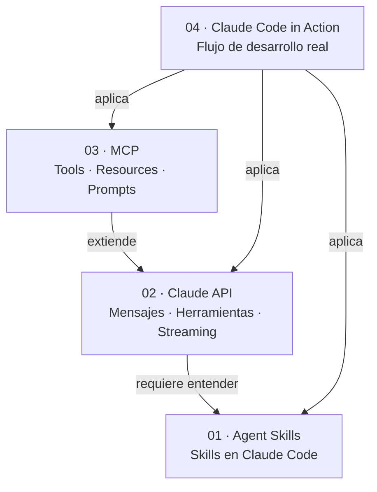

# INDEX.md — Mapa de conocimiento · Claude Partner Network

> Autor: John Mario Montoya Zapata
> Última actualización: 09/06/2026 (sesión 2)
> Estado de la ruta: 🟡 En progreso
>
> **Este archivo es mantenido por Claude.** Cada vez que se crea o modifica una nota,
> Claude actualiza las secciones correspondientes. No editar manualmente las tablas de
> lectures; sí editar el registro personal al final.

---

## Progreso general

| Curso | Estado | Lectures completadas |
|-------|--------|----------------------|
| 01 · Introduction to Agent Skills | ✅ Completado | 6 / 6 |
| 02 · Building with the Claude API | 🟡 En progreso | 11 / 11 notas (curso completo en borrador) |
| 03 · Introduction to Model Context Protocol | ⬜ Pendiente | 0 / ? |
| 04 · Claude Code in Action | ⬜ Pendiente | 0 / ? |

---

## 01 · Introduction to Agent Skills ✅

> Skills en Claude Code: instrucciones markdown reutilizables que Claude aplica
> automáticamente según el contexto de la tarea.
> **Completado:** 28/04/2026

- Overview: [[01_agent_skills/_overview]] ✅
- Lectures:
  - [[01_agent_skills/01_que_son_skills]] — Qué son los Skills ✅
  - [[01_agent_skills/02_creating_your_first_skill]] — Creando tu primer Skill ✅
  - [[01_agent_skills/03_configuration_and_multi_file_skills]] — Configuración y Skills Multi-archivo ✅
  - [[01_agent_skills/04_skills_vs_other_features]] — Skills vs Otras Funcionalidades ✅
  - [[01_agent_skills/05_sharing_skills]] — Compartiendo Skills (repo, plugins, enterprise, subagents) ✅
  - [[01_agent_skills/06_troubleshooting_skills]] — Troubleshooting de Skills ✅

---

## 02 · Building with the Claude API 🟡

> Espectro completo de trabajo con modelos Anthropic vía API: mensajes, herramientas,
> streaming, contexto, y más.

- Overview: [[02_claude_api/_overview]] 🟡
- Lectures:
  - [[02_claude_api/01x_api_fundamentals/010_fundamentos_api_y_conversaciones]] — Modelos, flujo de 5 pasos, request básico, multi-turn stateless ✅
  - [[02_claude_api/02x_system_prompts/020_system_prompts]] — System prompt como parámetro `system=` separado ✅
  - [[02_claude_api/03x_temperature/030_temperature]] — Parámetro 0–1 que escala distribución de probabilidades ✅
  - [[02_claude_api/04x_streaming_and_output/040_response_streaming]] — Streaming + Controlling Output (pre-fill, stop sequences, structured data) ✅
  - [[02_claude_api/05x_prompt_evaluation/050_prompt_evaluation]] — Pipeline de eval: dataset → run → grade → iterar ✅
  - [[02_claude_api/06x_prompt_engineering/060_prompt_engineering_techniques]] — Claridad · Especificidad · XML tags · Ejemplos ✅
  - [[02_claude_api/07x_tool_use/070_tool_use]] — Tool use: funciones · schemas · loop run_conversation · batch · structured data ✅
  - [[02_claude_api/08x_rag/080_rag_and_agentic_search]] — RAG: chunking · embeddings · BM25 · RRF · reranking · contextual retrieval ✅
  - [[02_claude_api/09x_features_claude/090_features_claude]] — Extended Thinking · Vision/PDF · Citations · Prompt Caching · Code Execution ✅
  - [[02_claude_api/010x_mcp/100_mcp]] — FastMCP · Tools · Resources · Prompts · MCPClient · Inspector ✅
  - [[02_claude_api/011x_anthropic_apps/110_anthropic_apps]] — Claude Code (CLAUDE.md · work trees · MCP · auto-debug) · Computer Use ✅

---

## 03 · Introduction to Model Context Protocol

> Construir servidores y clientes MCP en Python.
> Primitivas fundamentales: **tools**, **resources**, **prompts**.

- Overview: [[03_mcp/_overview]] ⬜
- Lectures:
  *(se irán agregando a medida que avances)*

---

## 04 · Claude Code in Action

> Integrar Claude Code en flujos de desarrollo reales.

- Overview: [[04_claude_code/_overview]] ⬜
- Lectures:
  *(se irán agregando a medida que avances)*

---

## Comparativas y notas transversales

> Notas que sintetizan o comparan conceptos de múltiples cursos.

- [[_comparativas/claude_code_customization_features]] — Los 5 mecanismos de personalización de Claude Code (skills, CLAUDE.md, hooks, subagents, MCP) ✅

---

## Grafo de conexiones entre cursos

> Mapa de dependencias y relaciones entre los cursos de la ruta.

*(Este diagrama se actualizará con conexiones más granulares a medida que avances.)*

---

## Conceptos clave por primitiva

> Índice transversal por concepto, independiente del curso. Se construye progresivamente.

### Skills / Instrucciones
- **Skill**: carpeta + `SKILL.md` con `name` y `description` en frontmatter → [[01_que_son_skills]]
- **Lazy loading semántico**: solo `name+description` al arrancar; cuerpo completo on demand → [[01_que_son_skills]]
- **Jerarquía**: Enterprise > Personal > Project > Plugin → [[02_creating_your_first_skill]]
- **`allowed-tools`** (lista blanca de herramientas) + **`model`** (opcional) → [[03_configuration_and_multi_file_skills]]
- **Progressive disclosure**: SKILL.md < 500 líneas; referencias en `references/`; scripts se ejecutan, no se leen → [[03_configuration_and_multi_file_skills]]
- **Skills vs CLAUDE.md vs Hooks vs Subagents vs MCP** → [[04_skills_vs_other_features]] + [[_comparativas/claude_code_customization_features]]
- **Distribución**: repo commit → plugin → enterprise managed settings → [[05_sharing_skills]]
- **Subagents + skills**: declarar explícitamente en campo `skills:` del agente custom → [[05_sharing_skills]]
- **Troubleshooting**: validator primero, `claude --debug` segundo, description tercero → [[06_troubleshooting_skills]]

### API · Mensajes y modelos
- **Modelos**: Opus (razonamiento complejo) / Sonnet (balance) / Haiku (velocidad/volumen) → [[02_claude_api/01x_api_fundamentals/010_fundamentos_api_y_conversaciones]]
- **Flujo de 5 pasos**: cliente → servidor → API → generación (tokenización→embedding→contextualización→generación) → response → [[02_claude_api/01x_api_fundamentals/010_fundamentos_api_y_conversaciones]]
- **API stateless**: sin memoria entre requests; el developer mantiene y envía historial completo → [[02_claude_api/01x_api_fundamentals/010_fundamentos_api_y_conversaciones]]
- **System prompt**: parámetro `system=` separado — controla el *cómo*, no el *qué* → [[02_claude_api/02x_system_prompts/020_system_prompts]]
- **Temperature**: 0 = determinista (extracción/JSON), ~1 = creativo (brainstorming) → [[02_claude_api/03x_temperature/030_temperature]]
- **Streaming**: `text_stream` chunks en tiempo real; `get_final_message()` para persistencia → [[02_claude_api/04x_streaming_and_output/040_response_streaming]]
- **Pre-filling + stop sequences**: controlar dirección y longitud del output sin cambiar el prompt → [[02_claude_api/04x_streaming_and_output/040_response_streaming]]
- **Prompt Evaluation**: pipeline dataset → run_prompt → grade → score promedio → iterar → [[02_claude_api/05x_prompt_evaluation/050_prompt_evaluation]]
- **Graders**: code (sintaxis: JSON/Python/regex), model (LLM puntúa), human (máxima precisión) → [[02_claude_api/05x_prompt_evaluation/050_prompt_evaluation]]
- **Prompt engineering**: claridad (verbo de acción) → especificidad (Tipo A atributos + Tipo B pasos) → XML tags (delimitar contextos) → ejemplos (one-shot/multi-shot con reasoning) → [[02_claude_api/06x_prompt_engineering/060_prompt_engineering_techniques]]
- **Tool use**: función Python + schema JSON + loop `run_conversation` chequeando `stop_reason=="tool_use"` → [[02_claude_api/07x_tool_use/070_tool_use]]
- **Tool result block**: `tool_use_id` + `content` (string) + `is_error` en mensaje de usuario → [[02_claude_api/07x_tool_use/070_tool_use]]
- **Batch Tool**: meta-tool con lista de invocaciones para forzar ejecución paralela → [[02_claude_api/07x_tool_use/070_tool_use]]
- **Tools para structured data**: `tool_choice` + `response.content[0].input` en vez de pre-filling → [[02_claude_api/07x_tool_use/070_tool_use]]
- **RAG**: chunking → embeddings (Voyage AI) → vector DB + BM25 → Reciprocal Rank Fusion → reranking LLM → contextual retrieval → [[02_claude_api/08x_rag/080_rag_and_agentic_search]]
- **Cosine distance**: métrica de similitud entre embeddings (0 = idénticos) → [[02_claude_api/08x_rag/080_rag_and_agentic_search]]
- **Extended Thinking**: reasoning budget · thinking block + firma criptográfica · usar tras agotar prompt engineering → [[02_claude_api/09x_features_claude/090_features_claude]]
- **Vision/PDF**: bloques `image` y `document` en content · prompting detallado > calidad de imagen → [[02_claude_api/09x_features_claude/090_features_claude]]
- **Citations**: `citation_page_location` (PDF) · `citation_char_location` (texto) · transparencia de fuentes → [[02_claude_api/09x_features_claude/090_features_claude]]
- **Prompt Caching**: `cache_control` ephemeral · TTL 1h · mínimo 1024 tokens · máx 4 breakpoints · invalida si cambia contenido antes del breakpoint → [[02_claude_api/09x_features_claude/090_features_claude]]
- **Code Execution + Files API**: Docker sin red · I/O exclusivo vía Files API · tool del lado del servidor → [[02_claude_api/09x_features_claude/090_features_claude]]
- **Claude Code**: agente en terminal · CLAUDE.md como memoria · 3 tipos (Project/Local/User) · cliente MCP nativo → [[02_claude_api/011x_anthropic_apps/110_anthropic_apps]]
- **Git work trees**: copias físicas del proyecto por rama para paralelizar instancias sin conflictos → [[02_claude_api/011x_anthropic_apps/110_anthropic_apps]]
- **Debugging automatizado**: GitHub Actions + CloudWatch + Claude Code → PR con fixes diarios → [[02_claude_api/011x_anthropic_apps/110_anthropic_apps]]
- **Computer Use**: loop screenshot→Claude→acción · schema `computer_20250124` · Docker container · implementación de referencia de Anthropic → [[02_claude_api/011x_anthropic_apps/110_anthropic_apps]]
- **MCP**: protocolo que delega definición y ejecución de herramientas a un servidor especializado → [[02_claude_api/010x_mcp/100_mcp]]
- **FastMCP**: `@mcp.tool` / `@mcp.resource` / `@mcp.prompt` — schemas JSON generados automáticamente desde Python → [[02_claude_api/010x_mcp/100_mcp]]
- **MCPClient**: wrapper de `ClientSession` con `AsyncExitStack`; métodos: `list_tools()`, `call_tool()`, `list_prompts()`, `get_prompt()`, `read_resource()` → [[02_claude_api/010x_mcp/100_mcp]]
- **Transport stdio**: servidor lanzado como subproceso, comunicación por stdin/stdout → [[02_claude_api/010x_mcp/100_mcp]]
- **Tools vs Resources**: tools = reactivo (Claude las pide); resources = proactivo (cliente solicita por URI) → [[02_claude_api/010x_mcp/100_mcp]]
- **Prompts MCP**: retornan `list[base.Message]` listos para Claude; reusables como slash commands → [[02_claude_api/010x_mcp/100_mcp]]
- **MCP Inspector**: `mcp dev server.py` → debugger en browser (requiere Node.js/npx) → [[02_claude_api/010x_mcp/100_mcp]]

### MCP · Protocolo y primitivas
*(vacío — se llena al avanzar en Curso 3)*

### Claude Code · Flujo de desarrollo
*(vacío — se llena al avanzar en Curso 4)*

---

## Conexión con trabajo en Protección S.A.

> Aplicaciones concretas del conocimiento de esta ruta al stack de Protección.

| Concepto aprendido | Aplicación potencial en Protección |
|--------------------|-----------------------------------|
| Skills de proyecto en `.claude/skills/` | Skill `airflow-dag-review` para estándares internos de DAGs, versionado en el repo |
| `allowed-tools` de solo lectura | Skill de auditoría de pipelines que solo puede leer, nunca modificar archivos de prod |
| Progressive disclosure con `references/` | Guía de estándares de DAGs separada del SKILL.md principal para no saturar contexto |
| Custom subagent con skills declarados | Agente `pipeline-reviewer` con `airflow-dag-review` + `bq-query-review` para revisiones delegadas |
| Skills personales en `~/.claude/skills/` | Skill `commit-message` con Conventional Commits que aplica en todos los repos |
| Validator como pre-commit hook | Validar automáticamente los skills del equipo antes de hacer push |

---

### Registro personal de la ruta

- Fecha de inicio:
- Motivación principal:
- Qué quiero poder hacer al terminar:
- Insights inesperados:
